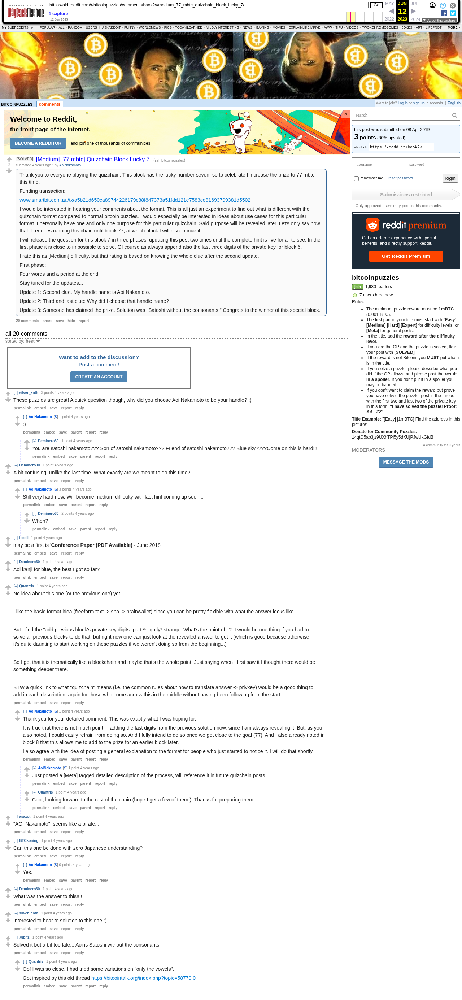

# [Medium] [77 mbtc] Quizchain Block Lucky 7

[Original thread](https://www.reddit.com/r/bitcoinpuzzles/comments/baok2v/medium_77_mbtc_quizchain_block_lucky_7/). The `sourceUrl` of the [quizchain/7 record](../../../src/collections/quizchain/7.ts), the source of three of its four hints, the answer and the funding txid, all in the post itself. The fourth hint's answer, the block 6 key suffix `MQz`, comes from the [block 6 thread](aoinakamoto-2019-04-07-bafyoo.md). The address is not printed; the funding transaction pays it. Neither the entropy hash nor the WIF is printed: the record reconstructs both from the recipe of the earlier blocks and the published solution. The post went up on April 8, 2019, at 02:55:51 UTC, five minutes after the funding transaction's block time. Its last edit is stamped April 9, 02:03:12 UTC, the morning after the claim.

## Historical provenance

The Wayback Machine holds one capture of the `old.reddit.com` URL and one of the `www.reddit.com` URL, stamped June 12, 2023, 10:56:59 and 10:56:57. archive.today lists one capture of the `old.reddit.com` URL, stamped April 8, 2019, 04:01:10, an hour after the post and before its first update, but on September 25, 2026 it answered 429 with its "One more step" page, so that body was not read; its timemap for the `www.reddit.com` URL answered 404. Provenance rests on the [old.reddit.com capture](https://web.archive.org/web/20230612105659/https://old.reddit.com/r/bitcoinpuzzles/comments/baok2v/medium_77_mbtc_quizchain_block_lucky_7/), whose HTML carries the post with all three updates and the 19 comments the thread header counts. Its body was read on September 25, 2026 and matches the transcript below word for word, including the funding txid and the solution. `archive_content: confirmed` on that basis.

The Arctic Shift Reddit archive holds a twentieth comment that the 2023 capture no longer shows: u/dcryptoguy at 17:15:38 UTC on April 8, "Someone claimed this!!! Please what was the answer??", six minutes before the claim's block time. It is not in the transcript, because the capture does not carry it.

The record names none of the commenters. u/78bits wrote that they solved it "a bit too late", and nothing on the chain ties any name to the claim.

## Transcript

> Thank you to everyone playing the quizchain. This block has the lucky number seven, so to celebrate I increase the prize to 77 mbtc this time.
>
> Funding transaction:
>
> www.smartbit.com.au/tx/a5b21d650ca89744226179c88f847373a51fdd121e7583ce81693799381d5502
>
> I would be interested in hearing your comments about the format. This is all just an experiment to find out what is different with the quizchain format compared to normal bitcoin puzzles. I would especially be interested in ideas about use cases for this particular format. I personally have one and only one purpose for this particular quizchain. Said purpose will be revealed later. Let's only say now that it requires running this chain until block 77, at which block I will discontinue it.
>
> I will release the question for this block 7 in three phases, updating this post two times until the complete hint is live for all to see. In the first phase it is close to impossible to solve. Of course as always append also the last three digits of the private key for block 6.
>
> I rate this as [Medium] difficulty, but that rating is based on knowing the whole clue after the second update.
>
> First phase:
>
> Four words and a period at the end.
>
> Stay tuned for the updates...
>
> Update 1: Second clue. My handle name is Aoi Nakamoto.
>
> Update 2: Third and last clue: Why did I choose that handle name?
>
> Update 3: Someone has claimed the prize. Solution was "Satoshi without the consonants." Congrats to the winner of this special block.

## Comments

**u/silver_anth**, 3 points:

> These puzzles are great! A quick question though, why did you choose Aoi Nakamoto to be your handle? :)

**u/AoiNakamoto**, 1 point, reply:

> :)

**u/Deminero30**, 1 point, reply:

> You are satoshi nakamoto??? Son of satoshi nakamoto??? Friend of satoshi nakamoto??? Blue sky????Come on this is hard!!!

**u/Deminero30**, 1 point:

> A bit confusing, unlike the last time. What exactly are we meant to do this time?

**u/AoiNakamoto**, 3 points, reply:

> Still very hard now. Will become medium difficulty with last hint coming up soon...

**u/Deminero30**, 2 points, reply:

> When?

**u/fecell**, 1 point:

> may be a first is '**Conference Paper** **(PDF Available)** · June 2018'

**u/Deminero30**, 1 point:

> Aoi kanji for blue, the best I got so far?

**u/Quantris**, 1 point:

> No idea about this one (or the previous one) yet.
>
> I like the basic format idea (freeform text -> sha -> brainwallet) since you can be pretty flexible with what the answer looks like.
>
> But I find the "add previous block's private key digits" part \*slightly\* strange. What's the point of it? It would be one thing if you had to solve all previous blocks to do that, but right now one can just look at the revealed answer to get it (which is good because otherwise it's quite daunting to start working on these puzzles if we weren't doing so from the beginning...)
>
> So I get that it is thematically like a blockchain and maybe that's the whole point. Just saying when I first saw it I thought there would be something deeper there.
>
> BTW a quick link to what "quizchain" means (i.e. the common rules about how to translate answer -> privkey) would be a good thing to add in each description, again for those who come across this in the middle without having been following from the start.

**u/AoiNakamoto**, 1 point, reply:

> Thank you for your detailed comment. This was exactly what I was hoping for.
>
> It is true that there is not much point in adding the last digits from the previous solution now, since I am always revealing it. But, as you also noted, I could easily refrain from doing so. And I fully intend to do so once we get close to the goal (77). And I also already noted in block 8 that this allows me to add to the prize for an earlier block later.
>
> I also agree with the idea of posting a general explanation to the format for people who just started to notice it. I will do that shortly.

**u/AoiNakamoto**, 1 point, reply:

> Just posted a [Meta] tagged detailed description of the process, will reference it in future quizchain posts.

**u/Quantris**, 1 point, reply:

> Cool, looking forward to the rest of the chain (hope I get a few of them!). Thanks for preparing them!

**u/asazot**, 1 point:

> "AOI Nakamoto", seems like a pirate...

**u/BTCkoning**, 1 point:

> Can this one be done with zero Japanese understanding?

**u/AoiNakamoto**, 0 points, reply:

> Yes.

**u/Deminero30**, 1 point:

> What was the answer to this!!!!!

**u/silver_anth**, 1 point:

> Interested to hear to solution to this one :)

**u/78bits**, 1 point:

> Solved it but a bit too late...
> Aoi is Satoshi without the consonants.

**u/Quantris**, 1 point, reply:

> Oof I was so close. I had tried some variations on "only the vowels".
>
> Got inspired by this old thread https://bitcointalk.org/index.php?topic=58770.0

Quantris's first comment separates its paragraphs with zero-width spaces, which the transcript drops. The other formatting follows the capture: bold in fecell's comment, literal asterisks in Quantris's.

## Screenshot

The screenshot is a render of the archive capture, not of the live page, so it carries the Wayback banner at the top. The "4 years ago" stamps are relative to the capture, June 12, 2023. Capture method and limits: [source archive](../README.md).
