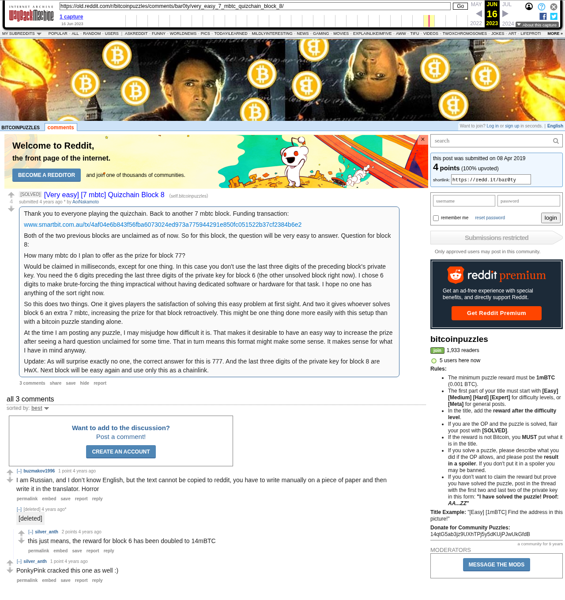

# [Very easy] [7 mbtc] Quizchain Block 8

[Original thread](https://www.reddit.com/r/bitcoinpuzzles/comments/bar0ty/very_easy_7_mbtc_quizchain_block_8/). The `sourceUrl` of the [quizchain/8 record](../../../src/collections/quizchain/8.ts), the source of its two hints, the answer, the funding txid and the last three characters of the key, all in the post itself. The address is not printed; the funding transaction pays it. Neither the entropy hash nor the WIF is printed: the record reconstructs both from the published answer and six characters of the reconstructed block 6 key, and the WIF it gets ends in the printed `HwX`. The post went up on April 8, 2019, at 07:54:50 UTC, fourteen minutes after the funding transaction's block time. Its only edit is stamped 08:10:48 UTC the same morning, in the capture and in Arctic Shift alike, so the update with the answer and the key suffix went up three hours before the claim.

## Historical provenance

The Wayback Machine holds one capture of the `old.reddit.com` URL, stamped June 16, 2023, 15:21:36, and one of the `www.reddit.com` URL a second earlier. archive.today answered 404 for the timemaps of both URLs on September 25, 2026. Provenance rests on the [old.reddit.com capture](https://web.archive.org/web/20230616152136/https://old.reddit.com/r/bitcoinpuzzles/comments/bar0ty/very_easy_7_mbtc_quizchain_block_8/), whose HTML carries the post with its update and the three comments the thread header counts, plus the shell of a deleted one that a reply hangs off. Its body was read on September 25, 2026 and matches the transcript below word for word, including the funding txid, the answer and the key suffix. The Arctic Shift Reddit archive holds the same post and comments with the same text. `archive_content: confirmed` on that basis.

Arctic Shift lists two deleted comments, both with `[deleted]` as author and body: one at 09:18:08 UTC, the one u/silver_anth replied to, and one at 12:28:25 UTC under u/silver_anth's second comment, which the capture does not render.

The record names none of the commenters. u/silver_anth wrote that PonkyPink cracked this one as well, and the chain shows the block 6 and block 8 claims paying one address in one block, but nothing on the chain ties that address to a name.

## Transcript

> Thank you to everyone playing the quizchain. Back to another 7 mbtc block. Funding transaction:
>
> www.smartbit.com.au/tx/4af04e6b843f56fba6073024ed973a775944291e850fc051522b37cf2384b6e2
>
> Both of the two previous blocks are unclaimed as of now. So for this block, the question will be very easy to answer. Question for block 8:
>
> How many mbtc do I plan to offer as the prize for block 77?
>
> Would be claimed in milliseconds, except for one thing. In this case you don't use the last three digits of the preceding block's private key. You need the 6 digits preceding the last three digits of the private key for block 6 (the other unsolved block right now). I chose 6 digits to make brute-forcing the thing impractical without having dedicated software or hardware for that task. I hope no one has anything of the sort right now.
>
> So this does two things. One it gives players the satisfaction of solving this easy problem at first sight. And two it gives whoever solves block 6 an extra 7 mbtc, increasing the prize for that block retroactively. This might be one thing done more easily with this setup than with a bitcoin puzzle standing alone.
>
> At the time I am posting any puzzle, I may misjudge how difficult it is. That makes it desirable to have an easy way to increase the prize after seeing a hard question unclaimed for some time. That in turn means this format might make some sense. It makes sense for what I have in mind anyway.
>
> Update: As will surprise exactly no one, the correct answer for this is 777. And the last three digits of the private key for block 8 are HwX. Next block will be easy again and use only this as a chainlink.

## Comments

**u/buzmakov1996**, 1 point:

> I am Russian, and I don’t know English, but the text cannot be copied to reddit, you have to write manually on a piece of paper and then write it in the translator. Horror

**[deleted]**:

> [deleted]

**u/silver_anth**, 2 points, reply:

> this just means, the reward for block 6 has been doubled to 14mBTC

**u/silver_anth**, 1 point:

> PonkyPink cracked this one as well :)

## Screenshot

The screenshot is a render of the archive capture, not of the live page, so it carries the Wayback banner at the top. The "4 years ago" stamps are relative to the capture, June 16, 2023. Capture method and limits: [source archive](../README.md).
