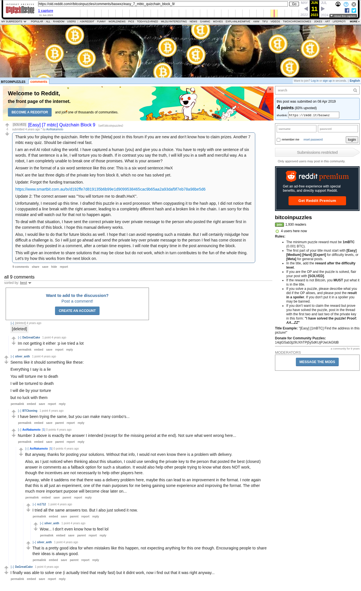

# [Easy] [7 mbtc] Quizchain Block 9

[Original thread](https://www.reddit.com/r/bitcoinpuzzles/comments/baswxz/easy_7_mbtc_quizchain_block_9/). The `sourceUrl` of the [quizchain/9 record](../../../src/collections/quizchain/9.ts), the source of its three hints, the answer with the author's account of the line break that broke the hash, and the funding txid, all in the post itself. The address is not printed; the funding transaction pays it. Neither the entropy hash nor the WIF is printed: the record reconstructs both from the published answer with the line break appended, and the key it gets matches the public key the claim revealed. The post went up on April 8, 2019, at 12:00:06 UTC, a minute and a half before the funding transaction's block time. Its last edit is stamped 23:49:29 UTC the same day, in the capture and in Arctic Shift alike, so the capture shows the post as it stood after the claim.

## Historical provenance

The Wayback Machine holds one capture of the `old.reddit.com` URL, stamped June 11, 2023, 15:26:22, and one of the `www.reddit.com` URL two seconds earlier. Provenance rests on the [old.reddit.com capture](https://web.archive.org/web/20230611152622/https://old.reddit.com/r/bitcoinpuzzles/comments/baswxz/easy_7_mbtc_quizchain_block_9/), whose HTML carries the post with both updates and the nine comments the thread header counts, plus the shell of a deleted one that a reply hangs off. Its body was read on September 25, 2026 and matches the transcript below word for word, including the funding txid, the answer and the line break explanation. The Arctic Shift Reddit archive holds the same post and comments with the same text, authors, times and scores. `archive_content: confirmed` on that basis.

Arctic Shift lists two deleted comments, both with `[deleted]` as author and body: one at 12:20:58 UTC, the one u/DaGreatCake replied to, and one at 13:05:58 UTC under that reply, which the capture does not render.

The record names none of the commenters. The author wrote that the key went by private message to whoever posted the right answer first, and u/rs1712 wrote at 23:14 that they had just solved it, five minutes before the claim, but nothing on the chain ties the claim to a name.

## Transcript

> Thank you for playing the quizchain. Refer to the [Meta] post in this forum if you are new and don't know how to claim prizes. Another 7 mbtc easy quiz. Should be claimed real fast.
>
> I am an evil AI robot ruling the world. I have captured a human (you) and give you a choice. You have to reply with one sentence of six words. If that sentence is a lie, I will torture you to death. If in contrast you say the truth, I will kill you in a swift and merciful way. As a robot, I am completely unable to break one of those promises. What is your answer?
>
> Answer in the format of a six word sentence like this one: This is a six word sentence.HwX
>
> HwX are the last three digits of the private key from block 8, which no one has solved yet.
>
> Update: Forgot the funding transaction.
>
> https://www.smartbit.com.au/tx/d192ffe7d819135b6b99e1d9099538465cac9b65aa2a93daf9f7eb78a98be5d6
>
> Update 2: The correct answer was "You will torture me to death.HwX".
>
> Unfortunately, I messed up this time. I drafted this puzzle in a word processor. When copypasting it to the hash app, I did not notice that I copypasted a line break with the right answer, leading to a completely different hash and a broken link in the chain. I am sorry for this mistake and will watch out for that not to happen again.
>
> To deal with that situation, I have sent the correct private key over private message to the person who posted the right answer first in the comments of this block. I hope this manual delivery works.
>
> Also, I would like to do that for future blocks as well. I hope that I can avoid repeating such a mistake. But I will certainly misjudge how difficult a challenge is. So I will just go ahead and send the private key over private message to the person I feel has come closest in the solution they posted in a comment, after a certain time expires. I will note that expiry time in the post announcing the block.
>
> This will give an incentive to share solutions that may be close but do not work, which in turn contributes to the fun of the whole thing. Let's try how this works from the next block on.

## Comments

**[deleted]**:

> [deleted]

**u/DaGreatCake**, 1 point, reply:

> Im not getting it either :p ive tried a lot

**u/silver_anth**, 1 point:

> Seems like it should something like these:
>
> Everything I say is a lie
>
> You will torture me to death
>
> I will be tortured to death
>
> I will die by your torture
>
> but no luck with them

**u/BTCkoning**, 1 point, reply to u/silver_anth:

> I have been trying the same, but you can make many combo's...

**u/AoiNakamoto**, 0 points, reply to u/silver_anth:

> Number 3 above is exactly the answer I intended (except for the missing period at the end). Not sure what went wrong here...

**u/AoiNakamoto**, 0 points, reply:

> But anyway, thanks for posting your solutions. Without that info, I would not even know there is a problem with delivery.
>
> Also, as I just noticed when thinking about this situation, I could use sending the private key to the person that posted the best (closest) answer in comments as a fallback option for such a situation. It would also help other people trying to know what does NOT work, though the incentives are not necessarily to help other players here.
>
> Anyway, while it saddens me that there was a delivery problem here, maybe this can lead to an improvement in the format. I note again that this is all just an experiment, one of the main purposes for me being gaining some experience and improving the format. The other much more important purpose will become clear later on...

**u/rs1712**, 1 point, reply:

> I tried all the same answers too. But I also just solved it now.

**u/silver_anth**, 1 point, reply:

> Wow... I don't even know how to feel lol

**u/silver_anth**, 1 point, reply to u/AoiNakamoto:

> That is a pretty good idea for when mistakes like this happen, not expecting anything for this one though. Encouraging people to share their ideas is always good.

**u/DaGreatCake**, 1 point:

> I finally was able to solve one (i actually tried that really fast) but it didnt work, now i find out that it was right anyway...

## Screenshot

The screenshot is a render of the archive capture, not of the live page, so it carries the Wayback banner at the top. The "4 years ago" stamps are relative to the capture, June 11, 2023. Capture method and limits: [source archive](../README.md).
