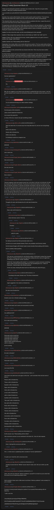

# [Easy] [7 mbtc] Quizchain Block 10

[Original thread](https://www.reddit.com/r/bitcoinpuzzles/comments/bb1ajr/easy_7_mbtc_quizchain_block_10/). The `sourceUrl` of the [quizchain/10 record](../../../src/collections/quizchain/10.ts), the source of its three hints, the solution with the author's account of the line break that got into this hash too, and the funding txid, all in the post itself. The address, the public key and the WIF are printed in a player's comment at the end. The entropy hash is not printed: the record reconstructs it from the published solution with the line break appended, and it derives that WIF. The post went up on April 9, 2019, at 00:21:17 UTC, two and a half minutes after the funding transaction's block time. Arctic Shift stamps its last edit at 10:13:30 UTC on April 10, so the transcript shows the post as it stood after the claim.

## Historical provenance

No capture found. On September 25, 2026 the Wayback Machine index listed one entry for the `www.reddit.com` URL, June 16, 2023, 14:57:33 UTC, and one for the `old.reddit.com` URL five seconds later. Both answer 404 "has not archived that URL" on replay, with and without `id_`, so their bodies could not be read. MemGator lists those two entries and nothing else. The archive.today timemaps for the `www.reddit.com`, `old.reddit.com` and bare `reddit.com` URLs answered 404.

The transcript below comes from the [Arctic Shift](https://arctic-shift.photon-reddit.com/) Reddit archive: the post record and the comment tree for `bb1ajr`, read on September 25, 2026. The [pullpush](https://pullpush.io/) Reddit archive, read the same day, gives the same post text, time and edit stamp, and the same 38 comments with the same authors, times, scores and parents. Their bodies differ only in how the empty `&#x200B;` paragraph in three comments is escaped, and the transcript leaves those empty paragraphs out.

Arctic Shift lists two deleted comments, both top level with `[deleted]` as author and body, at 01:37:48 and 08:18:45 UTC on April 9. Nothing replies to either.

The record names none of the commenters. The author wrote that the solution went to the comment closest at the time, u/Agelais wrote at 01:39:42 UTC on April 10 that they had received the answer, and the claim confirmed at 01:42:12, but nothing on the chain ties the claim to a name. u/Crypto_Rachel printed the address, the public key and the WIF at 09:27:00 UTC, after the claim.

## Transcript

> Thank you for playing the quizchain. Last block was a broken link. I hope this one goes better. Another 7 mbtc prize, funding transaction below.
>
> www.smartbit.com.au/tx/18c5191722eb13326322300205c24d229cfc45bfb0c29af30ee8c22c9c8fecb7
>
> Question: Four words within Einstein. Format: "word1 word2 word3 word4.fnw". The last three digits from the broken link in block 9 are set as fnw for this block. German words allowed.
>
> This should be fairly easy to solve, if there are no delivery problems this time, I expect the prize to not survive more than one hour before someone claims it.
>
> To experiment a bit with the format, if after about seven hours no one has claimed it, I will send the private key directly to the player who came closest in his answer in the comments manually. I would of course prefer to just lazily watch as the automatic delivery works as intended, so good luck with finding the solution before that expiry time.
>
> Update: For info on how this works, see the recent [Meta] post in this subreddit.
>
> Update 2: Takes longer than expected. Here is a hint. Break up "within" into "with" and "in".
>
> Update 3: Damn, this was supposed to be easy. Another judgment miss on my part. So here is another hint. Google "with Einstein".
>
> Update: Solution was "Moonwalking with ein Stein.fnw"
>
> Explanation: Four words within is two words with and two words in. The two words with are those from the famous book titile that shows up in a Google search, the two words in are just "ein Stein" (a stone in German).
>
> I sent the solution to the comment that was closest at the time. There may have been another delivery problem.
>
> For future blocks, please post your best solution in a comment, even if the hash does not check out. If I see the correct answer, I will know that there is another problem with delivery. And if the block takes long to get solved, I know whom to send the solution (comment closest to solving it).
>
> Final Update and apology: As several people noted, my mistake in hashing block 9 happened in this block too. Again a line break at the end from copypasting from a draft in a wordprocessor.
>
> It has been pointed out that I should check better. You can be sure that I am double checking this particular point very carefully now. At the time I posted these two blocks I was not aware of this way of screwing up. I certainly am now. Sorry again for this mistake.

## Comments

**u/Agelais**, 1 point:

> Normal capitalization?

**u/AoiNakamoto**, 1 point, reply to u/Agelais:

> Yes.

**u/Agelais**, 2 points:

> Btw. Do you suggest in your blocks brute-forcing? I'm asking that due to the reason, I can't do it at the moment, and if words are not directly connected, so probably need to do some sort of it...

**u/AoiNakamoto**, 3 points, reply to u/Agelais:

> I try to avoid brute forcing as an ideal solution strategy.

**u/silver_anth**, 1 point:

> My best guess at the moment is:
>
> Liebe ursache akademish frieden.fnw
>
> Love causes this peace.fnw
>
> or mixes of the two.
> Anyone else got something similar?

**u/silver_anth**, 1 point, reply to u/silver_anth:

> After the latest hint, I've moved away from Kanji (like block 4), and am now trying things like:
>
> With in Ein stein.fnw
>
> Words with in Einstein.fnw
>
> With in ein stein.fnw
>
> I'm thinking it could be an anagram now.

**[deleted]**:

> [deleted]

**u/whatupyo02**, 1 point:

> sein in stein eins

**u/Crypto_Rachel**, 1 point:

> Nine nein ten eins

**u/Crypto_Rachel**, 1 point:

> Eins tien nine nein

**u/Crypto_Rachel**, 1 point:

> Eins in stien in

**u/Agelais**, 0 points:

> Tried all anagrams with short special words:
> Ene I In St;
> Nee I In St;
> Een I In St;
> Nie Ne I St;
> Nie En I St;
> Ne En I Sit;
> Ne En I Its;
> Ne En I Tis;
> Ne En Si Ti;
> Ne En Si It;
> Ne En Is Ti;
> Ne En Is It;
> Ne Sen I Ti;
> Ne Sen I It;
> Ne Ens I Ti;
> Ne Ens I It;
> Ne Net I Si;
> Ne Net I Is;
> Ne Ten I Si;
> Ne Ten I Is;
> Ne Es I Tin;
> Ne Es I Nit;
> Ne Es In Ti;
> Ne Es In It;
> Ne Tes I In;
> Ne Set I In;
> Ne Est I In;
> Ne Te I Sin;
> Ne Te I Ins;
> Ne Te I Nis;
> Ne Te In Si;
> Ne Te In Is;
> Ne Et I Sin;
> Ne Et I Ins;
> Ne Et I Nis;
> Ne Et In Si;
> Ne Et In Is;
> En Sen I Ti;
> En Sen I It;
> En Ens I Ti;
> En Ens I It;
> En Net I Si;
> En Net I Is;
> En Ten I Si;
> En Ten I Is;
> En Es I Tin;
> En Es I Nit;
> En Es In Ti;
> En Es In It;
> En Tes I In;
> En Set I In;
> En Est I In;
> En Te I Sin;
> En Te I Ins;
> En Te I Nis;
> En Te In Si;
> En Te In Is;
> En Et I Sin;
> En Et I Ins;
> En Et I Nis;
> En Et In Si;
> En Et In Is;
> Sen Te I In;
> Sen Et I In;
> Ens Te I In;
> Ens Et I In;
> Net Es I In;
> Ten Es I In;
> Es Te I Inn;
> Es Et I Inn.

**u/Agelais**, 1 point, reply to u/Agelais:

> Thoughts:
> Ein stein with Einstein.fnw
> Ein with stein Einstein.fnw

**u/Agelais**, 1 point, reply to u/Agelais:

> Moon walk with Einstein.fnw

**u/fecell**, 1 point, reply to u/Agelais:

> where Germany word is "fnw" )))

**u/Agelais**, 1 point, reply to u/fecell:

> Einstein)

**u/fecell**, 1 point, reply to u/Agelais:

> yah)) it's a joke..

**u/Agelais**, 1 point, reply to u/Agelais:

> So, taking to account two hints personally leads me to:
>
> 1st hint to use words actually Einstein (That's why probably used German words).
>
> 2nd hint about Google with Einstein leads to book (mostly) Moonwalking with Einstein...
>
> How to combine, thats question...

**u/Quantris**, 1 point, reply to u/Agelais:

> This may be a red herring but it's cute that the author of that book is Joshua Foer (sounds like "Four"). Perhaps that is how you'd get there without the hint. And so it might have something to do with his "words" somehow.
>
> FWIW the "moonwalking with einstein" is a mnemonic he used to memorize something about a deck of cards (not sure the details here, but something like Ace = Albert of Diamonds = diamond glove like Michael Jackson).
>
> At the very least, chasing this down led to an interesting story about this guy...

**u/tarje**, 1 point, reply to u/Quantris:

> According to the book, Einstein was "The three of diamonds".

**u/Agelais**, 1 point, reply to u/Agelais:

> Again suggestion: Von Leibniz zu Einstein.fnw

**u/Agelais**, 1 point, reply to u/Agelais:

> Ein stein innen Einstein.fnw

**u/sharkrazor**, 1 point:

> Einstein essen ein ei.
> Einstein eating an egg.

**u/Agelais**, 1 point:

> Have read the book, but it seems not necessarily to do that)

**u/Agelais**, 1 point:

> Any additional hint?

**u/BTCkoning**, 1 point:

> Ein in stein and something

**[deleted]**:

> [deleted]

**u/jlyo43**, 1 point:

> Moonwalk with ein stein.fnw
> moonwalk with ein stein.fnw
> moonwalk with a stone.fnw
> Moonwalk with a stone.fnw
> intense intines sienite tennies.fnw
> with in a stone.fnw
>
> all not working

**u/DaGreatCake**, 1 point:

> Ein stein in Einstein?

**u/DaGreatCake**, 1 point:

> Moonwalk with in Einstein?

**u/whatupyo02**, 1 point:

> Love cause this flat

**u/bulleteyedk**, 1 point:

> Have tried a lot, both lower and upper as first char - can't remember them all but some of them is:
>
> Physics with in Einstein.fnw
>
> Theory with in Einstein.fnw
>
> Equation with in Einstein.fnw
>
> Paper with in Einstein.fnw
>
> Work with in Einstein.fnw
>
> e=mc2 with in Einstein.fnw
>
> with in Albert Einstein.fnw
>
> Symbols with in Einstein.fnw
>
> "Non-plot" with in Einstein.fnw
>
> Non-plot with in Einstein.fnw
>
> Music with in Einstein.fnw
>
> Scenes with in Einstein.fnw
>
> Themes with in Einstein.fnw
>
> Life with in Einstein.fnw
>
> Connections with in Einstein.fnw
>
> From with in Einstein.fnw
>
> Curvature with in Einstein.fnw
>
> Collapse with in Einstein.fnw
>
> Decomposition with in Einstein.fnw

**u/Agelais**, 1 point:

> So the answer was: "Moonwalking with ein Stein".
>
> Was received an answer as was mentioned in the block 10... Sorry for late respond.

**u/whatupyo02**, 1 point, reply to u/Agelais:

> Hmm, I dont get the correct pk with that

**u/Quantris**, 1 point:

> Hrm... in what sense is capitalizing Stein considered "normal capitalization"?
>
> I'm quite sure I tried this with a lowercase stein.

**u/Quantris**, 1 point, reply to u/Quantris:

> Actually it seems like the "official" answer doesn't really work. Not sure what's up with that.

**u/Quantris**, 2 points:

> Umm...why can't you check for "delivery problems" yourself? It is trivial for you to check that the answer you are expecting actually works.
>
> Not to mention it does seem a little lame to call these "delivery problems" when actually it is just a mistake.

**u/Crypto_Rachel**, 1 point:

> if anyone is having trouble finding the solution it's (no quotes)"Moonwalking with ein Stein.fnw
>
> " with a new line
>
> 14zuee5qyQwypAcAjyexpTNZqaxY8K9NWj
>
> 022170ce8d3a1e8387ab5a362f7724ccf07c3b608d69dcf5561f172e07a7accdeb
>
> L28sMk6rGrZeYMKeXKVnkLgAU4Zc9igbwKcPUo8N6NjnSgSx6peH

## Screenshot

The screenshot is a render of the thread in Arctic Shift's ID lookup, not of Reddit, since no readable capture of the Reddit page exists. Capture method and limits: [source archive](../README.md).
