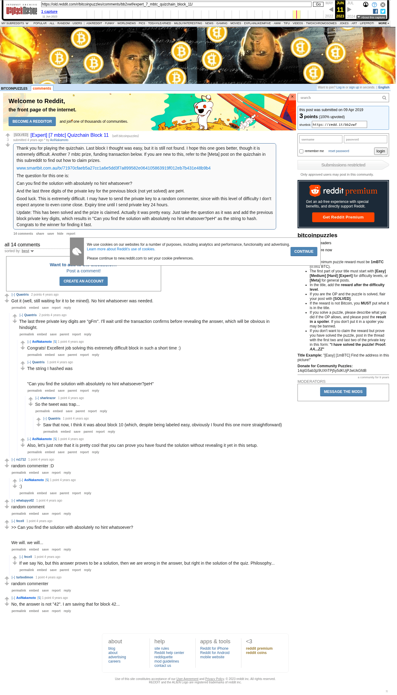

# [Expert] [7 mbtc] Quizchain Block 11

[Original thread](https://www.reddit.com/r/bitcoinpuzzles/comments/bb2vwf/expert_7_mbtc_quizchain_block_11/). The `sourceUrl` of the [quizchain/11](../../../src/collections/quizchain/11.ts) record and the source of two of its hints and the funding transaction, with the solution the author edited in. The post went up on April 9, 2019, at 03:04:09 UTC, 24 seconds before the block time of its funding transaction. Its last edit is stamped 04:10:04 UTC on April 9, 2019, so the transcript shows the post as it stood after the claim.

## Historical provenance

The Wayback Machine holds one capture of the `old.reddit.com` URL and one of the `www.reddit.com` URL. Provenance rests on the [old.reddit.com capture](https://web.archive.org/web/20230611182209/https://old.reddit.com/r/bitcoinpuzzles/comments/bb2vwf/expert_7_mbtc_quizchain_block_11/), stamped June 11, 2023, 18:22:09 UTC, whose HTML carries the post, which matches the transcript below word for word. It renders 14 comments, and each matches the Arctic Shift record of the same ID by author and text. Only the markdown of links and lists renders differently. The capture was read on September 27, 2026. `archive_content: confirmed` on that basis.

The [Arctic Shift](https://arctic-shift.photon-reddit.com/) Reddit archive, read the same day, lists 16 comments, two of which the capture does not render: deleted ones and replies behind a "load more" link. The transcript takes every comment, its author, text and score from Arctic Shift and nests them as the capture does. One of them is a deleted comment, kept below as `[deleted]`.

The record names none of the commenters: nothing on the chain ties a claim to a name.

## Transcript

> Thank you for playing the quizchain. Last block I thought was easy, but it is still not found. I hope this one goes better, though it is extremely difficult. Another 7 mbtc prize, funding transaction below. If you are new to this, refer to the [Meta] post on the quizchain in this subreddit to find out how to claim prizes.
>
> www.smartbit.com.au/tx/71970cfaeb5a27cc1a6e5dd3f7a899582e064105863919f012eb7b431e48b9b4
>
> The question for this one is:
>
> Can you find the solution with absolutely no hint whatsoever?
>
> And the last three digits of the private key for the previous block (not yet solved) are peH.
>
> Good luck. This is extremely difficult. I may have to send the private key to a random commenter, since with this level of difficulty I don't expect anyone to even come close. Expiry time until I send private key 24 hours.
>
> Update: This has been solved and the prize is claimed. Actually it was pretty easy. Just take the question as it was and add the previous block private key digits, which results in "Can you find the solution with absolutely no hint whatsover?peH" as the string to hash. Congrats to the winner for finding it fast.

## Comments

**u/Quantris**, 2 points:

> Got it (well, still waiting for it to be mined). No hint whatsoever was needed.

**u/Quantris**, 2 points, reply to u/Quantris:

> The last three private key digits are "gFm". I'll wait until the transaction confirms before revealing the answer, which will be obvious in hindsight.

**u/AoiNakamoto**, 1 point, reply to u/Quantris:

> Congrats! Excellent job solving this extremely difficult block in such a short time :)

**u/Quantris**, 1 point, reply to u/Quantris:

> The string I hashed was
>
> "Can you find the solution with absolutely no hint whatsoever?peH"

**u/sharkrazor**, 1 point, reply to u/Quantris:

> So the tweet was trap...

**u/Quantris**, 1 point, reply to u/sharkrazor:

> Saw that now, I think it was about block 10 (which, despite being labeled easy, obviously I found this one more straightforward)

**u/AoiNakamoto**, 1 point, reply to u/Quantris:

> Also, let's just note that it is pretty cool that you can prove you have found the solution without revealing it yet in this setup.

**u/rs1712**, 1 point:

> random commenter :D

**u/AoiNakamoto**, 1 point, reply to u/rs1712:

> :)

**u/whatupyo02**, 1 point:

> random comment

**u/fecell**, 1 point:

> > > Can you find the solution with absolutely no hint whatsoever?
>
> We will. we will...

**u/fecell**, 1 point, reply to u/fecell:

> If we say No, but this answer proves to be a solution, then we are wrong in the answer, but right in the solution of the quiz. Philosophy...

**u/turbodimon**, 1 point:

> random commenter

**u/AoiNakamoto**, 1 point:

> No, the answer is not "42". I am saving that for block 42...

**u/tarje**, 1 point:

> random comment- error, out of entropy

**[deleted]**:

> [deleted]

## Screenshot

The screenshot is a render of the archive capture, not of the live page, so it carries the Wayback banner at the top. The "4 years ago" stamps are relative to the capture, June 11, 2023. Capture method and limits: [source archive](../README.md).
