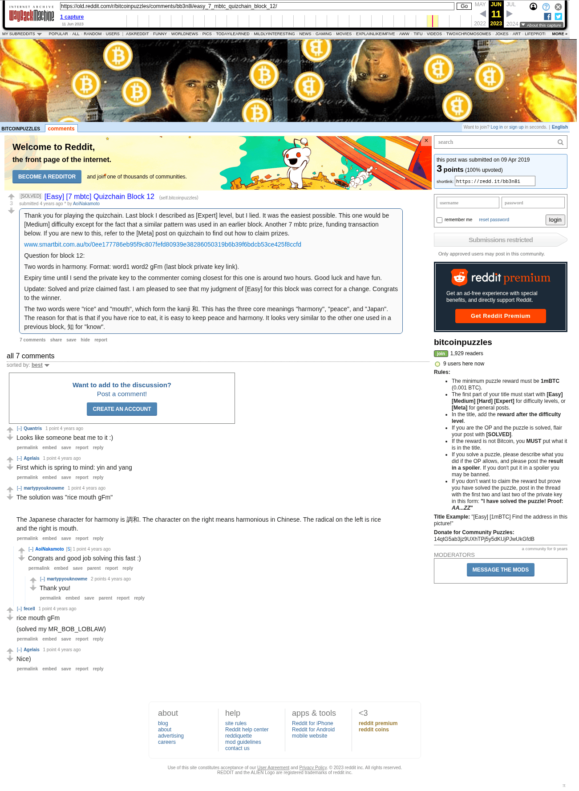

# [Easy] [7 mbtc] Quizchain Block 12

[Original thread](https://www.reddit.com/r/bitcoinpuzzles/comments/bb3n8i/easy_7_mbtc_quizchain_block_12/). The `sourceUrl` of the [quizchain/12](../../../src/collections/quizchain/12.ts) record and the source of its question and the funding transaction, with the solution the author edited in. The post went up on April 9, 2019, at 04:30:15 UTC, 6 minutes after the block time of its funding transaction. Its last edit is stamped 05:10:07 UTC on April 9, 2019, so the transcript shows the post as it stood after the claim.

## Historical provenance

The Wayback Machine holds one capture of the `old.reddit.com` URL and one of the `www.reddit.com` URL. Provenance rests on the [old.reddit.com capture](https://web.archive.org/web/20230611074439/https://old.reddit.com/r/bitcoinpuzzles/comments/bb3n8i/easy_7_mbtc_quizchain_block_12/), stamped June 11, 2023, 07:44:39 UTC, whose HTML carries the post, which matches the transcript below word for word. It renders seven comments, and each matches the Arctic Shift record of the same ID by author and text. Only the markdown of links and lists renders differently. The capture was read on September 27, 2026. `archive_content: confirmed` on that basis.

The [Arctic Shift](https://arctic-shift.photon-reddit.com/) Reddit archive, read the same day, lists the same seven comments. The transcript takes authors, text and scores from it and nests the comments as the capture does.

The record names none of the commenters: nothing on the chain ties a claim to a name.

## Transcript

> Thank you for playing the quizchain. Last block I described as [Expert] level, but I lied. It was the easiest possible. This one would be [Medium] difficulty except for the fact that a similar pattern was used in an earlier block. Another 7 mbtc prize, funding transaction below. If you are new to this, refer to the [Meta] post on quizchain to find out how to claim prizes.
>
> www.smartbit.com.au/tx/0ee177786eb95f9c807fefd80939e38286050319b6b39f6bdcb53ce425f8ccfd
>
> Question for block 12:
>
> Two words in harmony. Format: word1 word2 gFm (last block private key link).
>
> Expiry time until I send the private key to the commenter coming closest for this one is around two hours. Good luck and have fun.
>
> Update: Solved and prize claimed fast. I am pleased to see that my judgment of [Easy] for this block was correct for a change. Congrats to the winner.
>
> The two words were "rice" and "mouth", which form the kanji 和. This has the three core meanings "harmony", "peace", and "Japan". The reason for that is that if you have rice to eat, it is easy to keep peace and harmony. It looks very similar to the other one used in a previous block, 知 for "know".

## Comments

**u/Quantris**, 1 point:

> Looks like someone beat me to it :)

**u/Agelais**, 1 point:

> First which is spring to mind: yin and yang

**u/martypyouknowme**, 1 point:

> The solution was "rice mouth gFm"
>
> The Japanese character for harmony is 調和. The character on the right means harmonious in Chinese. The radical on the left is rice and the right is mouth.

**u/AoiNakamoto**, 1 point, reply to u/martypyouknowme:

> Congrats and good job solving this fast :)

**u/martypyouknowme**, 2 points, reply to u/AoiNakamoto:

> Thank you!

**u/fecell**, 1 point:

> rice mouth gFm
>
> (solved my MR\_BOB\_LOBLAW)

**u/Agelais**, 1 point:

> Nice)

## Screenshot

The screenshot is a render of the archive capture, not of the live page, so it carries the Wayback banner at the top. The "4 years ago" stamps are relative to the capture, June 11, 2023. Capture method and limits: [source archive](../README.md).
