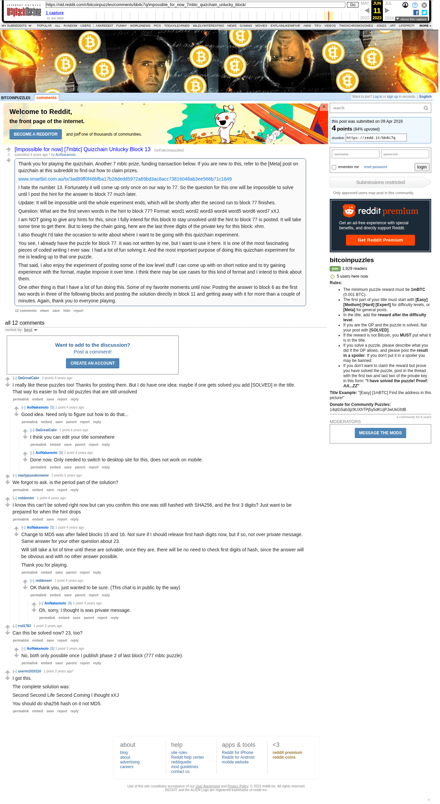

# [Impossible for now] [7mbtc] Quizchain Unlucky Block 13

[Original thread](https://www.reddit.com/r/bitcoinpuzzles/comments/bb4c7q/impossible_for_now_7mbtc_quizchain_unlucky_block/). The `sourceUrl` of the [quizchain/13](../../../src/collections/quizchain/13.ts) record and the source of two of its hints and the funding transaction. The post went up on April 9, 2019, at 05:59:05 UTC, 14 minutes after the block time of its funding transaction. Its last edit is stamped 13:18:46 UTC on May 11, 2019.

## Historical provenance

The Wayback Machine holds one capture of the `old.reddit.com` URL and one of the `www.reddit.com` URL. Provenance rests on the [old.reddit.com capture](https://web.archive.org/web/20230611110221/https://old.reddit.com/r/bitcoinpuzzles/comments/bb4c7q/impossible_for_now_7mbtc_quizchain_unlucky_block/), stamped June 11, 2023, 11:02:21 UTC, whose HTML carries the post, which matches the transcript below word for word. It renders 12 comments, and each matches the Arctic Shift record of the same ID by author and text. Only the markdown of links and lists renders differently. The capture was read on September 27, 2026. `archive_content: confirmed` on that basis.

The [Arctic Shift](https://arctic-shift.photon-reddit.com/) Reddit archive, read the same day, lists 13 comments, one of which the capture does not render. The transcript takes every comment, its author, text and score from Arctic Shift and nests them as the capture does.

The record names none of the commenters: nothing on the chain ties a claim to a name.

## Transcript

> Thank you for playing the quizchain. Another 7 mbtc prize, funding transaction below. If you are new to this, refer to the [Meta] post on quizchain at this subreddit to find out how to claim prizes.
>
> www.smartbit.com.au/tx/3ad89ff0f48bfba17b28dedd5972a69bd3ac8acc73816048ab3ee566b71c1849
>
> I hate the number 13. Fortunately it will come up only once on our way to 77. So the question for this one will be impossible to solve until I post the hint for the answer to block 77 much later.
>
> Update: It will be impossible until the whole experiment ends, which will be shortly after the second run to block 77 finishes.
>
> Question: What are the first seven words in the hint to block 77? Format: word1 word2 word3 word4 word5 word6 word7 xXJ.
>
> I am NOT going to give any hints for this, since I fully intend for this block to stay unsolved until the hint to block 77 is posted. It will take some time to get there. But to keep the chain going, here are the last three digits of the private key for this block: xhm.
>
> I also thought I'd take the occasion to write about where I want to be going with this quizchain experiment.
>
> You see, I already have the puzzle for block 77. It was not written by me, but I want to use it here. It is one of the most fascinating pieces of coded writing I ever saw. I had a lot of fun solving it. And the most important purpose of doing this quizchain experiment for me is leading up to that one puzzle.
>
> That said, I also enjoy the experiment of posting some of the low level stuff I can come up with on short notice and to try gaining experience with the format, maybe improve it over time. I think there may be use cases for this kind of format and I intend to think about them.
>
> One other thing is that I have a lot of fun doing this. Some of my favorite moments until now: Posting the answer to block 6 as the first two words in three of the following blocks and posting the solution directly in block 11 and getting away with it for more than a couple of minutes. Again, thank you to everyone playing.

## Comments

**u/DaGreatCake**, 2 points:

> I really like these puzzles too! Thanks for posting them. But I do have one idea: maybe if one gets solved you add [SOLVED] in the title. That way its easier to find old puzzles that are still unsolved

**u/AoiNakamoto**, 1 point, reply to u/DaGreatCake:

> Good idea. Need only to figure out how to do that...

**u/DaGreatCake**, 1 point, reply to u/AoiNakamoto:

> I think you can edit your title somewhere

**u/AoiNakamoto**, 1 point, reply to u/AoiNakamoto:

> Done now. Only needed to switch to desktop site for this, does not work on mobile.

**u/martypyouknowme**, 2 points:

> We forgot to ask. is the period part of the solution?

**u/reddeneer**, 1 point:

> I know this can't be solved right now but can you confirm this one was still hashed with SHA256, and the first 3 digits? Just want to be prepared for when the hint drops

**u/AoiNakamoto**, 1 point, reply to u/reddeneer:

> Change to MD5 was after failed blocks 15 and 16. Not sure if I should release first hash digits now, but if so, not over private message. Same answer for your other question about 23.
>
> Will still take a lot of time until these are solvable, once they are, there will be no need to check first digits of hash, since the answer will be obvious and with no other answer possible.
>
> Thank you for playing.

**u/reddeneer**, 1 point, reply to u/AoiNakamoto:

> OK thank you, just wanted to be sure. (This chat is in public by the way)

**u/AoiNakamoto**, 1 point, reply to u/reddeneer:

> Oh, sorry, I thought is was private message.

**u/rnd1783**, 1 point:

> Can this be solved now? 23, too?

**u/AoiNakamoto**, 1 point, reply to u/rnd1783:

> No, both only possible once I publish phase 2 of last block (777 mbtc puzzle).

**u/userm1010110**, 1 point:

> I got this.
>
> The complete solution was:
>
> Second Second Life Second Coming I thought xXJ
>
> You should do sha256 hash on it not MD5.

**u/pogob**, 1 point:

> How long did it take you to solve the puzzle that will be block 77?

## Screenshot

The screenshot is a render of the archive capture, not of the live page, so it carries the Wayback banner at the top. The "4 years ago" stamps are relative to the capture, June 11, 2023. Capture method and limits: [source archive](../README.md).
