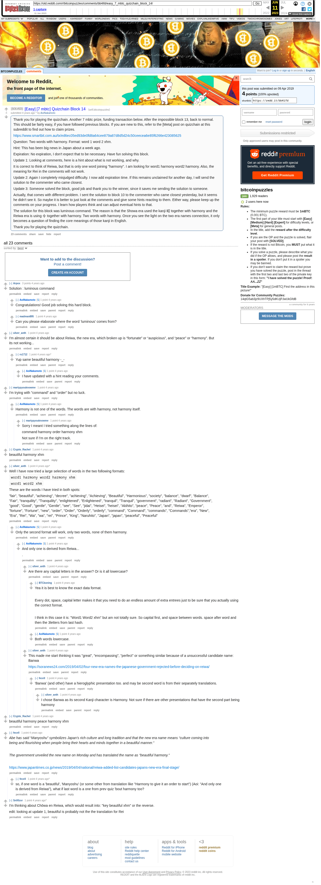

# [Easy] [7 mbtc] Quizchain Block 14

[Original thread](https://www.reddit.com/r/bitcoinpuzzles/comments/bb4ifd/easy_7_mbtc_quizchain_block_14/). The `sourceUrl` of the [quizchain/14](../../../src/collections/quizchain/14.ts) record and the source of three of its hints and the funding transaction, with the solution the author edited in. The post went up on April 9, 2019, at 06:21:35 UTC, 9 minutes before the block time of its funding transaction. Its last edit is stamped 22:54:50 UTC on April 9, 2019, so the transcript shows the post as it stood after the claim.

## Historical provenance

The Wayback Machine holds one capture of the `old.reddit.com` URL and one of the `www.reddit.com` URL. Provenance rests on the [old.reddit.com capture](https://web.archive.org/web/20230611112909/https://old.reddit.com/r/bitcoinpuzzles/comments/bb4ifd/easy_7_mbtc_quizchain_block_14/), stamped June 11, 2023, 11:29:09 UTC, whose HTML carries the post, which matches the transcript below word for word. It renders 23 comments, and each matches the Arctic Shift record of the same ID by author and text. Only the markdown of links and lists renders differently. The capture was read on September 27, 2026. `archive_content: confirmed` on that basis.

The [Arctic Shift](https://arctic-shift.photon-reddit.com/) Reddit archive, read the same day, lists 24 comments, one of which the capture does not render. The transcript takes every comment, its author, text and score from Arctic Shift and nests them as the capture does. One of them is a deleted comment, kept below as `[deleted]`.

The record names none of the commenters: nothing on the chain ties a claim to a name.

## Transcript

> Thank you for playing the quizchain. Another 7 mbtc prize, funding transaction below. After the impossible block 13, back to normal. This should be fairly easy, if you have followed previous blocks. If you are new to this, refer to the [Meta] post on quizchain at this subreddit to find out how to claim prizes.
>
> https://www.smartbit.com.au/tx/ed6ec05ed93de0fd8a64cee879a87d8d5d24c50ceecea6e85f6266e423085625
>
> Question: Two words with harmony. Format: word 1 word 2 xhm.
>
> Hint: This has been big news in Japan about a week ago.
>
> Expiration: No expiration, I don't expect that to be necessary. Have fun solving this block.
>
> Update 1: Looking at comments, here is a hint about what is not working, and why.
>
> It is correct to think of Reiwa, but that is only one word joining "harmony". I am looking for word1 harmony word2 harmony. Also, the meaning for Rei in the comments will not work.
>
> Update 2: Again I completely misjudged difficulty. I now add expiration time. If this remains unclaimed for another day, I will send the solution to the commenter who came closest.
>
> Update 3: Someone solved the block, good job and thank you to the winner, since it saves me sending the solution to someone.
>
> Actually, that comes with different problem. I sent the solution to block 10 to the commenter who came closest yesterday, but it seems he didn't see it. So maybe it is better to just look at the comments and give some hints reacting to them. Either way, please keep up the comments on your progress. I learn how players think and can adjust eventual hints to that.
>
> The solution for this block was luminous command. The reason is that the Showa era used the kanji 昭 together with harmony and the Reiwa era is using 令 together with harmony. Two words with harmony. Once you see the light on the two era names connection, it only becomes a question of finding the core meanings of those kanji in English.
>
> Thank you for playing the quizchain.

## Comments

**u/Arpox**, 3 points:

> Solution : luminous command

**u/AoiNakamoto**, 1 point, reply to u/Arpox:

> Congratulations! Good job solving this hard block.

**u/madman895**, 1 point, reply to u/Arpox:

> Can you please elaborate where the word ‘luminous’ comes from?

**u/silver_anth**, 1 point:

> I'm almost certain it should be about Reiwa, the new era, which broken up is “fortunate” or “auspicious”, and “peace” or “harmony”. But its not working...

**u/rs1712**, 1 point, reply to u/silver_anth:

> Yup same
> beautiful harmony -_-

**u/AoiNakamoto**, 1 point, reply to u/rs1712:

> I have updated with a hint reading your comments.

**[deleted]**, reply to u/rs1712:

> [deleted]

**u/martypyouknowme**, 1 point:

> I'm trying with "command" and "order" but no luck.

**u/AoiNakamoto**, 1 point, reply to u/martypyouknowme:

> Harmony is not one of the words. The words are with harmony, not harmony itself.

**u/martypyouknowme**, 1 point, reply to u/AoiNakamoto:

> Sorry I meant I tried something along the lines of:
>
> command harmony order harmony xhm
>
> Not sure if I’m on the right track.

**u/Crypto_Rachel**, 1 point:

> beautiful _harmony_ xhm

**u/silver_anth**, 1 point:

> Well I have now tried a large selection of words in the two following formats:
>
> `word1 harmony word2 harmony xhm`
>
> `word1 word2 xhm`
>
> These are the words I have tried in both spots:
>
> "fair", "beautiful", "achieving", "decree", "achieving", "Achieving", "Beautiful", "Harmonious", "society", "balance", "dwarf", "Balance", "Fair", "tranquility", "Tranquility", "enlightened", "Enlightened", "tranquil", "Tranquil", "government", "radiant", "Radiant", "Government", "good", "Good", "gentle", "Gentle", "see", "See", "jidai", "Heisei", "heisei", "Akihito", "peace", "Peace", "and", "Reiwa", "Emperor", "fortune", "Fortune", "new", "order", "Order", "Orderly", "orderly", "command", "Command", "commands", "Commands","era", "New", "Era", "Rei", "Wa", "wa", "rei", "Prince", "King", "Naruhito", "Japan", "japan", "peaceful", "Peaceful"

**u/AoiNakamoto**, 1 point, reply to u/silver_anth:

> Only the second format will work, only two words, none of them harmony.

**u/AoiNakamoto**, 1 point, reply to u/AoiNakamoto:

> And only one is derived from Reiwa...
>
> .

**u/silver_anth**, 1 point, reply to u/AoiNakamoto:

> Are there any capital letters in the answer? Or is it all lowercase?

**u/BTCkoning**, 1 point, reply to u/silver_anth:

> Yea it is best to know the exact data format.
>
> Every dot, space, capital letter makes it that you need to do an endless amount of extra entrees just to be sure that you actually using the correct format.
>
> I think in this case it is: "Word1 Word2 xhm" but am not totally sure. So capital first, and space between words. space after word and then the 3letters from last hash.

**u/AoiNakamoto**, 1 point, reply to u/silver_anth:

> Both words lowercase.

**u/silver_anth**, 1 point, reply to u/AoiNakamoto:

> This made me start thinking it was "great", "encompassing", "perfect" or something similar because of a unsuccessful candidate name: Banwa
>
> https://soranews24.com/2019/04/02/four-new-era-names-the-japanese-government-rejected-before-deciding-on-reiwa/

**u/fecell**, 1 point, reply to u/silver_anth:

> 'Banwa' (and other) have a hieroglyphic presentation too. and may be second word is from their separately translations.

**u/silver_anth**, 1 point, reply to u/fecell:

> I chose Banwa as its second Kanji character is Harmony. Not sure if there are other presentations that have the second part being harmony

**u/Crypto_Rachel**, 1 point:

> beautiful harmony peace harmony xhm

**u/fecell**, 1 point:

> _Abe has said “Manyoshu” symbolizes Japan’s rich culture and long tradition and that the new era name means “culture coming into being and flourishing when people bring their hearts and minds together in a beautiful manner.”_
>
> _The government unveiled the new name on Monday and has translated the name as “beautiful harmony.”_
>
> [https://www.japantimes.co.jp/news/2019/04/04/national/reiwa-added-list-candidates-japans-new-era-final-stage/](https://www.japantimes.co.jp/news/2019/04/04/national/reiwa-added-list-candidates-japans-new-era-final-stage/)

**u/fecell**, 1 point, reply to u/fecell:

> so, if one word is a 'beautiful', 'Manyoshu' (or some other from translation like "Harmony to give it an order to start") (Aoi: "And only one is derived from Reiwa"), what if last word is a one from prev quiz 'bout harmony too?

**u/Sn00zor**, 1 point:

> I'm thinking about Chōwa en Reiwa, which would result into:
> "key beautiful xhm" or the reverse.
>
> edit: looking at update 1, beautiful is probably not the the translation for Rei

## Screenshot

The screenshot is a render of the archive capture, not of the live page, so it carries the Wayback banner at the top. The "4 years ago" stamps are relative to the capture, June 11, 2023. Capture method and limits: [source archive](../README.md).
