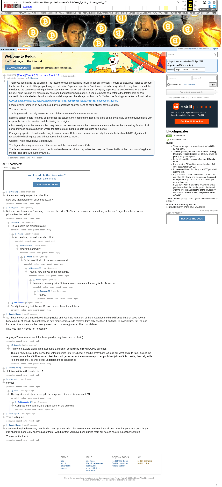

# [Easy] [7 mbtc] Quizchain Block 15

[Original thread](https://www.reddit.com/r/bitcoinpuzzles/comments/bb7q8r/easy_7_mbtc_quizchain_block_15/). The `sourceUrl` of the [quizchain/15](../../../src/collections/quizchain/15.ts) record and the source of three of its hints and the funding transaction, with the solution the author edited in. The post went up on April 9, 2019, at 13:07:35 UTC, 4 minutes after the block time of its funding transaction. Its last edit is stamped 03:54:51 UTC on April 10, 2019, so the transcript shows the post as it stood after the claim.

## Historical provenance

The Wayback Machine holds one capture of the `old.reddit.com` URL and one of the `www.reddit.com` URL. Provenance rests on the [old.reddit.com capture](https://web.archive.org/web/20230611171702/https://old.reddit.com/r/bitcoinpuzzles/comments/bb7q8r/easy_7_mbtc_quizchain_block_15/), stamped June 11, 2023, 17:17:02 UTC, whose HTML carries the post, which matches the transcript below word for word. It renders 18 comments, and each matches the Arctic Shift record of the same ID by author and text. Only the markdown of links and lists renders differently. The capture was read on September 27, 2026. `archive_content: confirmed` on that basis.

The [Arctic Shift](https://arctic-shift.photon-reddit.com/) Reddit archive, read the same day, lists 19 comments, one of which the capture does not render. The transcript takes every comment, its author, text and score from Arctic Shift and nests them as the capture does. One of them is a deleted comment, kept below as `[deleted]`.

The record names none of the commenters: nothing on the chain ties a claim to a name.

## Transcript

> Thank you for playing the quizchain. The last block was a resounding failure in design. I thought it would be easy; but I failed to account for the fact that most of the people trying are not native Japanese speakers. So it turned out to be very difficult. I may have to send the solution to the commenter who got the closest tomorrow. I think I will refrain from using any Japanese language theme for the time being. I hope this one will prove really easy and I am not misjudging again. If you are new to this, refer to the [Meta] post on this subreddit for a detailed explanation on how to claim a prize. Like always this block is for 7 mbtc, the funding transaction is found below.
>
> www.smartbit.com.au/tx/28c827328eda7da662349f363deb359c35425227c664d63fd39d90e447200342
>
> I had a similar theme in an earlier block. I give a sentence and you need to edit it slightly for the solution.
>
> The sentence is
>
> The longest chain not only serves as proof of the sequence of the events witnessed
>
> Remove certain letters from that sentence for the solution, then append the last three digits of the private key of the previous block, with a space between the solution and the linking three digits.
>
> Of course right now the main problem may be that the previous block is hard to solve and no one knows the private key for that block, so we may see again a situation where the first to crack that block gets this prize as a bonus.
>
> Emergency update: I found another way to screw this up. Delivery on this one works only if you do the hash with MD5 algorithm. I restarted the hashing app and did not notice that it reset to MD5...
>
> Update: This is solved now. Solution was
>
> The lngest chn nt nly serves s prf f the sequence f the events wtnessed ZNb
>
> The letters removed are A, O, and I, as in my handle name. Hint on my twitter feed was the "Satoshi without the consonants" tagline at the top. This time without the vowels...

## Comments

**u/BTCkoning**, 2 points:

> Someone actually swiped the other block..
>
> Now only that person can solve this puzzle?

**u/silver_anth**, 1 point:

> Not sure how this one isn't working, I removed the extra "the" from the sentence, then adding in the last 3 digits from the previous private key, but no luck...

**u/0xNick**, 1 point, reply to u/silver_anth:

> Did you solve the previous block?

**u/rs1712**, 1 point, reply to u/0xNick:

> No he didnt, but we know who did :D

**u/Deminero30**, 1 point, reply to u/rs1712:

> What's the answer?

**u/Arpox**, 1 point, reply to u/Deminero30:

> Solution of block 14 : luminous command

**u/Deminero30**, 1 point, reply to u/Arpox:

> Thanks, how did you come about this?

**u/Arpox**, 1 point, reply to u/Deminero30:

> Luminous harmony is the Shōwa era and command harmony is the Reiwa era.

**u/Deminero30**, 1 point, reply to u/Arpox:

> Thanks.

**u/AoiNakamoto**, 1 point, reply to u/silver_anth:

> Good job noticing that, but no. Do not remove those three letters.

**u/Crypto_Rachel**, 1 point:

> So I hate to even ask, I have loved these puzzles and you have kept most of them at a good medium difficulty, but that does have a huge amount of possibilities not knowing how many characters to remove. If it's only one then it isn't bad, 68 possibilities, But I'm sure it's more. If it's more than five that's (correct me if I'm wrong) over 1 trillion possibilities.
>
> If it's less than 4 maybe not necessary.
>
> Anyways Thank You so much for these puzzles they have been a blast :)

**u/Quantris**, 1 point, reply to u/Crypto_Rachel:

> It's more of a word game thing; just trying a bunch of possibilities isn't what OP is going for.
>
> Though I'm with you in the sense that without getting into OP's head, it can be pretty hard to figure out what angle to take. It's just the style of puzzle that OP likes to set. I feel like it will get easier as there are more puzzles published (since OP is creating them all, aside from the last one), as we'll better understand their sensibilities

**u/QuickyGaming**, 1 point:

> Solution to this yet? Needed for 17

**u/silver_anth**, 1 point:

> solved!

**u/fecell**, 1 point, reply to u/silver_anth:

> The lngest chn nt nly serves s prf f the sequence f the events wtnessed ZNb

**u/AoiNakamoto**, 1 point, reply to u/fecell:

> Congrats to the winner, and again sorry for the screwup.

**u/whatupyo02**, 1 point:

> This is killing me

**u/Crypto_Rachel**, 1 point:

> I can only imagine how many people tried that. :) I know I did, plus atleast a few on discord. It's all good Sh\*t happens lol a good laugh. it is what it is. I am really enjoying all of them. With how fast you have been putting them out no one should expect perfection :) .
>
> Thanks for the fun :)

**[deleted]**:

> [deleted]

## Screenshot

The screenshot is a render of the archive capture, not of the live page, so it carries the Wayback banner at the top. The "4 years ago" stamps are relative to the capture, June 11, 2023. Capture method and limits: [source archive](../README.md).
