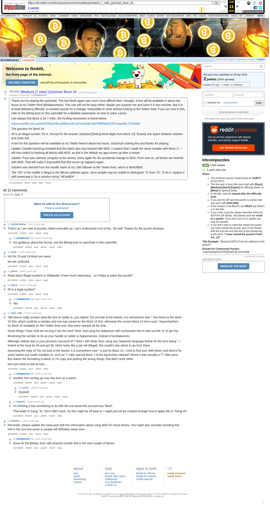

# [Medium] [7 mbtc] Quizchain Block 16

[Original thread](https://www.reddit.com/r/bitcoinpuzzles/comments/bbeuye/medium_7_mbtc_quizchain_block_16/). The `sourceUrl` of the [quizchain/16](../../../src/collections/quizchain/16.ts) record and the source of two of its hints and the funding transaction, with the solution the author edited in. The post went up on April 9, 2019, at 23:18:09 UTC, 13 minutes before the block time of its funding transaction. Its last edit is stamped 05:26:28 UTC on April 10, 2019.

## Historical provenance

The Wayback Machine holds one capture of the `old.reddit.com` URL and one of the `www.reddit.com` URL. Provenance rests on the [old.reddit.com capture](https://web.archive.org/web/20230611122311/https://old.reddit.com/r/bitcoinpuzzles/comments/bbeuye/medium_7_mbtc_quizchain_block_16/), stamped June 11, 2023, 12:23:11 UTC, whose HTML carries the post, which matches the transcript below word for word. It renders 12 comments, and each matches the Arctic Shift record of the same ID by author and text. Only the markdown of links and lists renders differently. The capture was read on September 27, 2026. `archive_content: confirmed` on that basis.

The [Arctic Shift](https://arctic-shift.photon-reddit.com/) Reddit archive, read the same day, lists the same 12 comments. The transcript takes authors, text and scores from it and nests the comments as the capture does.

The record names none of the commenters: nothing on the chain ties a claim to a name.

## Transcript

> Thank you for playing the quizchain. The last block again was much more difficult than I thought. A hint will be available in about two hours at my Twitter feed @NakamotoAoi. This one will not be easy either. Maybe you surprise me and solve it in two minutes. But it is at least [Medium] difficulty. A numbers puzzle for a change. Impossible to solve without looking at the Twitter feed. If you are new to this, refer to the [Meta] post on this subreddit for a detailed explanation on how to claim a prize.
>
> Like always this block is for 7 mbtc, the funding transaction is found below.
>
> www.smartbit.com.au/tx/602f53a24fecdb5face4b1ed7eecfa9e7ab78f995eb015f074aac89c7332968c
>
> The question for block 16:
>
> 40 is an illegal number. Fix it. Format for the answer: [solution] [linking three digits from block 15]. Exactly one space between solution and chain link.
>
> A hint for this question will be available at my Twitter feed in about two hours. Good luck solving this and thanks for playing.
>
> Update: Double-checking revealed that this block also was hashed with MD5. I suspect that I made the same mistake with block 17. I will now switch to hashing all blocks with MD5, as that is the default my app comes up after a restart.
>
> Update: Prize was claimed, congrats to the winner. Sorry again for the accidental change to MD5. From now on, all blocks are hashed with MD5. That will make it impossible that this screw up happens again.
>
> Solution was derived from the handle name of my 16th follower at the Twitter feed, which is HE4OBEK.
>
> The "4O" in the middle is illegal in the Bitcoin address space, since people may be unable to distinguish "0" from "O". To fix it, replace it with lowercase o, for a solution string "HE4oBEK".

## Comments

**u/QuickyGaming**, 1 point:

> Tried it as I am new to puzzles, failed miserably as I can't understand a lot of this. Oh well. Thanks for the puzzle anyways.

**u/AoiNakamoto**, 2 points, reply to u/QuickyGaming:

> For guidance about the format, see the [Meta] post on quizchain in this subreddit.

**u/fecell**, 1 point:

> hint for 15 and 16 block are same.
>
> we are confused..

**u/jnkred**, 1 point:

> Read about illegal numbers in Wikipedia. Knew much interesting... Is it helps to solve this puzzle?

**u/jnkred**, 1 point:

> 55 is a legal number?

**u/AoiNakamoto**, 1 point, reply to u/jnkred:

> Yes.

**u/silver_anth**, 1 point:

> Still seems really unclear what the hint on twitter is, you replied "Do not look at the tweets, it is somewhere else." Two times to the block 15 hint, which could be a mistake and one was meant for the block 16 hint, otherwise the current block 16 hint is just: "#quizchainhint for block 16 available on this Twitter feed now. Was there already all the time..."
>
> Some things I have tried are turning it into the word "forty" and using the Nakamoto with consonants hint to take out the "o" to get frty.
>
> Reversing the number to 04 as your handle on twitter is NakamotoAoi, instead of AoiNakamoto.
>
> Although unlikely due to your previous comment of "I think I will refrain from using any Japanese language theme for the time being.". I looked at the kanji for 40 and got 卌, which looks like a jail cell (illegal). But couldn't see where to go from there.
>
> Assuming the reply of "Do not look at the tweets, it is somewhere else." is just for block 15, I tried to find your 40th tweet, and tried to fix some tweets you made mistakes in, such as "7 mbtc special block 7 of the #quizchain claimed" where it was actually a 77 mbtc prize. But unless the formatting is weird, or I'm copy and pasting the wrong things, that didn't work either.
>
> Not sure what to look at now.....

**u/AoiNakamoto**, 1 point, reply to u/silver_anth:

> Another hint coming up now, this time as a tweet...

**u/rs1712**, 1 point, reply to u/AoiNakamoto:

> Soulved

**u/Quantris**, 1 point, reply to u/silver_anth:

> I'm thinking it has somethiing to do with the one tweet this account has "liked".
>
> That leads to trying "4L" but it didn't work. So this might be off base or I might just not be creative enough how to apply this to "fixing 40"

**u/Quantris**, 1 point:

> Reminder: please update the meta-post with this information about using MD5 for future blocks. You might also consider including this info in the next few posts or people will definitely waste time.

**u/AoiNakamoto**, 1 point, reply to u/Quantris:

> Done for the [Meta]. And I will certainly include that in the next couple of blocks.

## Screenshot

The screenshot is a render of the archive capture, not of the live page, so it carries the Wayback banner at the top. The "4 years ago" stamps are relative to the capture, June 11, 2023. Capture method and limits: [source archive](../README.md).
