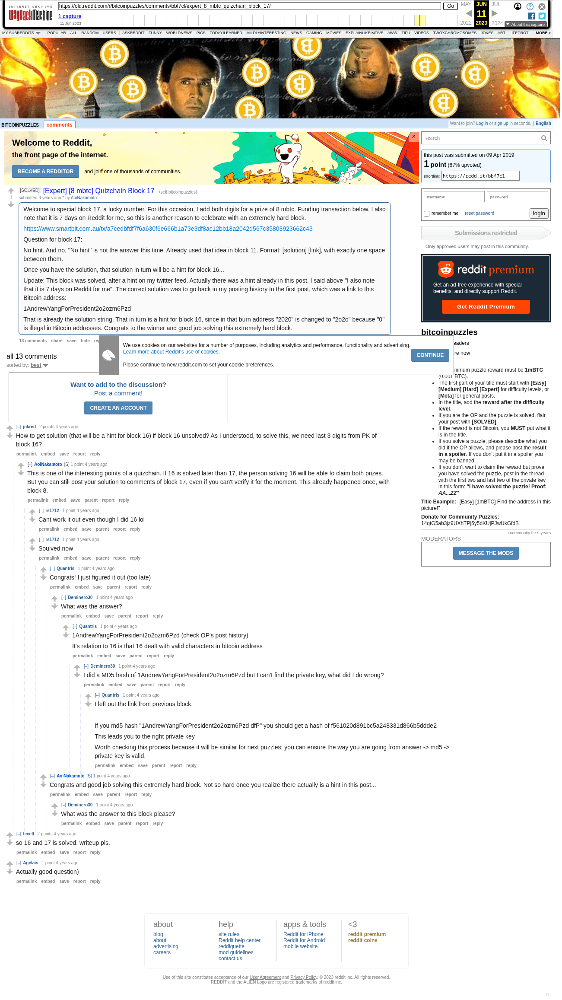

# [Expert] [8 mbtc] Quizchain Block 17

[Original thread](https://www.reddit.com/r/bitcoinpuzzles/comments/bbf7cl/expert_8_mbtc_quizchain_block_17/). The `sourceUrl` of the [quizchain/17](../../../src/collections/quizchain/17.ts) record and the source of three of its hints and the funding transaction, with the solution the author edited in. The post went up on April 9, 2019, at 23:51:36 UTC, 9 minutes after the block time of its funding transaction. Its last edit is stamped 06:10:17 UTC on April 10, 2019, so the transcript shows the post as it stood after the claim.

## Historical provenance

The Wayback Machine holds one capture of the `old.reddit.com` URL and one of the `www.reddit.com` URL. Provenance rests on the [old.reddit.com capture](https://web.archive.org/web/20230611080338/https://old.reddit.com/r/bitcoinpuzzles/comments/bbf7cl/expert_8_mbtc_quizchain_block_17/), stamped June 11, 2023, 08:03:38 UTC, whose HTML carries the post, which matches the transcript below word for word. It renders 13 comments, and each matches the Arctic Shift record of the same ID by author and text. Only the markdown of links and lists renders differently. The capture was read on September 27, 2026. `archive_content: confirmed` on that basis.

The [Arctic Shift](https://arctic-shift.photon-reddit.com/) Reddit archive, read the same day, lists the same 13 comments. The transcript takes authors, text and scores from it and nests the comments as the capture does.

The record names none of the commenters: nothing on the chain ties a claim to a name.

## Transcript

> Welcome to special block 17, a lucky number. For this occasion, I add both digits for a prize of 8 mbtc. Funding transaction below. I also note that it is 7 days on Reddit for me, so this is another reason to celebrate with an extremely hard block.
>
> https://www.smartbit.com.au/tx/a7cedbfdf7f6a630f6e666b1a73e3df8ac12bb18a2042d567c35803923662c43
>
> Question for block 17:
>
> No hint. And no, "No hint" is not the answer this time. Already used that idea in block 11. Format: [solution] [link], with exactly one space between them.
>
> Once you have the solution, that solution in turn will be a hint for block 16...
>
> Update: This block was solved, after a hint on my twitter feed. Actually there was a hint already in this post. I said above "I also note that it is 7 days on Reddit for me". The correct solution was to go back in my posting history to the first post, which was a link to this Bitcoin address:
>
> 1AndrewYangForPresident2o2ozm6Pzd
>
> That is already the solution string. That in turn is a hint for block 16, since in that burn address "2020" is changed to "2o2o" because "0" is illegal in Bitcoin addresses. Congrats to the winner and good job solving this extremely hard block.

## Comments

**u/jnkred**, 2 points:

> How to get solution (that will be a hint for block 16) if block 16 unsolved? As I understood, to solve this, we need last 3 digits from PK of block 16?

**u/AoiNakamoto**, 1 point, reply to u/jnkred:

> This is one of the interesting points of a quizchain. If 16 is solved later than 17, the person solving 16 will be able to claim both prizes. But you can still post your solution to comments of block 17, even if you can't verify it for the moment. This already happened once, with block 8.

**u/rs1712**, 1 point, reply to u/AoiNakamoto:

> Cant work it out even though I did 16 lol

**u/rs1712**, 1 point, reply to u/AoiNakamoto:

> Soulved now

**u/Quantris**, 1 point, reply to u/rs1712:

> Congrats! I just figured it out (too late)

**u/Deminero30**, 1 point, reply to u/Quantris:

> What was the answer?

**u/Quantris**, 1 point, reply to u/Deminero30:

> 1AndrewYangForPresident2o2ozm6Pzd (check OP's post history)
>
> It's relation to 16 is that 16 dealt with valid characters in bitcoin address

**u/Deminero30**, 1 point, reply to u/Quantris:

> I did a MD5 hash of 1AndrewYangForPresident2o2ozm6Pzd but I can't find the private key, what did I do wrong?

**u/Quantris**, 1 point, reply to u/Deminero30:

> I left out the link from previous block.
>
> If you md5 hash "1AndrewYangForPresident2o2ozm6Pzd dfP" you should get a hash of f561020d891bc5a248331d866b5ddde2
>
> This leads you to the right private key
>
> Worth checking this process because it will be similar for next puzzles; you can ensure the way you are going from answer -> md5 -> private key is valid.

**u/AoiNakamoto**, 1 point, reply to u/rs1712:

> Congrats and good job solving this extremely hard block. Not so hard once you realize there actually is a hint in this post...

**u/Deminero30**, 1 point, reply to u/AoiNakamoto:

> What was the answer to this block please?

**u/fecell**, 2 points:

> so 16 and 17 is solved. writeup pls.

**u/Agelais**, 1 point:

> Actually good question)

## Screenshot

The screenshot is a render of the archive capture, not of the live page, so it carries the Wayback banner at the top. The "4 years ago" stamps are relative to the capture, June 11, 2023. Capture method and limits: [source archive](../README.md).
