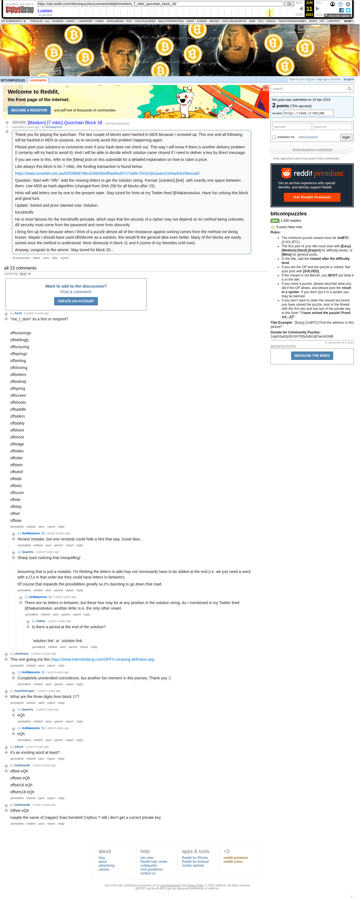

# [Meidum] [7 mbtc] Quizchain Block 18

[Original thread](https://www.reddit.com/r/bitcoinpuzzles/comments/bbij0e/meidum_7_mbtc_quizchain_block_18/). The `sourceUrl` of the [quizchain/18](../../../src/collections/quizchain/18.ts) record and the source of its question and the funding transaction, with the solution the author edited in. The post went up on April 10, 2019, at 05:58:34 UTC, 2 minutes after the block time of its funding transaction. Its last edit is stamped 11:35:54 UTC on April 10, 2019, so the transcript shows the post as it stood after the claim.

## Historical provenance

The Wayback Machine holds one capture of the `old.reddit.com` URL and one of the `www.reddit.com` URL. Provenance rests on the [old.reddit.com capture](https://web.archive.org/web/20230611165401/https://old.reddit.com/r/bitcoinpuzzles/comments/bbij0e/meidum_7_mbtc_quizchain_block_18/), stamped June 11, 2023, 16:54:01 UTC, whose HTML carries the post, which matches the transcript below word for word. It renders 13 comments, and each matches the Arctic Shift record of the same ID by author and text. Only the markdown of links and lists renders differently. The capture was read on September 27, 2026. `archive_content: confirmed` on that basis.

The [Arctic Shift](https://arctic-shift.photon-reddit.com/) Reddit archive, read the same day, lists the same 13 comments. The transcript takes authors, text and scores from it and nests the comments as the capture does.

The record names none of the commenters: nothing on the chain ties a claim to a name.

## Transcript

> Thank you for playing the quizchain. The last couple of blocks were hashed in MD5 because I screwed up. This one and all following will be hashed in MD5 on purpose, so to securely avoid this problem happening again.
>
> Please post your solutions to comments even if your hash does not check out. This way I will know if there is another delivery problem (I certainly will try hard to avoid it). And I will be able to decide which solution came closest if I need to deliver a key by direct message.
>
> If you are new to this, refer to the [Meta] post on this subreddit for a detailed explanation on how to claim a prize.
>
> Like always this block is for 7 mbtc, the funding transaction is found below.
>
> https://www.smartbit.com.au/tx/f299d6796ce34829eeff0a48a45717ad9c7f432c6e2aae21e84a9cb1f8eecabf
>
> Question: Start with "offs". Add the missing letters to get the solution string. Format: [solution] [link]. with exactly one space between them. Use MD5 as hash algorithm (changed from SHA 256 for all blocks after 15).
>
> Hints will add letters one by one to the present state. Stay tuned for hints at my Twitter feed @NakamotoAoi. Have fun solving this block and good luck.
>
> Update: Solved and prize claimed now. Solution:
>
> Kerckhoffs
>
> He is most famous for the Kerckhoffs principle, which says that the security of a cipher may not depend on its method being unknown. All security must come from the password and none from obscurity.
>
> I bring him up here because when I think of a puzzle almost all of the resistance against solving comes from the method not being known. Maybe I should have used sffohkcreK as a solution, this would fit the general idea even better. Many of the blocks are easily solved once the method is understood. Most obviously in block 11 and 6 (some of my favorites until now).
>
> Anyway, congrats to the winner. Stay tuned for block 20...

## Comments

**u/fecell**, 2 points:

> "me\_I\_dum" its a hint or misprint?
>
> offscourings
>
> offsettingly
>
> offscouring
>
> offsprings
>
> offsetting
>
> offshoring
>
> offsetters
>
> offsidesly
>
> offspring
>
> offscreen
>
> offshoots
>
> offsaddle
>
> offsiders
>
> offsidely
>
> offshore
>
> offshoot
>
> offstage
>
> offsides
>
> offsider
>
> offstein
>
> offsetof
>
> offside
>
> offsets
>
> offscum
>
> offsite
>
> offskip
>
> offset
>
> offsaw

**u/AoiNakamoto**, 2 points, reply to u/fecell:

> Honest mistake, but one certainly could hide a hint that way. Good idea...

**u/Quantris**, 1 point, reply to u/fecell:

> Sharp eyes noticing that misspelling!
>
> Assuming that is just a mistake, I'm thinking the letters to add may not necessarily have to be added at the end (i.e. we just need a word with o,f,f,s in that order but they could have letters in-between)
>
> Of course that expands the possibilities greatly so it's daunting to go down that road.

**u/AoiNakamoto**, 1 point, reply to u/Quantris:

> There are no letters in between, but these four may be at any position in the solution string. As I mentioned in my Twitter feed @NakamotoAoi, another letter is e, the only other vowel.

**u/0xNick**, 1 point, reply to u/AoiNakamoto:

> Is there a period at the end of the solution?
>
> \`solution link\` or \`solution link.\`

**u/sharkrazor**, 2 points:

> This one giving me this
> https://www.internetslang.com/OFFS-meaning-definition.asp

**u/AoiNakamoto**, 1 point, reply to u/sharkrazor:

> Completely unintended coincidence, but another fun moment in this journey. Thank you :)

**u/IvayloGeorgiev**, 1 point:

> What are the three digits from block 17?

**u/Quantris**, 1 point, reply to u/IvayloGeorgiev:

> eQh

**u/AoiNakamoto**, 1 point, reply to u/IvayloGeorgiev:

> eQh

**u/jnkred**, 1 point:

> it's an existing word at least?

**u/bulleteyedk**, 1 point:

> offset eQh
>
> offsets eQh
>
> offset18 eQh
>
> offsets18 eQh

**u/bulleteyedk**, 1 point:

> Offset eQh
>
> maybe the name of (rapper) Kiari Kendrell Cephus ? still i don't get a correct private key

## Screenshot

The screenshot is a render of the archive capture, not of the live page, so it carries the Wayback banner at the top. The "4 years ago" stamps are relative to the capture, June 11, 2023. Capture method and limits: [source archive](../README.md).
