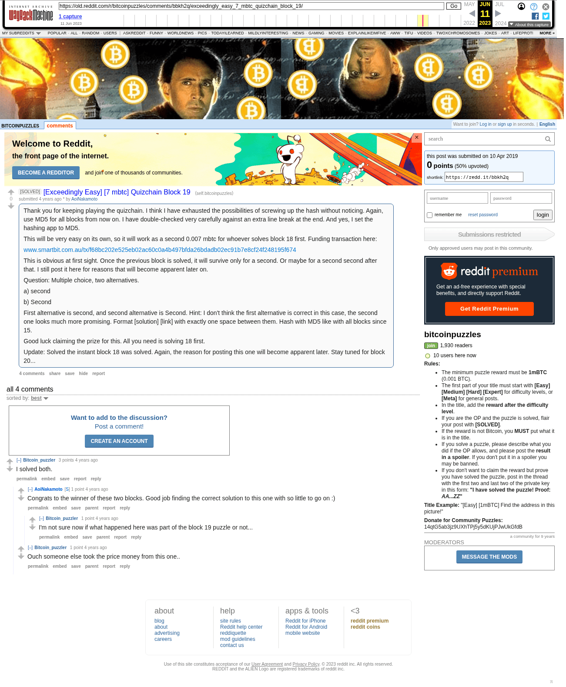

# [Exceedingly Easy] [7 mbtc] Quizchain Block 19

[Original thread](https://www.reddit.com/r/bitcoinpuzzles/comments/bbkh2q/exceedingly_easy_7_mbtc_quizchain_block_19/). The `sourceUrl` of the [quizchain/19](../../../src/collections/quizchain/19.ts) record and the source of two of its hints and the funding transaction. The post went up on April 10, 2019, at 10:37:47 UTC, 17 minutes before the block time of its funding transaction. Its last edit is stamped 11:38:03 UTC on April 10, 2019, so the transcript shows the post as it stood after the claim.

## Historical provenance

The Wayback Machine holds one capture of the `old.reddit.com` URL and one of the `www.reddit.com` URL. Provenance rests on the [old.reddit.com capture](https://web.archive.org/web/20230611164727/https://old.reddit.com/r/bitcoinpuzzles/comments/bbkh2q/exceedingly_easy_7_mbtc_quizchain_block_19/), stamped June 11, 2023, 16:47:27 UTC, whose HTML carries the post, which matches the transcript below word for word. It renders four comments, and each matches the Arctic Shift record of the same ID by author and text. Only the markdown of links and lists renders differently. The capture was read on September 27, 2026. `archive_content: confirmed` on that basis.

The [Arctic Shift](https://arctic-shift.photon-reddit.com/) Reddit archive, read the same day, lists the same four comments. The transcript takes authors, text and scores from it and nests the comments as the capture does.

The record names none of the commenters: nothing on the chain ties a claim to a name.

## Transcript

> Thank you for keeping playing the quizchain. I think I have exhausted the possibilities of screwing up the hash without noticing. Again, use MD5 for all blocks from now on. I have double-checked very carefully against an extra line break at the end. And yes, I set the hashing app to MD5.
>
> This will be very easy on its own, so it will work as a second 0.007 mbtc for whoever solves block 18 first. Funding transaction here:
>
> www.smartbit.com.au/tx/f68bc202e525eb02ac60c0a4b497bfda26bdadb02ec91b7e8cf24f248195f674
>
> This is obvious at first sight. Once the previous block is solved, it will survive only for a second. Or maybe for a second second after that. I still post it here for reasons that will become apparent later on.
>
> Question: Multiple choice, two alternatives.
>
> a) second
>
> b) Second
>
> First alternative is second, and second alternative is Second. Hint: I don't think the first alternative is correct in this case, the second one looks much more promising. Format [solution] [link] with exactly one space between them. Hash with MD5 like with all blocks since 15.
>
> Good luck claiming the prize for this. All you need is solving 18 first.
>
> Update: Solved the instant block 18 was solved. Again, the reason for posting this one will become apparent later. Stay tuned for block 20...

## Comments

**u/Bitcoin_puzzler**, 3 points:

> I solved both.

**u/AoiNakamoto**, 1 point, reply to u/Bitcoin_puzzler:

> Congrats to the winner of these two blocks. Good job finding the correct solution to this one with so little to go on :)

**u/Bitcoin_puzzler**, 1 point, reply to u/AoiNakamoto:

> I'm not sure now if what happened here was part of the block 19 puzzle or not...

**u/Bitcoin_puzzler**, 1 point, reply to u/Bitcoin_puzzler:

> Ouch someone else took the price money from this one..

## Screenshot

The screenshot is a render of the archive capture, not of the live page, so it carries the Wayback banner at the top. The "4 years ago" stamps are relative to the capture, June 11, 2023. Capture method and limits: [source archive](../README.md).
