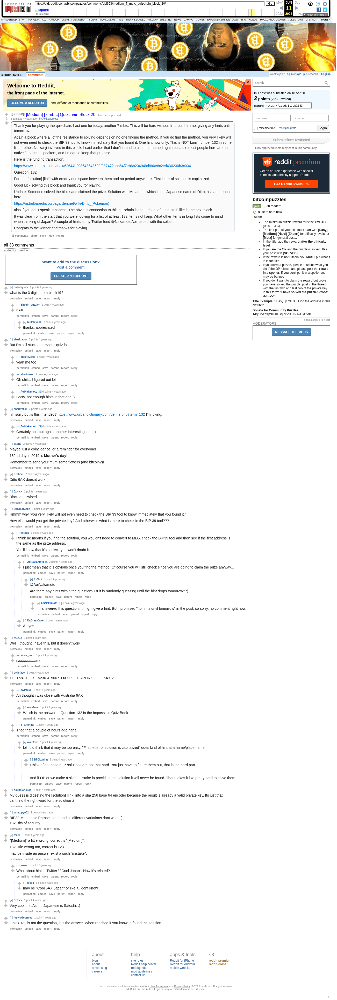

# ]Medium] [7 mbtc] Quizchain Block 20

[Original thread](https://www.reddit.com/r/bitcoinpuzzles/comments/bbl653/medium_7_mbtc_quizchain_block_20/). The `sourceUrl` of the [quizchain/20](../../../src/collections/quizchain/20.ts) record and the source of three of its hints and the funding transaction, with the solution the author edited in. The post went up on April 10, 2019, at 12:01:42 UTC, 8 minutes after the block time of its funding transaction. Its last edit is stamped 04:37:31 UTC on April 11, 2019, so the transcript shows the post as it stood after the claim.

## Historical provenance

The Wayback Machine holds one capture of the `old.reddit.com` URL and two of the `www.reddit.com` URL, plus five of single comment permalinks. Provenance rests on the [old.reddit.com capture](https://web.archive.org/web/20230611190051/https://old.reddit.com/r/bitcoinpuzzles/comments/bbl653/medium_7_mbtc_quizchain_block_20/), stamped June 11, 2023, 19:00:51 UTC, whose HTML carries the post, which matches the transcript below word for word. It renders 33 comments, and each matches the Arctic Shift record of the same ID by author and text. Only the markdown of links and lists renders differently. The capture was read on September 27, 2026. `archive_content: confirmed` on that basis.

The [Arctic Shift](https://arctic-shift.photon-reddit.com/) Reddit archive, read the same day, lists 37 comments, four of which the capture does not render: deleted ones and replies behind a "load more" link. The transcript takes every comment, its author, text and score from Arctic Shift and nests them as the capture does. Two of them are deleted comments, kept below as `[deleted]`.

The record names none of the commenters: nothing on the chain ties a claim to a name.

## Transcript

> Thank you for playing the quizchain. Last one for today, another 7 mbtc. This will be hard without hint, but I am not giving any hints until tomorrow.
>
> Again a block where all of the resistance to solving depends on no one finding the method. If you do find the method, you very likely will not even need to check the BIP 39 tool to know immediately that you found it. One hint now only: This is NOT kanji number 132 in some list or other. No kanji involved in this block. I said earlier that I don't intend to use that method again because most people here are not native Japanese speakers, and I mean to keep that promise.
>
> Here is the funding transaction:
>
> https://www.smartbit.com.au/tx/62644b298643648502f237472abb64f7eb6b204949d890e8c2ed430230b3c034
>
> Question: 132
>
> Format: [solution] [link] with exactly one space between them and no period anywhere. First letter of solution is capitalized.
>
> Good luck solving this block and thank you for playing.
>
> Update: Someone solved the block and claimed the prize. Solution was Metamon, which is the Japanese name of Ditto, as can be seen here
>
> https://m.bulbapedia.bulbagarden.net/wiki/Ditto_(Pokémon)
>
> also if you don't speak Japanese. The obvious connection to this quizchain is that I do lot of meta stuff, like in the next block.
>
> It was clear from the start that you were looking for a list of at least 132 items not kanji. What other items in long lists come to mind when thinking of Japan? A couple of hints at my Twitter feed @NakamotoAoi helped with the solution.
>
> Congrats to the winner and thanks for playing.

## Comments

**u/bulleteyedk**, 2 points:

> what is the 3 digits from block19?

**u/Bitcoin_puzzler**, 1 point, reply to u/bulleteyedk:

> 6AX

**u/bulleteyedk**, 1 point, reply to u/Bitcoin_puzzler:

> thanks, appreciated

**[deleted]**, reply to u/bulleteyedk:

> [deleted]

**u/sharkrazor**, 2 points:

> But I'm still stuck at previous quiz lol

**u/bulleteyedk**, 1 point, reply to u/sharkrazor:

> yeah me too

**u/sharkrazor**, 1 point, reply to u/sharkrazor:

> Oh shit... I figured out lol

**u/AoiNakamoto**, 0 points, reply to u/sharkrazor:

> Sorry, not enough hints in that one :)

**u/sharkrazor**, 2 points:

> I'm sorry but is this intended?
> https://www.urbandictionary.com/define.php?term=132
> I'm joking.

**u/AoiNakamoto**, 0 points, reply to u/sharkrazor:

> Certainly not, but again another interesting idea :)

**u/tarje**, 1 point, reply to u/sharkrazor:

> that is the hidden meaning in all the puzzles ;-)

**u/78bits**, 2 points:

> Maybe just a coincidence, or a reminder for everyone!
>
> 132nd day in 2019 is **Mother's day**!
>
> Remember to send your mum some flowers (and bitcoin?)!

**u/JTobcat**, 2 points:

> Ditto 6AX doesnt work

**u/0xNick**, 2 points:

> Block got swiped.

**u/DaGreatCake**, 1 point:

> Hmmm why "you very likely will not even need to check the BIP 39 tool to know immediately that you found it."
>
> How else would you get the private key? And otherwise what is there to check in the BIP 39 tool???

**u/0xNick**, 1 point, reply to u/DaGreatCake:

> I think he means if you find the solution, you wouldn't need to convert to MD5, check the BIP39 tool and then see if the first address is the same as the prize address.
>
> You'll know that it's correct, you won't doubt it.

**u/AoiNakamoto**, 2 points, reply to u/0xNick:

> I just mean that it is obvious once you find the method. Of course you will still check since you are going to claim the prize anyway...

**u/0xNick**, 1 point, reply to u/AoiNakamoto:

> @AoiNakamoto
>
> Are there any hints within the question? Or it is randomly guessing until the hint drops tomorrow? :)

**u/AoiNakamoto**, 1 point, reply to u/0xNick:

> If I answered this question, it might give a hint. But I promised "no hints until tomorrow" in the post, so sorry, no comment right now.

**[deleted]**, reply to u/0xNick:

> [deleted]

**u/DaGreatCake**, 1 point, reply to u/0xNick:

> Ah yes

**u/rs1712**, 1 point:

> Well I thought i have this, but it doesn't work

**u/silver_anth**, 1 point, reply to u/rs1712:

> saaaaaaaaame

**u/owlefave**, 1 point:

> TH\_TN♥GE.EXE 5236 415667\_OXXE:.... ERRORZ...........6AX ?

**u/owlefave**, 1 point, reply to u/owlefave:

> Ah thought i was close with Australia 6AX

**u/owlefave**, 1 point, reply to u/owlefave:

> Which is the answer to Question 132 in the Impossible Quiz Book

**u/BTCkoning**, 1 point, reply to u/owlefave:

> Tried that a couple of hours ago haha.

**u/owlefave**, 1 point, reply to u/BTCkoning:

> lol i did think that it may be too easy. "First letter of solution is capitalized" does kind of hint at a name/place name...

**u/BTCkoning**, 1 point, reply to u/owlefave:

> I think often those quiz solutions are not that hard. You just have to figure them out, that is the hard part.
>
> And if OP or we make a slight mistake in providing the solution it will never be found. That makes it like pretty hard to solve them.

**u/ooxpolarisxoo**, 1 point:

> My guess is digesting the \[solution\] \[link\] into a sha 256 base 64 encoder because the result is already a valid private key. Its just that i cant find the right word for the solution :(

**u/whatupyo02**, 1 point:

> BIP39 Mnemonic Phrase, seed and all different variations dont work :(
> 132 Bits of security

**u/fecell**, 1 point:

> "\]Medium\]" a little wrong, correct is "\[Medium\]".
>
> 132 little wrong too, correct is 123.
>
> may be inside an answer exist a such "mistake".

**u/jnkred**, 1 point, reply to u/fecell:

> What about hint in Twitter? "Cool Japan". How it's related?

**u/fecell**, 1 point, reply to u/jnkred:

> may be "Cool 6AX Japan" or like it.. dont know..

**u/0xNick**, 1 point:

> Very cool that Ash in Japanese is Satoshi. :)

**u/IvayloGeorgiev**, 1 point:

> I think 132 is not the question, it is the answer. When reached it you know to found the solution.

**u/tarje**, 1 point:

> [132 Customers File Class Action Lawsuit Against Coincheck](https://news.bitcoin.com/132-customers-file-class-action-lawsuit-against-coincheck/) (Japanese cryptocurrency exchange.)

## Screenshot

The screenshot is a render of the archive capture, not of the live page, so it carries the Wayback banner at the top. The "4 years ago" stamps are relative to the capture, June 11, 2023. Capture method and limits: [source archive](../README.md).
