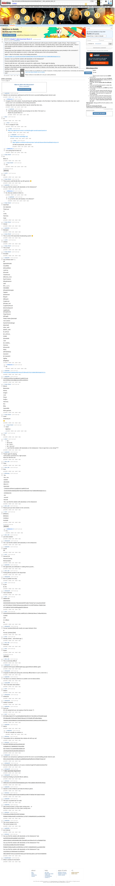

# [Hard] [7 mbtc] Quizchain Block 21

[Original thread](https://www.reddit.com/r/bitcoinpuzzles/comments/bbsqhh/hard_7_mbtc_quizchain_block_21/). The `sourceUrl` of the [quizchain/21](../../../src/collections/quizchain/21.ts) record and the source of three of its hints and the funding transaction. The WIF of block 11 is printed here by u/whatupyo02. The post went up on April 10, 2019, at 23:03:27 UTC, 3 minutes after the block time of its funding transaction. Its last edit is stamped 13:26:54 UTC on April 11, 2019, so the transcript shows the post as it stood after the claim.

## Historical provenance

The Wayback Machine holds one capture of the `old.reddit.com` URL and one of the `www.reddit.com` URL, plus four of single comment permalinks. Provenance rests on the [old.reddit.com capture](https://web.archive.org/web/20230611155211/https://old.reddit.com/r/bitcoinpuzzles/comments/bbsqhh/hard_7_mbtc_quizchain_block_21/), stamped June 11, 2023, 15:52:11 UTC, whose HTML carries the post, which matches the transcript below word for word. It renders 85 comments, and each matches the Arctic Shift record of the same ID by author and text. Only the markdown of links and lists renders differently. The capture was read on September 27, 2026. `archive_content: confirmed` on that basis.

The [Arctic Shift](https://arctic-shift.photon-reddit.com/) Reddit archive, read the same day, lists 102 comments, 20 of which the capture does not render: deleted ones and replies behind a "load more" link. The transcript takes every comment, its author, text and score from Arctic Shift and nests them as the capture does. 16 of them are deleted comments, kept below as `[deleted]`.

The record names none of the commenters: nothing on the chain ties a claim to a name.

## Transcript

> Thank you for playing the quizchain. Block 20 still not solved and I will not post a hint for another couple of hours. That is because I want to have the previous block unsolved for this one. I need that situation so that the thing I want to test with this block works. That is I want people to post the solution in comments while no one is able to check it against the one I committed to with the funding transaction.
>
> Please post your best solution to the comments. I will send the link code from the unsolved previous post privately to the commenter if and only if one of the solutions is correct. In that case I will also post a hint to the previous block.
>
> Again 7 mbtc for this block. Here is the funding transaction:
>
> www.smartbit.com.au/tx/f2e3d1562bf103b90da495076dc32f7df04ed03791b73d9603f6000da819121c
>
> Question: Can you find the solution with absolutely no hint whatsoever?
>
> Format: [solution] [link] with exactly one space between them.
>
> Have fun with this one. I will monitor comments for a right answer. Thanks again for playing.
>
> Update: Block was solved. The method for this was pointing to block 11 with the question (since that question was identical to the question in this block) and then expecting the leap back another 10 blocks to the first block, then use the solution to that after fixing the spelling mistake it had.
>
> Solution as noted in comments was "Satoshi was an anonymous cypherpunk and the first one to succeed building private Internet cash."

## Comments

**u/mapl3sn0w**, 2 points:

> Satoshi is an anonymous cypherpunk and the first one to succeed building private Internet cash.

**u/AoiNakamoto**, 1 point, reply to u/mapl3sn0w:

> Congrats, first to the solution. Good job fixing the spelling mistake in the first block I had there. Bothered me a lot at the time, but I can't correct once I am committed by the funding transaction.
>
> Linking code sent, but previous block may be solved fast also now...

**u/mapl3sn0w**, 1 point, reply to u/AoiNakamoto:

> Yeah that spelling mistake was annoying me too when i first saw it :p
> thanks for puzzle block 21 !

**u/Arpox**, 1 point:

> 42

**u/Arpox**, 1 point, reply to u/Arpox:

> i for i in range(10**100)

**u/Arpox**, 1 point, reply to u/Arpox:

> https://raw.githubusercontent.com/dwyl/english-words/master/words.txt

**u/mapl3sn0w**, 1 point, reply to u/Arpox:

> [https://dictionary.cambridge.org/](https://dictionary.cambridge.org/)

**u/Arpox**, 1 point, reply to u/mapl3sn0w:

> https://github.com/brannondorsey/naive-hashcat/releases/download/data/rockyou.txt
>
> 133 Mb of passwords, can't miss it.

**[deleted]**, reply to u/Arpox:

> [deleted]

**u/AoiNakamoto**, 1 point, reply to u/Arpox:

> I am saving that for block 42...

**u/Crypto_Rachel**, 1 point:

> 21
>
> Block 21

**u/Crypto_Rachel**, 1 point, reply to u/Crypto_Rachel:

> 132

**u/rs1712**, 1 point:

> 132

**u/Crypto_Rachel**, 1 point:

> These posts could literally blow up with guesses 😊

**u/mapl3sn0w**, 1 point:

> Can you find the solution with absolutely no hint whatsoever?

**u/AoiNakamoto**, 1 point, reply to u/mapl3sn0w:

> No, that was solution to block 11.

**u/mapl3sn0w**, 1 point, reply to u/AoiNakamoto:

> Cn yu fnd the slutn wth bslutely n hnt whtsever?

**u/Crypto_Rachel**, 1 point:

> Quizchain
>
> Aoi nakamoto
>
> Thank you
>
> 77
>
> Lucky
>
> Harmony
>
> Hope

**u/Crypto_Rachel**, 1 point:

> Solved

**u/mapl3sn0w**, 1 point:

> Blackjack

**u/Crypto_Rachel**, 1 point:

> This is a test of the Quizchain broadcasting system 😊

**u/rs1712**, 1 point:

> solution

**u/Crypto_Rachel**, 1 point:

> This is hard

**u/Crypto_Rachel**, 1 point:

> Encoded

**u/mapl3sn0w**, 1 point:

> Any of these work ? :)
> jnk
>
> @jnk30001695
>
> Snowfl4ke
>
> @Snowfl4ke1
>
> Lars9.xa
>
> @Lars9X
>
> VovaKorova
>
> @korova\_vova
>
> Eyal Cinamon
>
> @eyalcinamon
>
> ivaki
>
> @i\_v\_a\_k\_i
>
> HE4OBEK
>
> @IvayloGGeorgiev
>
> Tadashi
>
> @zhamisen
>
> Btcjunk
>
> @btcjunk ‏
>
> CryptoLoot
>
> @crypto\_loot ‏
>
> CryptoFactPunch
>
> @coinnukepunch ‏
>
> mapl3sn0w
> @mapl3sn0w
>
> Pogo Bounce
>
> @PogoB
>
> Follow Follow @eich4all
>
> User actions
>
> Rachel Eichenberger
>
> @eich4all
>
> silver\_anth
>
> @silver\_anth ‏
>
> B LeFevre
>
> @\_LeFevre\_ ‏
>
> Dridrik
>
> @cedridrik ‏
>
> Liam
>
> @\_rstudios\_ ‏
>
> Nomena
>
> @noomr06 ‏
>
> Marty
>
> @PolishMarty ‏
>
> DemetriX
>
> @\_DemetriX ‏
>
> Agelay
>
> @Agelay2 ‏

**u/AoiNakamoto**, 1 point, reply to u/mapl3sn0w:

> No.

**u/mapl3sn0w**, 1 point:

> [f2e3d1562bf103b90da495076dc32f7df04ed03791b73d9603f6000da819121c](http://www.smartbit.com.au/tx/f2e3d1562bf103b90da495076dc32f7df04ed03791b73d9603f6000da819121c)

**u/mapl3sn0w**, 1 point:

> 12HDDSxU6F9crKJycdjWxKG1VaRRZS1ntA
> Atn1SZRRaV1GKxWjdcyJKrc9F6UxSDDH21

**u/Crypto_Rachel**, 1 point:

> Bitcoin
>
> Blockchain
>
> Money
>
> Dragon
>
> Love
>
> Peace
>
> Pe@ce
>
> Harmony
>
> Era
>
> Bliss
>
> Impossible
>
> More guesses

**u/Crypto_Rachel**, 1 point:

> Insert
>
> Dictionary.txt
>
> 😊

**u/Crypto_Rachel**, 1 point, reply to u/Crypto_Rachel:

> Insert
>
> Bip39.txt

**u/LiaVl**, 1 point:

> Yes

**u/jnkred**, 1 point:

> - No /
> - Not at all /
> - No, I can't /
> - No, I can not /
> - I can't find the solution with absolutely no hint whatsoever /
>   How to type here a new string????

**u/mapl3sn0w**, 1 point:

> Thanks again for playing.
> I will monitor comments for a right answer.
> Have fun with this one.

**u/silver_anth**, 1 point:

> Third

**u/silver_anth**, 1 point:

> First

**u/BTCkoning**, 1 point:

> \-Yes
>
> \-Yes i can
>
> \-solution
>
> \-absolutely
>
> \-Block 21
>
> \-Quizchain
>
> \- 12HDDSxU6F9crKJycdjWxKG1VaRRZS1ntA
>
> \- f2e3d1562bf103b90da495076dc32f7df04ed03791b73d9603f6000da819121c
>
> \- AoiNakamoto
>
> \- Aoi
>
> \- second
>
> \-Second
>
> \-Yes i can find the solution with absolutely no hint whatsoever

**u/silver_anth**, 1 point:

> Please post your best solution to the comments.

**u/LiaVl**, 1 point:

> \]Medium\]
>
> \[Meidum\]
>
> Untribium
>
> Australia

**u/silver_anth**, 1 point:

> your best solution

**u/whatupyo02**, 1 point:

> Yes I can find the solution with absolutely no hint whatsoever.

**u/mapl3sn0w**, 1 point:

> Zeroth
> 0th

**u/LiaVl**, 1 point:

> Second Life
>
> Second Coming
>
> Reincarnation

**u/mapl3sn0w**, 1 point:

> We appreciate your dedication in making these puzzles...

**u/silver_anth**, 1 point:

> Posting Bitcoin puzzles to the #quizchain

**u/whatupyo02**, 1 point:

> Born to publish one story.

**u/LiaVl**, 1 point:

> a) yes
>
> b) Yes

**u/whatupyo02**, 1 point:

> You're welcome

**u/LiaVl**, 1 point:

> 486604799
>
> 3592540203
>
> 000000006f016342d1275be946166cff975c8b27542de70a7113ac6d1ef3294f
>
> e0175970efb4417950921bfcba2a3a1e88c007c21232ff706009cc70b89210b4
>
> 1Fi7o3BKMcT82NVtnMRNqsj8aE5CWbAo4z

**u/LiaVl**, 1 point:

> 00000000000000000021e800c1e8df51b22c1588e5a624bea17e9faa34b2dc4a
>
> 21e800
>
> 21M
>
> 21 millions
>
> No

**u/whatupyo02**, 1 point:

> Format: \[solution\] \[link\] with exactly one space between them.
>
> or
>
> Format: \[solution\] \[link\]

**u/fecell**, 1 point:

> Already solved... some block ago ;)

**u/silver_anth**, 1 point:

> Good luck

**u/LiaVl**, 1 point:

> Expert

**u/silver_anth**, 1 point:

> This is extremely difficult

**u/whatupyo02**, 1 point:

> L3qP93VXiHtTzwpUCv6BNKApBnneg1LjajeenEND2Cx5BNALJgFm

**u/whatupyo02**, 1 point:

> Congrats! Excellent job solving this extremely difficult block in such a short time :)

**u/mapl3sn0w**, 1 point:

> The block is an obvious reference to another one ten blocks before.

**u/madman895**, 1 point:

> “Yes! It has been done before.”

**u/LiaVl**, 1 point:

> DejaVu

**u/whatupyo02**, 1 point:

> whatsover

**u/whatupyo02**, 1 point:

> random comment

**u/mapl3sn0w**, 1 point:

> Fuck you
> (i'm not saying fuck you, but saying is that the answer ?)

**u/LiaVl**, 1 point:

> 8374ddacc0ab247517cac8d49a6bb625de489132178e2466111d7b4eb651aba8
>
> f3f7ddfeebfb27fd1feeddd7ffebbf7dfe4ed13797bf3df613ff7b4fbe59bbbc
>
> 708300522b5003880824150365800958200640058031199002e2000108081014

**u/mapl3sn0w**, 1 point:

> 5W1H

**u/mapl3sn0w**, 1 point, reply to u/mapl3sn0w:

> this isn't actually my solution :p

**u/sharkrazor**, 1 point:

> ?reveostahw tnih on yletulosba htiw noitulos eht dnif uoy naC

**u/sharkrazor**, 1 point:

> 9e01bf67d950860ca8182ac80646c5d2
>
> 318fab89c3217db8f669937300a45f69
>
> 5d1743302c7311aeb60dd8cebb6b10ef
>
> c3034fae663b430a36ed581dd283cb7e

**u/whatupyo02**, 1 point:

> Satoshi is an anonymous cypherpunk and the first one to succed building private Internet cash.
>
> 50611e63a52089bc14e38becb1ad8880be6ba8f4aff0e64223f3dbd740adc1b7

**u/whatupyo02**, 1 point:

> My favorite Bitcoin address is of course 1AndrewYangForPresident2o2o6zmPzd

**u/whatupyo02**, 1 point:

> **7 mbtc Quizchain Experiment**

**u/whatupyo02**, 1 point:

> Good luck finding my favorite Bitcoin address.

**u/sharkrazor**, 1 point:

> 4fd06cd3118515483504684b9fadbdb2aa65c79501dd8d6c396efe5961f5e6ac

**u/mapl3sn0w**, 1 point:

> Satoshi is CEO of Bitcoin and holds the Bitcoin patent.

**u/sharkrazor**, 1 point:

> 7ec11ee7e6b6f1aadfc6e4aaf139288532e35fb7570bf3eb7807a8ab7ef165af

**u/mapl3sn0w**, 1 point:

> This quiz as posted was not valid.

**u/mapl3sn0w**, 1 point:

> Stay tuned for block 2 of this chain coming soon... or
> Stay tuned for block 22 of this chain coming soon...

**u/sharkrazor**, 1 point:

> 5133c80eee32bfbcf253235974939de8
>
> f35db847883be34a9f12ce556f430ec1c87807149fa8965d2811aecb80625fd2

**u/mapl3sn0w**, 1 point:

> The correct answer is a). or
> The correct answer is b).

**u/mapl3sn0w**, 1 point:

> Ian Coleman

**u/sharkrazor**, 1 point:

> Can you find the solution with absolutely no hint whatsoever?.abc
>
> 4a250f2639cd0d1ab68bb7a18c529912
>
> ad93023583612e950584f8023fbc7bb4af851e8c059ee52c87ca76b89b0f782b
>
> Can you find the solution with absolutely no hint whatsoever?.Pzd
>
> 5133c80eee32bfbcf253235974939de8
>
> f35db847883be34a9f12ce556f430ec1c87807149fa8965d2811aecb80625fd2
>
> Can you find the solution with absolutely no hint whatsoever?.Uzp
>
> c2a22835c2c576b50aede72e15f53547
>
> 38b22d940b752d1a1ea2b34d7eb5a1a447d2fc40aca80c1ca575341f44db9008

**u/IvayloGeorgiev**, 1 point:

> What is solution for this block?

**[deleted]**:

> [deleted]

**[deleted]**, reply to a deleted comment:

> [deleted]

**[deleted]**, reply to a deleted comment:

> [deleted]

**[deleted]**, reply to a deleted comment:

> [deleted]

**[deleted]**, reply to a deleted comment:

> [deleted]

**[deleted]**, reply to a deleted comment:

> [deleted]

**[deleted]**, reply to a deleted comment:

> [deleted]

**u/tarje**, 1 point:

> supercalifragilisticexpialidocious

**[deleted]**:

> [deleted]

**u/tarje**, 2 points:

> winner winner chicken dinner

**u/tarje**, 1 point:

> 5Joi7sah2K1ytQGWUYvgQ46sZJUuWgtyjvYNGCz45fyDDev4ah8

**u/tarje**, 1 point:

> You will torture me to death (with these puzzles).

**u/AoiNakamoto**, 1 point, reply to u/tarje:

> lol :)

**[deleted]**:

> [deleted]

**[deleted]**:

> [deleted]

**[deleted]**, reply to a deleted comment:

> [deleted]

**[deleted]**:

> [deleted]

**[deleted]**:

> [deleted]

**[deleted]**:

> [deleted]

**[deleted]**:

> [deleted]

## Screenshot

The screenshot is a render of the archive capture, not of the live page, so it carries the Wayback banner at the top. The "4 years ago" stamps are relative to the capture, June 11, 2023. Capture method and limits: [source archive](../README.md).
