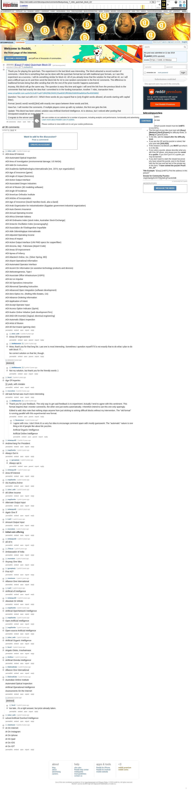

# [Easy] [7 mbtc] Quizchain Block 22

[Original thread](https://www.reddit.com/r/bitcoinpuzzles/comments/bbukyu/easy_7_mbtc_quizchain_block_22/). The `sourceUrl` of the [quizchain/22](../../../src/collections/quizchain/22.ts) record and the source of two of its hints and the funding transaction, with the solution the author edited in. The post went up on April 11, 2019, at 02:05:42 UTC, 13 minutes after the block time of its funding transaction. Its last edit is stamped 06:03:54 UTC on April 11, 2019, so the transcript shows the post as it stood after the claim.

## Historical provenance

The Wayback Machine holds one capture of the `old.reddit.com` URL and one of the `www.reddit.com` URL. Provenance rests on the [old.reddit.com capture](https://web.archive.org/web/20230611173058/https://old.reddit.com/r/bitcoinpuzzles/comments/bbukyu/easy_7_mbtc_quizchain_block_22/), stamped June 11, 2023, 17:30:58 UTC, whose HTML carries the post, which matches the transcript below word for word. It renders 38 comments, and each matches the Arctic Shift record of the same ID by author and text. Only the markdown of links and lists renders differently. The capture was read on September 27, 2026. `archive_content: confirmed` on that basis.

The [Arctic Shift](https://arctic-shift.photon-reddit.com/) Reddit archive, read the same day, lists 42 comments, six of which the capture does not render: deleted ones and replies behind a "load more" link. The transcript takes every comment, its author, text and score from Arctic Shift and nests them as the capture does. Five of them are deleted comments, kept below as `[deleted]`.

The record names none of the commenters: nothing on the chain ties a claim to a name.

## Transcript

> Thank you for playing the quizchain. The experiment in the last block was interesting. The block attracted a record number of comments. I think this is something that can be done with the quizchain format but not with traditional quiz formats, so I see this experiment as a success. I will do something similar for block 42. All of you already know that the solution for that will be 42, so I will post a difficult quiz as 41 and then send the block link for 42 to one random commenter in the first 42 comments. The difference to traditional formats being that after sending that info the rest of the prize transfer happens automated.
>
> Anyway, this block will go the same way. The question is easy this time and again I will send the link from the previous block to the commenter that had exactly the idea that I committed to in the funding transaction. Another 7 mbtc, transaction here:
>
> www.smartbit.com.au/tx/2c2cd07ca9718f42f9b1f409125a48301ff50bb20d9350a6bfcbcf5e45659892
>
> Question: You start out with A O I. Which three words do you expand that to (only English words allowed, all words starting with capital letter).
>
> Format: [word1 word2 word3] [link] with exactly one space between three words and link.
>
> Have fun. I will monitor the comments. If multiple players come up with my solution, the first one gets the link.
>
> Update: This block has been solved, solution was Artificial Overlord Intelligence. AI is obvious, but I noticed after posting that Omnipotent would be an even better fit.
>
> Congrats to the winner and thanks for playing.

## Comments

**u/silver_anth**, 3 points:

> AOI Area Of Interest
>
> AOI Automated Optical Inspection
>
> AOI Area of Investigation (environmental damage; US NASA)
>
> AOI Add-On Instructions
>
> AOI Academia Ophthalmologica Internationalis (est. 1974; eye organization)
>
> AOI Age of Innocence (game)
>
> AOI Angle of Impact (forensics)
>
> AOI Active Output Interface
>
> AOI Associated Oregon Industries
>
> AOI Art of Illusion (3D modeling software)
>
> AOI Angle Of Incidence
>
> AOI American Orthodox Institute
>
> AOI Articles of Incorporation
>
> AOI Age of Innocence (David Hamilton book, also a band)
>
> AOI Arab Organization for Industrialization (Egyptian government industrial organization)
>
> AOI Auto-Owners Insurance
>
> AOI Annual Operating Income
>
> AOI Africa Orientale Italiana
>
> AOI All Ordinaries Index (stock index, Australian Stock Exchange)
>
> AOI Antarctic Oscillation Index (oceanography)
>
> AOI Association de l'Ostéogenèse Imparfaite
>
> AOI Aide Odontologique Internationale
>
> AOI Adjusted Operating Income
>
> AOI Area of Impact
>
> AOI Active Output Interface (UNI PMD specs for copper/fiber)
>
> AOI Ancona, Italy - Falconara (Airport Code)
>
> AOI Areas Of Improvement
>
> AOI Apnea of Infancy
>
> AOI Atlantech Online, Inc. (Silver Spring, MD)
>
> AOI Airport Operational Information
>
> AOI Automated Operator Interface
>
> AOI Accent On Information (on assistive technology products and devices)
>
> AOI Atelosteogenesis, Type I
>
> AOI Associate Office Infrastructure (USPS)
>
> AOI Act on Impulse
>
> AOI Ad Operations Interactive
>
> AOI Abnormal Operating Instruction
>
> AOI Advanced Open Integration (software development)
>
> AOI Aero-Optics Inc. (Rolling Hills Estates, CA)
>
> AOI Advance Ordering Information
>
> AOI Application of Intent
>
> AOI Accept Operator Input
>
> AOI Access Option Indicator (Sprint)
>
> AOI Avalon Online Initiative (web development firm)
>
> AOI AND-OR-Invert(er) (logical; electrical engineering)
>
> AOI Automatic Object Inspection
>
> AOI Artist of Illusion
>
> AOI All Out Insane (gaming clan)

**u/silver_anth**, 2 points, reply to u/silver_anth:

> Areas Of Improvement

**u/AoiNakamoto**, 1 point, reply to u/silver_anth:

> Wow, thank you for that long list. Last one is most interesting. Sometimes I question myself if it is not exactly that to do what I plan to do with block 77...
>
> No correct solution on that list, though.

**u/fecell**, 2 points:

> Age Of Imperies
>
> ))) yeah, with mistake

**u/msvnoken**, 2 points:

> old task format was much more interesting

**u/AoiNakamoto**, 1 point, reply to u/msvnoken:

> Thank you for your feedback. The only way to get said feedback is to experiment. Actually I tend to agree with this sentiment. This format requires that I monitor comments, the other one just works automatically. I therefore intend to use this one only sparingly.
>
> Edited to add: Also note that nothing stops anyone from just sticking to solving difficult blocks without my intervention. The "old format" is running parallel with this experimental new format.

**u/Randomiser**, 1 point, reply to u/AoiNakamoto:

> I agree with msv. I don't think it's a very fun idea to encourage comment spam with mostly guesswork. The "automatic" nature is one thing a lot of people like about btc puzzles.
>
> Artificial Organic Intelligence
>
> Artificial Online Intelligence

**u/whatupyo02**, 2 points:

> AndrewYang For President

**u/mapl3sn0w**, 1 point:

> Always Out In

**u/gynoplasty**, 1 point, reply to u/mapl3sn0w:

> Always opt in

**u/whatupyo02**, 1 point:

> Area Of Interest

**u/mapl3sn0w**, 1 point:

> Aoi Asahina Anime

**u/silver_anth**, 1 point:

> All Other Income

**u/mapl3sn0w**, 1 point:

> Alternate Output Input

**u/whatupyo02**, 1 point:

> Again One If

**u/LiaVl**, 1 point:

> Amount Output Input

**u/msvnoken**, 1 point:

> **Initial coin offering**

**u/whatupyo02**, 1 point:

> All Of It

**u/JTobcat**, 1 point:

> Ambassador of India

**u/msvnoken**, 1 point:

> Anyway One Idea

**u/gynoplasty**, 1 point:

> First 42?

**u/sharkrazor**, 1 point:

> Alliance One International

**u/LiaVl**, 1 point:

> Artificial of Intelligence

**u/whatupyo02**, 1 point:

> Absolute Or Infinite

**u/mapl3sn0w**, 1 point:

> Artificial OpenNetwork Intelligence

**u/mapl3sn0w**, 1 point:

> Open Artificial Intelligence

**u/mapl3sn0w**, 1 point:

> Open-source Artificial Intelligence

**u/silver_anth**, 1 point:

> Artificial Organic Intelligence

**u/fecell**, 1 point:

> Arigato Otoko, Irrashaimase

**u/Sn00zor**, 1 point:

> Artificial Orenda Intelligence

**u/DaGreatCake**, 1 point:

> Alliance One International

**u/DaGreatCake**, 1 point:

> Australian Online Institute
>
> Automated Optical Inspection
>
> Artificial Operational Intelligence
>
> Assessments On the Internet

**u/silver_anth**, 1 point:

> solved Artificial Overlord Intelligence

**u/sharkrazor**, 0 points:

> AI On Internet
>
> AI On Instagram
>
> AI On Iphone
>
> AI On Ipad
>
> AI On IOS
>
> AI On IOT

**[deleted]**:

> [deleted]

**u/tarje**, 1 point:

> An Ornary Imp

**[deleted]**:

> [deleted]

**u/AoiNakamoto**, 2 points, reply to a deleted comment:

> Not my solution, but thank you for the friendly words :)

**[deleted]**:

> [deleted]

**[deleted]**:

> [deleted]

**[deleted]**:

> [deleted]

**u/fecell**, 1 point, reply to a deleted comment:

> too late.. it's a right answer, but prize already taken.

## Screenshot

The screenshot is a render of the archive capture, not of the live page, so it carries the Wayback banner at the top. The "4 years ago" stamps are relative to the capture, June 11, 2023. Capture method and limits: [source archive](../README.md).
