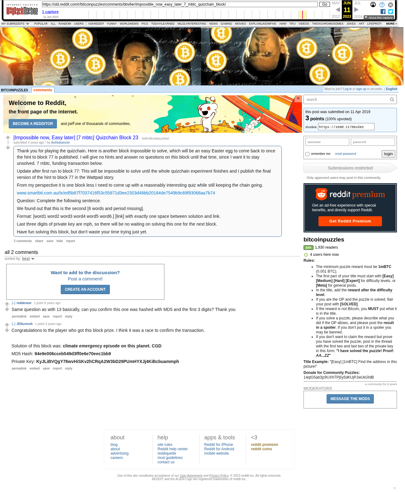

# [Impossible now, Easy later] [7 mbtc] Quizchain Block 23

[Original thread](https://www.reddit.com/r/bitcoinpuzzles/comments/bbv6er/impossible_now_easy_later_7_mbtc_quizchain_block/). The `sourceUrl` of the [quizchain/23](../../../src/collections/quizchain/23.ts) record and the source of three of its hints and the funding transaction. The WIF of block 23 is printed here by u/JDScreesh. The post went up on April 11, 2019, at 03:09:01 UTC, 13 minutes after the block time of its funding transaction. Its last edit is stamped 13:20:31 UTC on May 11, 2019.

## Historical provenance

The Wayback Machine holds one capture of the `old.reddit.com` URL and one of the `www.reddit.com` URL. Provenance rests on the [old.reddit.com capture](https://web.archive.org/web/20230611172247/https://old.reddit.com/r/bitcoinpuzzles/comments/bbv6er/impossible_now_easy_later_7_mbtc_quizchain_block/), stamped June 11, 2023, 17:22:47 UTC, whose HTML carries the post, which matches the transcript below word for word. It renders two comments, and each matches the Arctic Shift record of the same ID by author and text. Only the markdown of links and lists renders differently. The capture was read on September 27, 2026. `archive_content: confirmed` on that basis.

The [Arctic Shift](https://arctic-shift.photon-reddit.com/) Reddit archive, read the same day, lists the same two comments. The transcript takes authors, text and scores from it and nests the comments as the capture does.

The record names none of the commenters: nothing on the chain ties a claim to a name.

## Transcript

> Thank you for playing the quizchain. Here is another block impossible to solve, which will be an easy Easter egg to come back to once the hint to block 77 is published. I will give no hints and answer no questions on this block until that time, since I want it to stay unsolved. 7 mbtc, funding transaction below.
>
> Update after first run to block 77: This will be impossible to solve until the whole quizchain experiment finishes and I publish the final version of the hint to block 77 in the Wattpad story.
>
> From my perspective it is one block less I need to come up with a reasonably interesting quiz while still keeping the chain going.
>
> www.smartbit.com.au/tx/ed5b87f7037416f53c55871d3ee2303d48bb20184de7549b9c69f83068aa7b74
>
> Question: Complete the following sentence.
>
> We found out that this is the second [6 words and period missing].
>
> Format: [word1 word2 word3 word4 word5 word6.] [link] with exactly one space between solution and link.
>
> Last three digits of private key are mph, so there will be no waiting on solving this one for the next block.
>
> Have fun solving this block, but don't waste your time trying just yet.

## Comments

**u/reddeneer**, 1 point:

> Same question as with 13 basically, can you confirm this one was hashed with MD5 and the first 3 digits? Thank you

**u/JDScreesh**, 1 point:

> Congratulations to the player who got this block prize. I think it was a race to confirm the transaction.
>
> Solution of this block was: **climate emergency episode on this planet. CGD**
>
> MD5 Hash: **94e9e006cceb549d3ff0e6e70eec1bb9**
>
> Private Key: **KyJLiBVQgY76wvHiSKv2hCRqA2W3bD29PUmHYXJj4KiBcbuammph**

## Screenshot

The screenshot is a render of the archive capture, not of the live page, so it carries the Wayback banner at the top. The "4 years ago" stamps are relative to the capture, June 11, 2023. Capture method and limits: [source archive](../README.md).
