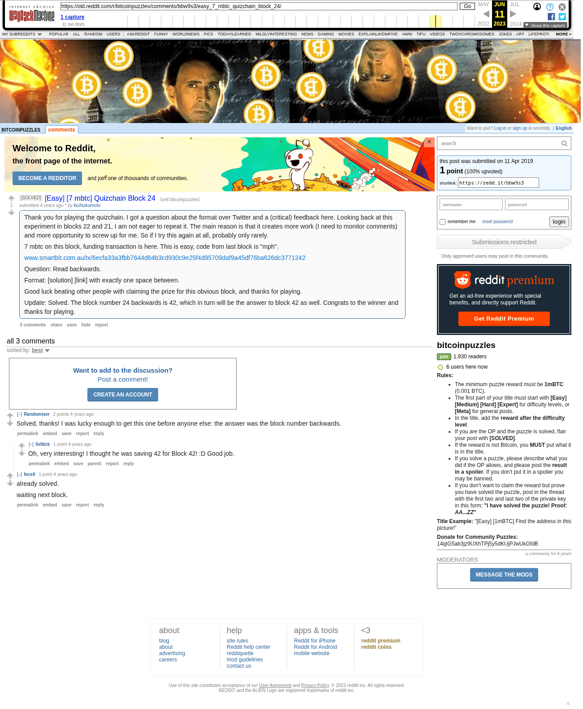

# [Easy] [7 mbtc] Quizchain Block 24

[Original thread](https://www.reddit.com/r/bitcoinpuzzles/comments/bbw9s3/easy_7_mbtc_quizchain_block_24/). The `sourceUrl` of the [quizchain/24](../../../src/collections/quizchain/24.ts) record and the source of two of its hints and the funding transaction, with the solution the author edited in. The post went up on April 11, 2019, at 05:47:56 UTC, 41 minutes after the block time of its funding transaction. Its last edit is stamped 06:07:10 UTC on April 11, 2019, so the transcript shows the post as it stood after the claim.

## Historical provenance

The Wayback Machine holds one capture of the `old.reddit.com` URL and one of the `www.reddit.com` URL. Provenance rests on the [old.reddit.com capture](https://web.archive.org/web/20230611161057/https://old.reddit.com/r/bitcoinpuzzles/comments/bbw9s3/easy_7_mbtc_quizchain_block_24/), stamped June 11, 2023, 16:10:57 UTC, whose HTML carries the post, which matches the transcript below word for word. It renders three comments, and each matches the Arctic Shift record of the same ID by author and text. Only the markdown of links and lists renders differently. The capture was read on September 27, 2026. `archive_content: confirmed` on that basis.

The [Arctic Shift](https://arctic-shift.photon-reddit.com/) Reddit archive, read the same day, lists the same three comments. The transcript takes authors, text and scores from it and nests the comments as the capture does.

The record names none of the commenters: nothing on the chain ties a claim to a name.

## Transcript

> Thank you for playing the quizchain. I got a question about the format over Twitter and a (critical) feedback here. Looking back at this experiment in blocks 22 and 21, I am not eager to repeat it. The main reason is that it creates more work (I need to monitor comments) and more opportunity to screw up for me. So if I try this again at all, probably only rarely.
>
> 7 mbtc on this block, funding transaction is here. This is easy, code from last block is "mph".
>
> www.smartbit.com.au/tx/6ecfa33a3fbb7644d64b3cd930c9e25f4d95709daf9a45df76ba626dc3771242
>
> Question: Read backwards.
>
> Format: [solution] [link] with exactly one space between.
>
> Good luck beating other people with claiming the prize for this obvious block, and thanks for playing.
>
> Update: Solved. The block number 24 backwards is 42, which in turn will be the answer to block 42 as well. Congrats to the winner and thanks for playing.

## Comments

**u/Randomiser**, 2 points:

> Solved, thanks! I was lucky enough to get this one before anyone else: the answer was the block number backwards.

**u/0xNick**, 1 point, reply to u/Randomiser:

> Oh, very interesting! I thought he was saving 42 for Block 42! :D Good job.

**u/fecell**, 1 point:

> already solved.
>
> waiting next block.

## Screenshot

The screenshot is a render of the archive capture, not of the live page, so it carries the Wayback banner at the top. The "4 years ago" stamps are relative to the capture, June 11, 2023. Capture method and limits: [source archive](../README.md).
