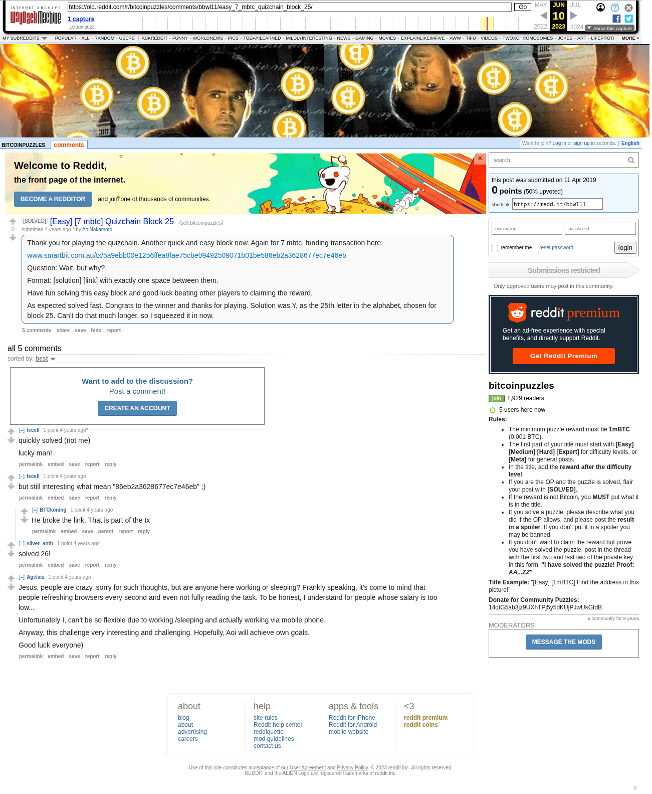

# [Easy] [7 mbtc] Quizchain Block 25

[Original thread](https://www.reddit.com/r/bitcoinpuzzles/comments/bbwl11/easy_7_mbtc_quizchain_block_25/). The `sourceUrl` of the [quizchain/25](../../../src/collections/quizchain/25.ts) record and the source of two of its hints and the funding transaction, with the solution the author edited in. The post went up on April 11, 2019, at 06:26:18 UTC, 37 seconds after the block time of its funding transaction. Its last edit is stamped 07:51:53 UTC on April 24, 2019, so the transcript shows the post as it stood after the claim.

## Historical provenance

The Wayback Machine holds one capture of the `old.reddit.com` URL and one of the `www.reddit.com` URL. Provenance rests on the [old.reddit.com capture](https://web.archive.org/web/20230610220730/https://old.reddit.com/r/bitcoinpuzzles/comments/bbwl11/easy_7_mbtc_quizchain_block_25/), stamped June 10, 2023, 22:07:30 UTC, whose HTML carries the post, which matches the transcript below word for word. It renders five comments, and each matches the Arctic Shift record of the same ID by author and text. Only the markdown of links and lists renders differently. The capture was read on September 27, 2026. `archive_content: confirmed` on that basis.

The [Arctic Shift](https://arctic-shift.photon-reddit.com/) Reddit archive, read the same day, lists the same five comments. The transcript takes authors, text and scores from it and nests the comments as the capture does.

The record names none of the commenters: nothing on the chain ties a claim to a name.

## Transcript

> Thank you for playing the quizchain. Another quick and easy block now. Again for 7 mbtc, funding transaction here:
>
> www.smartbit.com.au/tx/5a9ebb00e1256ffea8fae75cbe09492509071b01be586eb2a3628677ec7e46eb
>
> Question: Wait, but why?
>
> Format: [solution] [link] with exactly one space between them.
>
> Have fun solving this easy block and good luck beating other players to claiming the reward.
>
> As expected solved fast. Congrats to the winner and thanks for playing. Solution was Y, as the 25th letter in the alphabet, chosen for block 25. Can't do that much longer, so I squeezed it in now.

## Comments

**u/fecell**, 1 point:

> quickly solved (not me)
>
> lucky man!

**u/fecell**, 1 point:

> but still interesting what mean "86eb2a3628677ec7e46eb" ;)

**u/BTCkoning**, 1 point, reply to u/fecell:

> He broke the link. That is part of the tx

**u/silver_anth**, 1 point:

> solved 26!

**u/Agelais**, 1 point:

> Jesus, people are crazy, sorry for such thoughts, but are anyone here working or sleeping? Frankly speaking, it's come to mind that people refreshing browsers every second and even not fully reading the task. To be honest, I understand for people whose salary is too low...
>
> Unfortunately I, can't be so flexible due to working /sleeping and actually working via mobile phone.
>
> Anyway, this challenge very interesting and challenging. Hopefully, Aoi will achieve own goals.
>
> Good luck everyone)

## Screenshot

The screenshot is a render of the archive capture, not of the live page, so it carries the Wayback banner at the top. The "4 years ago" stamps are relative to the capture, June 10, 2023. Capture method and limits: [source archive](../README.md).
