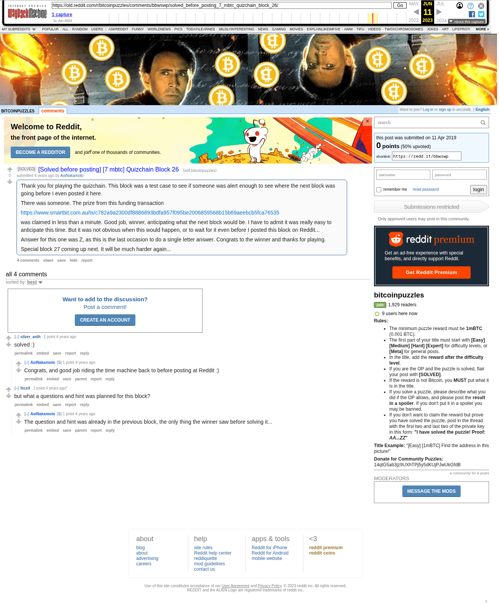

# [Solved before posting] [7 mbtc] Quizchain Block 26

[Original thread](https://www.reddit.com/r/bitcoinpuzzles/comments/bbwswp/solved_before_posting_7_mbtc_quizchain_block_26/). The `sourceUrl` of the [quizchain/26](../../../src/collections/quizchain/26.ts) record and the source of its question and the funding transaction, with the solution the author edited in. The post went up on April 11, 2019, at 06:57:49 UTC, 10 minutes after the block time of its funding transaction.

## Historical provenance

The Wayback Machine holds one capture of the `old.reddit.com` URL and one of the `www.reddit.com` URL. Provenance rests on the [old.reddit.com capture](https://web.archive.org/web/20230611082916/https://old.reddit.com/r/bitcoinpuzzles/comments/bbwswp/solved_before_posting_7_mbtc_quizchain_block_26/), stamped June 11, 2023, 08:29:16 UTC, whose HTML carries the post, which matches the transcript below word for word. It renders four comments, and each matches the Arctic Shift record of the same ID by author and text. Only the markdown of links and lists renders differently. The capture was read on September 27, 2026. `archive_content: confirmed` on that basis.

The [Arctic Shift](https://arctic-shift.photon-reddit.com/) Reddit archive, read the same day, lists the same four comments. The transcript takes authors, text and scores from it and nests the comments as the capture does.

The record names none of the commenters: nothing on the chain ties a claim to a name.

## Transcript

> Thank you for playing the quizchain. This block was a test case to see if someone was alert enough to see where the next block was going before I even posted it here.
>
> There was someone. The prize from this funding transaction
>
> https://www.smartbit.com.au/tx/c782a9a2300df8886893bdfa957f095be2006859568b15b69aeebcb5fca76535
>
> was claimed in less than a minute. Good job, winner, anticipating what the next block would be. I have to admit it was really easy to anticipate this time. But it was not obvious when this would happen, or to wait for it even before I posted this block on Reddit...
>
> Answer for this one was Z, as this is the last occasion to do a single letter answer. Congrats to the winner and thanks for playing.
>
> Special block 27 coming up next. It will be much harder again...

## Comments

**u/silver_anth**, 1 point:

> solved :)

**u/AoiNakamoto**, 1 point, reply to u/silver_anth:

> Congrats, and good job riding the time machine back to before posting at Reddit :)

**u/fecell**, 1 point:

> but what a questions and hint was planned for this block?

**u/AoiNakamoto**, 1 point, reply to u/fecell:

> The question and hint was already in the previous block, the only thing the winner saw before solving it...

## Screenshot

The screenshot is a render of the archive capture, not of the live page, so it carries the Wayback banner at the top. The "4 years ago" stamps are relative to the capture, June 11, 2023. Capture method and limits: [source archive](../README.md).
