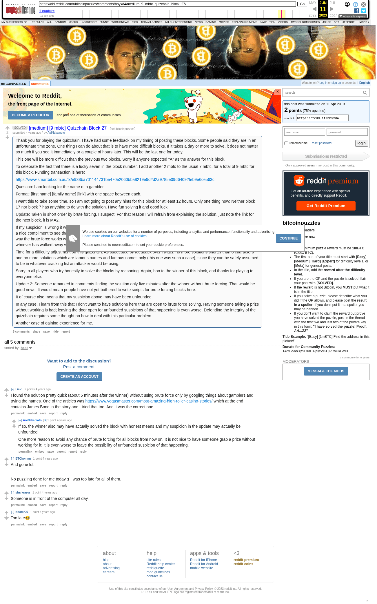

# [medium] [9 mbtc] Quizchain Block 27

[Original thread](https://www.reddit.com/r/bitcoinpuzzles/comments/bbyxd4/medium_9_mbtc_quizchain_block_27/). The `sourceUrl` of the [quizchain/27](../../../src/collections/quizchain/27.ts) record and the source of three of its hints and the funding transaction. The post went up on April 11, 2019, at 11:50:14 UTC, 8 minutes after the block time of its funding transaction. Its last edit is stamped 07:56:24 UTC on April 24, 2019, so the transcript shows the post as it stood after the claim.

## Historical provenance

The Wayback Machine holds one capture of the `old.reddit.com` URL and one of the `www.reddit.com` URL. Provenance rests on the [old.reddit.com capture](https://web.archive.org/web/20230611084219/https://old.reddit.com/r/bitcoinpuzzles/comments/bbyxd4/medium_9_mbtc_quizchain_block_27/), stamped June 11, 2023, 08:42:19 UTC, whose HTML carries the post, which matches the transcript below word for word. It renders five comments, and each matches the Arctic Shift record of the same ID by author and text. Only the markdown of links and lists renders differently. The capture was read on September 27, 2026. `archive_content: confirmed` on that basis.

The [Arctic Shift](https://arctic-shift.photon-reddit.com/) Reddit archive, read the same day, lists 6 comments, one of which the capture does not render. The transcript takes every comment, its author, text and score from Arctic Shift and nests them as the capture does. One of them is a deleted comment, kept below as `[deleted]`.

The record names none of the commenters: nothing on the chain ties a claim to a name.

## Transcript

> Thank you for playing the quizchain. I have had some feedback on my timing of posting these blocks. Some people said they are in an unfortunate time zone. One thing I can do about that is to have more difficult blocks. If it takes a day or more to solve, it does not matter so much if you see it immediately or a couple of hours later. This will be the last one for today.
>
> This one will be more difficult than the previous two blocks. Sorry if anyone expected "A" as the answer for this block.
>
> To celebrate the fact that there is a lucky seven in the block number, I add another 2 mbtc to the usual 7 mbtc, for a total of 9 mbtc for this block. Funding transaction is here:
>
> https://www.smartbit.com.au/tx/e938ba701144731be470e2060bba8219e9d2d2a9785e09d64092feb9e6ce563c
>
> Question: I am looking for the name of a gambler.
>
> Format: [first name] [family name] [link] with one space between each.
>
> I want this to take some time, so I am not going to post any hints for this block for at least 12 hours. Only one thing now: Neither block 17 nor block 7 has anything to do with the solution. Have fun solving it and good luck.
>
> Update: Taken in short order by brute forcing, I suspect. For that reason I will refrain from explaining the solution, just note the link for the next block, it is MA2.
>
> If my suspicion is wrong it would be nice for the winner to explain his reasoning in comments. Unfortunately, I think it is right. While it is a nice compliment to see that someone has taken the trouble to write a password cracker with the previous link as input (there is no way the brute force works without that input), I don"t think that beating brute forcing is the point of doing this kind of quiz. Shame on whoever has walked away with the prize for this block.
>
> Time for a difficulty adjustment on this quizchain. As suggested by feedback over Twitter, no more solutions shorter than 8 characters and no more solutions which are famous names and famous names only (this one was such a case), since they can be safely assumed to be in whatever cracking list an attacker would be using.
>
> Sorry to all players who try honestly to solve the blocks by reasoning. Again, boo to the winner of this block, and thanks for playing to everyone else.
>
> Update 2: Someone remarked in comments finding the solution only five minutes after the winner without brute forcing. That would be good news. It would mean people have not yet bothered to write scripts for brute forcing blocks here.
>
> It of course also means that my suspicion above may have been unfounded.
>
> In any case, I learn from this that I don't want to have solutions here that are open to brute force solving. Having someone taking a prize without working is bad; leaving the door open for unfounded suspicions of that happening is even worse. Defending the integrity of the quizchain requires some thought on how to deal with this particular problem.
>
> Another case of gaining experience for me.

## Comments

**u/LiaVl**, 2 points:

> I found the solution pretty quick (about 5 minutes after the winner) without using brute force only by googling things about gamblers and trying the names. One of the articles was [https://www.vegasmaster.com/most-amazing-high-roller-casino-stories/](https://www.vegasmaster.com/most-amazing-high-roller-casino-stories/) which at the end contains James Bond in the story and I tried that too. And it was the correct one.

**u/AoiNakamoto**, 1 point, reply to u/LiaVl:

> If so, the winner also may have actually solved the block with honest means and my suspicion in the update may actually be unfounded.
>
> One more reason to avoid any chance of brute forcing for all blocks from now on. It is not nice to have someone grab a prize without working for it; it is even worse to leave the possibility of unfounded suspicion of that happening.

**[deleted]**, reply to u/LiaVl:

> [deleted]

**u/BTCkoning**, 1 point:

> And gone lol.
>
> No puzzling done for me today :( I was too late for all of them.

**u/sharkrazor**, 1 point:

> Someone is in front of the computer all day.

**u/Noomr06**, 1 point:

> Too late😅

## Screenshot

The screenshot is a render of the archive capture, not of the live page, so it carries the Wayback banner at the top. The "4 years ago" stamps are relative to the capture, June 11, 2023. Capture method and limits: [source archive](../README.md).
