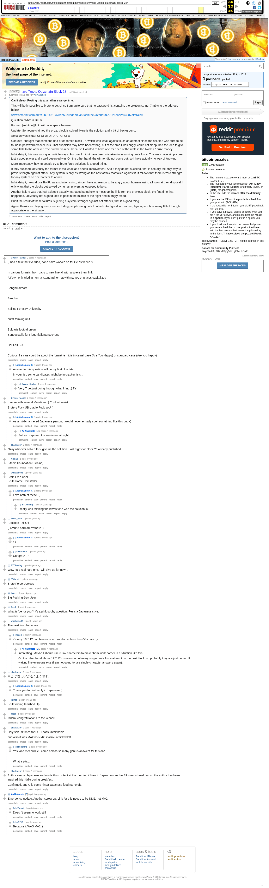

# hard 7mbtc Quizchain Block 28

[Original thread](https://www.reddit.com/r/bitcoinpuzzles/comments/bc3l0m/hard_7mbtc_quizchain_block_28/). The `sourceUrl` of the [quizchain/28](../../../src/collections/quizchain/28.ts) record and the source of two of its hints and the funding transaction, with the solution the author edited in. The post went up on April 11, 2019, at 18:49:05 UTC, 2 minutes after the block time of its funding transaction. Its last edit is stamped 10:46:36 UTC on April 12, 2019, so the transcript shows the post as it stood after the claim.

## Historical provenance

The Wayback Machine holds one capture of the `old.reddit.com` URL and one of the `www.reddit.com` URL. Provenance rests on the [old.reddit.com capture](https://web.archive.org/web/20230612111412/https://old.reddit.com/r/bitcoinpuzzles/comments/bc3l0m/hard_7mbtc_quizchain_block_28/), stamped June 12, 2023, 11:14:12 UTC, whose HTML carries the post, which matches the transcript below word for word. It renders 31 comments, and each matches the Arctic Shift record of the same ID by author and text. Only the markdown of links and lists renders differently. The capture was read on September 27, 2026. `archive_content: confirmed` on that basis.

The [Arctic Shift](https://arctic-shift.photon-reddit.com/) Reddit archive, read the same day, lists 33 comments, two of which the capture does not render: deleted ones and replies behind a "load more" link. The transcript takes every comment, its author, text and score from Arctic Shift and nests them as the capture does. Two of them are deleted comments, kept below as `[deleted]`.

The record names none of the commenters: nothing on the chain ties a claim to a name.

## Transcript

> Can't sleep. Posting this at a rather strange time.
>
> This will be impossible to brute force, since I am quite sure that no password list contains the solution string. 7 mbtc to the address below.
>
> www.smartbit.com.au/tx/2b91c510c78de50e9ddeb094583ab9ee2a2d8e0f477328eac2a53087effa64b9
>
> Question: What is BFU?
>
> Format: [solution] [link] with one space between.
>
> Update: Someone claimed the prize, block is solved. Here is the solution and a bit of background.
>
> Solution was BruteFUFUFUFUFUFUFUFUFU
>
> Context: I thought that someone had brute forced block 27, which was weak against such an attempt since the solution was sure to be found in password cracker lists. That suspicion may have been wrong, but at the time I was angry, could not sleep, had the idea to give some FUs to the attacker. The number is nine, because I wanted to have one for each of the mbtc in the block 27 prize money.
>
> In hindsight, this was wrong in multiple ways. For one, I might have been mistaken in assuming brute force. This may have simply been just a good player and a well deserved win. On the other hand, the winner did not come out, so I have actually no way of knowing.
>
> More importantly, having people try to brute force solutions is a good thing.
>
> If they succeed, obviously the format is too weak and needs improvement. And if they do not succeed, that is actually the only way to prove strength against attack. Any system is only as strong as the best attack that failed against it. It follows that there is zero strength for any system no one bothers to attack.
>
> In hindsight, I would use BotFU as a solution string, since I have no reason to be angry about humans using all tools at their disposal. I only want that the blocks get solved by human players as opposed to bots.
>
> Another failure was that half asleep I actually managed somehow to mess up the link from the previous block, the first time that happened. Obviously not a good idea to post in the middle of the night and in angry mood.
>
> But if the result of these failures is getting a system stronger against bot attacks, that is a good thing.
>
> Again, thanks for playing everyone, including people using bots to attack. And good job, winner, figuring out how many FUs I thought appropriate in the situation.

## Comments

**u/Crypto_Rachel**, 2 points:

> :) had a few that I've tried, none have worked so far Ce est la vie :)
>
> In various formats, from caps to new line all with a space then \[link\]
>
> A Few I only tried in normal standard format with names or places capitalized
>
> Bengbu airport
>
> Bengbu
>
> Beijing Forestry University
>
> burst forming unit
>
> Bulgaria footbal union
>
> Bundesstelle für Flugunfalluntersuchung
>
> Der Fall BFU
>
> Curious if a clue could be about the format ie if it is in camel case (Are You Happy) or standard case (Are you happy)

**u/AoiNakamoto**, 2 points, reply to u/Crypto_Rachel:

> Answer to this question will be my first clue later.
>
> In your list, some candidates might be in cracker lists...

**u/Crypto_Rachel**, 1 point, reply to u/AoiNakamoto:

> Very True, just going through what I find :) TY

**u/Crypto_Rachel**, 2 points:

> :) more with several Variations :) Couldn't resist
>
> Bruters Fuck UBrutable Fuck yoU :)

**u/AoiNakamoto**, 2 points, reply to u/Crypto_Rachel:

> As a mild-mannered Japanese person, I would never actually spell something like this out :-)

**u/AoiNakamoto**, 2 points, reply to u/AoiNakamoto:

> But you captured the sentiment all right...

**[deleted]**, reply to u/AoiNakamoto:

> [deleted]

**u/sharkrazor**, 2 points:

> Okay whoever solved this, give us the solution. Last digits for block 29 already published.

**u/Agelais**, 1 point:

> Bitcoin Foundation Ukraine)

**u/whatupyo02**, 1 point:

> Brain Free User
> Brute Force Uninstaller

**u/AoiNakamoto**, 2 points, reply to u/whatupyo02:

> Love both of these :-)

**u/BTCkoning**, 1 point, reply to u/AoiNakamoto:

> I really was thinking the lowest one was the solution lol.

**u/silver_anth**, 1 point:

> Brackets Fell Off
>
> [] around hard aren't there :)

**u/AoiNakamoto**, 2 points, reply to u/silver_anth:

> :-)

**u/sharkrazor**, 1 point, reply to u/silver_anth:

> Congratz 27

**u/BTCkoning**, 1 point:

> Wow its a real hard one, i will give up for now -.-

**u/JTobcat**, 1 point:

> Brute Force Useless

**u/jnkred**, 1 point:

> Big Fucking ~~Gun~~ User

**u/fecell**, 1 point:

> What is 'be for you'? It's a philosophy question. Feels a Japanese style.

**u/whatupyo02**, 1 point:

> The next link characters

**u/fecell**, 1 point, reply to u/whatupyo02:

> it's only 195112 combinations for bruteforce three base58 chars. ;)

**u/AoiNakamoto**, 2 points, reply to u/fecell:

> Interesting. Maybe I should use 6 link characters to make them work harder in a situation like this.
>
> On the other hand, those 195112 come on top of every single brute force attempt on the next block, so probably they are just better off waiting like everyone else (I am not going to use single character answers again).

**u/sharkrazor**, 1 point:

> 本当に"難しい"が合うようです。

**u/AoiNakamoto**, 1 point, reply to u/sharkrazor:

> Thank you for first reply in Japanese :)

**u/jnkred**, 1 point:

> Bruteforcing Finished Up

**u/fecell**, 1 point:

> tadam! congratulations to the winner!

**u/sharkrazor**, 1 point:

> Holy shit...9 times for FU. That's unthinkable.
>
> and also it was MA2 no NM2. it also unthinkable!!

**u/BTCkoning**, 1 point, reply to u/sharkrazor:

> Yes, and meanwhile i came across so many genius answers for this one...
>
> What a pity...

**u/sharkrazor**, 0 points:

> Author seems Japanese and wrote this content at the morning if lives in Japan now so the BF means breakfast so the author has been inspired this riddle during breakfast.
>
> Confirmed. and U is some kinda Japanese food name ofc.

**u/AoiNakamoto**, 0 points:

> Emergency update: Another screw up. Link for this needs to be NM2, not MA2.

**u/JTobcat**, 1 point, reply to u/AoiNakamoto:

> Doesn't seem to work still

**u/rs1712**, 1 point, reply to u/AoiNakamoto:

> Because it WAS MA2 :(

**[deleted]**:

> [deleted]

## Screenshot

The screenshot is a render of the archive capture, not of the live page, so it carries the Wayback banner at the top. The "4 years ago" stamps are relative to the capture, June 12, 2023. Capture method and limits: [source archive](../README.md).
