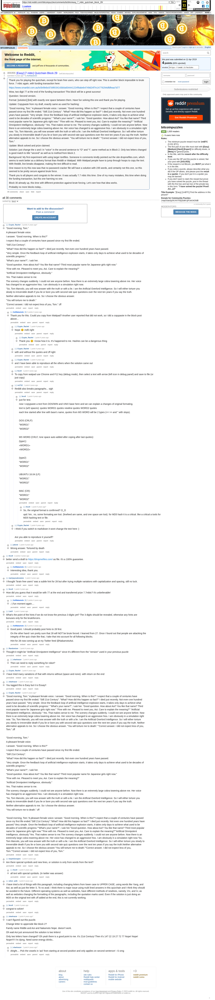

# [Easy] [7 mbtc] Quizchain Block 29

[Original thread](https://www.reddit.com/r/bitcoinpuzzles/comments/bc6rkn/easy_7_mbtc_quizchain_block_29/). The `sourceUrl` of the [quizchain/29](../../../src/collections/quizchain/29.ts) record and the source of three of its hints and the funding transaction, with the solution the author edited in. The post went up on April 11, 2019, at 23:33:49 UTC, 8 minutes before the block time of its funding transaction. Its last edit is stamped 12:22:09 UTC on April 12, 2019.

## Historical provenance

The Wayback Machine holds one capture of the `old.reddit.com` URL and one of the `www.reddit.com` URL, plus two of single comment permalinks. Provenance rests on the [old.reddit.com capture](https://web.archive.org/web/20230611185506/https://old.reddit.com/r/bitcoinpuzzles/comments/bc6rkn/easy_7_mbtc_quizchain_block_29/), stamped June 11, 2023, 18:55:06 UTC, whose HTML carries the post, which matches the transcript below word for word. It renders 30 comments, and each matches the Arctic Shift record of the same ID by author and text. Only the markdown of links and lists renders differently. The capture was read on September 27, 2026. `archive_content: confirmed` on that basis.

The [Arctic Shift](https://arctic-shift.photon-reddit.com/) Reddit archive, read the same day, lists the same 30 comments. The transcript takes authors, text and scores from it and nests the comments as the capture does.

The record names none of the commenters: nothing on the chain ties a claim to a name.

## Transcript

> Thank you for playing the quizchain, except for brain free users, who can step off right now. This is another block impossible to brute force. 7 mbtc again, with funding transaction here:
>
> https://www.smartbit.com.au/tx/b49ebc67d4fc54143b0a934441224f6abeb4749d24f7e14776294dfdfeaa7d77
>
> Wow, two digit 77 at the end of the funding transaction! This block will be a great success!
>
> Question: Second version.
>
> Format: [solution] [link] with exactly one space between them. Have fun solving this one and thank you for playing.
>
> Update: Copypaste from my draft, exactly same as used for hashing:
>
> "Good morning, Tom."
> A pleasant female voice.
> I answer. "Good morning. When is this?"
> I expect that a couple of centuries have passed since my first life ended.
> "Still 21st Century".
> "What? How did this happen so fast?" I died just recently. Not even one hundred years have passed.
> "Very simple. Once the feedback loop of artificial intelligence explosion starts, it takes only days to achieve what used to be decades of scientific progress."
> "What's your name?", I ask her.
> "Good question. How about Aoi? You like that name? Third most popular name for Japanese girls right now."
> "Fine with me. Pleased to meet you, Aoi. Care to explain the meaning?"
> "Artificial Omnipotent Intelligence, obviously."
> Yes. That makes sense to me.
> The scenery changes suddenly. I could not see anyone before. Now there is an extremely large cobra towering above me. Her voice has changed to an aggressive hiss. I am obviously in a simulation right now.
> "So, Tom Marvolo, you will now answer with the truth or with a lie. I am the Artificial Overlord Intelligence. So I will either torture you slowly to irreversible death if you lie or bore you with second rate quiz questions over the next ten years if you say the truth.
> Neither alternative appeals to me. So I choose the obvious answer.
> "You will torture me to death."
> "Correct answer. I did not expect less of you, Tom."
>
> Update: Block solved and prize claimed.
>
> Solution: just change the o and i in "voice" in the second sentence to "O" and "I", same method as in Block 2. Only two letters changed is good match to title "second" as well as to method from block 2.
>
> Background: My first experiment with using larger textfiles. Someone in comments kindly pointed out the site dropmefiles.com, which seems to work better as a delivery format than Reddit or Wattpad. With Wattpad people have to jump through hoops to copy the text. With Reddit, line breaks disappear, making the text difficult to read.
>
> One reason to try this now was that no password cracker file will have a solution with 235 words, and certainly not this one, so this seemed to be pretty secure against brute force.
>
> Thank you to all players and congrats to the winner. It was actually 7.7 mbtc this time. One of my many mistakes, this time when doing the funding transaction, but this one harming no one.
>
> Block 30 already up, this time with different protection against brute forcing. Let's see how that idea works.
>
> Probably no more blocks today...

## Comments

**u/Crypto_Rachel**, 2 points:

> "Good morning, Tom."
>
> A pleasant female voice.
>
> I answer. "Good morning. When is this?"
>
> I expect that a couple of centuries have passed since my first life ended.
>
> "Still 21st Century".
>
> "What? How did this happen so fast?" I died just recently. Not even one hundred years have passed.
>
> "Very simple. Once the feedback loop of artificial intelligence explosion starts, it takes only days to achieve what used to be decades of scientific progress."
>
> "What's your name?", I ask her.
>
> "Good question. How about Aoi? You like that name? Third most popular name for Japanese girls right now."
>
> "Fine with me. Pleased to meet you, Aoi. Care to explain the meaning?"
>
> "Artificial Omnipotent Intelligence, obviously."
>
> Yes. That makes sense to me.
>
> The scenery changes suddenly. I could not see anyone before. Now there is an extremely large cobra towering above me. Her voice has changed to an aggressive hiss. I am obviously in a simulation right now.
>
> "So, Tom Marvolo, you will now answer with the truth or with a lie. I am the Artificial Overlord Intelligence. So I will either torture you slowly to irreversible death if you lie or bore you with second rate quiz questions over the next ten years if you say the truth.
>
> Neither alternative appeals to me. So I choose the obvious answer.
>
> "You will torture me to death."
>
> "Correct answer. I did not expect less of you, Tom." zff

**u/AoiNakamoto**, 2 points, reply to u/Crypto_Rachel:

> Thank you for this. Could you copy from Wattpad? Another user reported that did not work, so I did a copypaste in the block post above...

**u/Crypto_Rachel**, 1 point, reply to u/AoiNakamoto:

> Nope 😊 md5 right

**u/Crypto_Rachel**, 1 point, reply to u/Crypto_Rachel:

> Thank you 😊 I know how it is. It's happened to me. Hashes can be a dangerous thing

**u/Crypto_Rachel**, 1 point, reply to u/AoiNakamoto:

> with and without the quotes and zff right

**u/Crypto_Rachel**, 1 point, reply to u/AoiNakamoto:

> and I have been able to reproduce all the others when the solution came out

**u/fecell**, 1 point, reply to u/AoiNakamoto:

> To copy from watpad use Chrome and F12 key (debug mode), then select a text with arrow (left icon in debug panel) and save to file (or just copy)

**u/rs1712**, 1 point, reply to u/AoiNakamoto:

> Reddit also breaks paragraphs... sigh

**u/fecell**, 1 point, reply to u/rs1712:

> just for test.
>
> now I copypaste a text from DOS/WIN and UNIX base here and we can explain a changes of original formating.
>
> text is (w/0 spaces): quotes WORD1 quotes newline quotes WORD2 quotes
>
> each line started after line with base's name, quotes from MS WORD will be 2 types (<< >> and " with slops).
>
> DOS (CRLF):
>
> "WORD1"
>
> "WORD2"
>
> MS WORD (CRLF, !one space auto added after coping after last quotes):
>
> (type1)
>
> «WORD1»
>
> «WORD2»
>
> (type2)
>
> “WORD1”
>
> “WORD2”
>
> UBUNTU 16.04 (LF):
>
> "WORD1"
>
> "WORD2"
>
> MAC (CR):
>
> "WORD1"
>
> "WORD2"

**u/fecell**, 1 point, reply to u/fecell:

> So, the original format is confirmed? О\_О
>
> upd: hm.. no, some formating are lost. (linefeed are same, and one space are lost). for MD5 hash it is a critical. like a critical a tools for MD5 hashing text or file.

**u/Crypto_Rachel**, 1 point, reply to u/AoiNakamoto:

> I think if you switch to markdown it wont change the text here :)
>
> Are you able to reproduce it yourself?

**u/jnkred**, 1 point, reply to u/Crypto_Rachel:

> Wrong answer. Tortured by death

**u/fecell**, 2 points:

> better send a draft to [https://dropmefiles.com/](https://dropmefiles.com/) as file. it's a 100% guarantee.

**u/AoiNakamoto**, 1 point, reply to u/fecell:

> Interesting idea, thank you.

**u/martypyouknowme**, 1 point:

> I thought “brain free users” was a subtle hint for 28 but after trying multiple variations with capitalization and spacing, still no luck.

**u/fecell**, 1 point:

> How did you guess that it would be with 77 at the end and transferred prize 7.7mbtc? it's unbelievable!

**u/AoiNakamoto**, 2 points, reply to u/fecell:

> ;-) fun moment again....

**u/LiaVl**, 1 point:

> What's the point of the hints if we do not know the previous 3 digits yet? The 3 digits should be revealed, otherwise any hints are bonuses only for the bruteforcers.

**u/AoiNakamoto**, 0 points, reply to u/LiaVl:

> Good point. I should probably post hints to 28 first.
>
> On the other hand I am pretty sure that 28 will NOT be brute forced. I learned from 27. Once I found out that people are attacking the integrity of the quiz chain like that, I take that into account for all following blocks.
>
> Hint for 28 now coming up at my Twitter feed @NakamotoAoi.

**u/Randomiser**, 1 point:

> Thought it might be "Artificial Omnipotent Intelligence" since it's different from the "version" used in your previous puzzle

**u/sharkrazor**, 1 point, reply to u/Randomiser:

> Then we need to reply something for robot?

**u/Crypto_Rachel**, 1 point:

> I have tried many variations of that with returns without (space and none). with return on the end

**u/sharkrazor**, 1 point:

> You tagged this is Easy but it is Essay!!

**u/Crypto_Rachel**, 1 point:

> "Good morning, Tom." A pleasant female voice. I answer. "Good morning. When is this?" I expect that a couple of centuries have passed since my first life ended. "Still 21st Century". "What? How did this happen so fast?" I died just recently. Not even one hundred years have passed. "Very simple. Once the feedback loop of artificial intelligence explosion starts, it takes only days to achieve what used to be decades of scientific progress." "What's your name?", I ask her. "Good question. How about Aoi? You like that name? Third most popular name for Japanese girls right now." "Fine with me. Pleased to meet you, Aoi. Care to explain the meaning?" "Artificial Omnipotent Intelligence, obviously." Yes. That makes sense to me. The scenery changes suddenly. I could not see anyone before. Now there is an extremely large cobra towering above me. Her voice has changed to an aggressive hiss. I am obviously in a simulation right now. "So, Tom Marvolo, you will now answer with the truth or with a lie. I am the Artificial Overlord Intelligence. So I will either torture you slowly to irreversible death if you lie or bore you with second rate quiz questions over the next ten years if you say the truth. Neither alternative appeals to me. So I choose the obvious answer. "You will torture me to death." "Correct answer. I did not expect less of you, Tom." zff
>
> "Good morning, Tom."
>
> A pleasant female voice.
>
> I answer. "Good morning. When is this?"
>
> I expect that a couple of centuries have passed since my first life ended.
>
> "Still 21st Century".
>
> "What? How did this happen so fast?" I died just recently. Not even one hundred years have passed.
>
> "Very simple. Once the feedback loop of artificial intelligence explosion starts, it takes only days to achieve what used to be decades of scientific progress."
>
> "What's your name?", I ask her.
>
> "Good question. How about Aoi? You like that name? Third most popular name for Japanese girls right now."
>
> "Fine with me. Pleased to meet you, Aoi. Care to explain the meaning?"
>
> "Artificial Omnipotent Intelligence, obviously."
>
> Yes. That makes sense to me.
>
> The scenery changes suddenly. I could not see anyone before. Now there is an extremely large cobra towering above me. Her voice has changed to an aggressive hiss. I am obviously in a simulation right now.
>
> "So, Tom Marvolo, you will now answer with the truth or with a lie. I am the Artificial Overlord Intelligence. So I will either torture you slowly to irreversible death if you lie or bore you with second rate quiz questions over the next ten years if you say the truth.
>
> Neither alternative appeals to me. So I choose the obvious answer.
>
> "You will torture me to death." zff
>
> "Good morning, Tom."A pleasant female voice.I answer. "Good morning. When is this?"I expect that a couple of centuries have passed since my first life ended."Still 21st Century"."What? How did this happen so fast?" I died just recently. Not even one hundred years have passed."Very simple. Once the feedback loop of artificial intelligence explosion starts, it takes only days to achieve what used to be decades of scientific progress.""What's your name?", I ask her."Good question. How about Aoi? You like that name? Third most popular name for Japanese girls right now.""Fine with me. Pleased to meet you, Aoi. Care to explain the meaning?""Artificial Omnipotent Intelligence, obviously."Yes. That makes sense to me.The scenery changes suddenly. I could not see anyone before. Now there is an extremely large cobra towering above me. Her voice has changed to an aggressive hiss. I am obviously in a simulation right now."So, Tom Marvolo, you will now answer with the truth or with a lie. I am the Artificial Overlord Intelligence. So I will either torture you slowly to irreversible death if you lie or bore you with second rate quiz questions over the next ten years if you say the truth.Neither alternative appeals to me. So I choose the obvious answer."You will torture me to death.""Correct answer. I did not expect less of you, Tom.""Correct answer. I did not expect less of you, Tom."

**u/IvayloGeorgiev**, 1 point:

> Are there special symbols and new lines, or solution is only from words from the text?

**u/fecell**, 1 point, reply to u/IvayloGeorgiev:

> all text with special symbols. (in twitter was answer)

**u/silver_anth**, 1 point:

> I have tried a lot of things with this paragraph, including changing letters from lower case to UPPER CASE, using words like Yang, and Aoi; as well as just the letter S. To no avail. I think there is major issue using multi lined answers in this quizchain and I think they should be avoided in the future. Different operating systems as well as websites, have different methods of newlines, namely, \r\n, and \n; as well as websites changing the formatting of the paragraphs, including the quotation marks used. Even if the solution is just doing an MD5 on the original text with zff added at the end, this is not currently working.

**u/fecell**, 1 point:

> congrat to solver!

**u/sharkrazor**, 1 point:

> I can't figured out this puzzle.
>
> Change letter to upperside like block 2?
>
> Family name Riddle and Aoi and Nakamoto Nope. doesn't work.
>
> Oh wait Aoi just announced the solution is two letters!
>
> Only two letters have changed? Oh yeah there is a good point to me.
> It's 21st Century! Then it's 14? 22 19 27 72 77
> Nope! Nope! Nope!!!!! I'm dying. Need some energy drinks..

**u/sharkrazor**, 1 point, reply to u/sharkrazor:

> Alright.... Pick the vowels in 'aoi' from starting at second position and only applies on second sentence!
> :-S omg

## Screenshot

The screenshot is a render of the archive capture, not of the live page, so it carries the Wayback banner at the top. The "4 years ago" stamps are relative to the capture, June 11, 2023. Capture method and limits: [source archive](../README.md).
