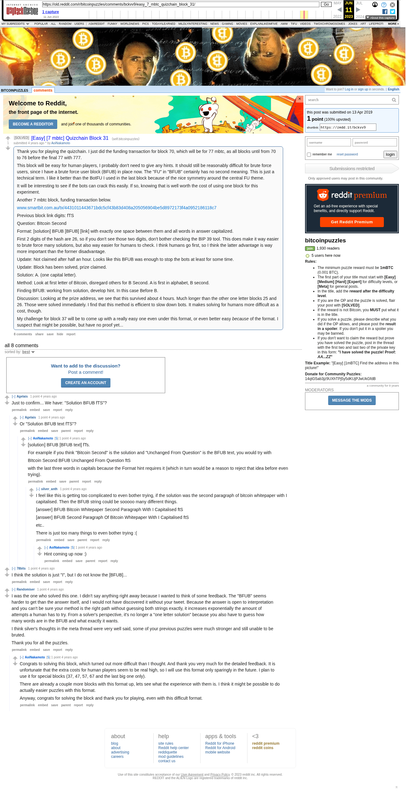

# [Easy] [7 mbtc] Quizchain Block 31

[Original thread](https://www.reddit.com/r/bitcoinpuzzles/comments/bckvv9/easy_7_mbtc_quizchain_block_31/). The `sourceUrl` of the [quizchain/31](../../../src/collections/quizchain/31.ts) record and the source of four of its hints and the funding transaction, with the solution the author edited in. The post went up on April 13, 2019, at 00:27:03 UTC, 15 minutes after the block time of its funding transaction. Its last edit is stamped 12:06:17 UTC on April 13, 2019, so the transcript shows the post as it stood after the claim.

## Historical provenance

The Wayback Machine holds one capture of the `old.reddit.com` URL and one of the `www.reddit.com` URL. Provenance rests on the [old.reddit.com capture](https://web.archive.org/web/20230611171015/https://old.reddit.com/r/bitcoinpuzzles/comments/bckvv9/easy_7_mbtc_quizchain_block_31/), stamped June 11, 2023, 17:10:15 UTC, whose HTML carries the post, which matches the transcript below word for word. It renders eight comments, and each matches the Arctic Shift record of the same ID by author and text. Only the markdown of links and lists renders differently. The capture was read on September 27, 2026. `archive_content: confirmed` on that basis.

The [Arctic Shift](https://arctic-shift.photon-reddit.com/) Reddit archive, read the same day, lists the same eight comments. The transcript takes authors, text and scores from it and nests the comments as the capture does.

The record names none of the commenters: nothing on the chain ties a claim to a name.

## Transcript

> Thank you for playing the quizchain. I just did the funding transaction for block 70, which will be for 77 mbtc, as all blocks until from 70 to 76 before the final 77 with 777.
>
> This block will be easy for human players, I probably don't need to give any hints. It should still be reasonably difficult for brute force users, since I have a brute force user block (BFUB) in place now. The "FU" in "BFUB" certainly has no second meaning. This is just a technical term. I like it better than the BotFU I used in the last block because of the nice symmetry around the central FU theme.
>
> It will be interesting to see if the bots can crack this easily. If so, knowing that is well worth the cost of using one block for this experiment.
>
> Another 7 mbtc block, funding transaction below.
>
> www.smartbit.com.au/tx/4431011443671bdc5cf43b83d408a205056904be5d8972173f4a0952186118c7
>
> Previous block link digits: fTS
>
> Question: BItcoin Second
>
> Format: [solution] BFUB [BFUB] [link] with exactly one space between them and all words in answer capitalized.
>
> First 2 digits of the hash are 26, so if you don't see those two digits, don't bother checking the BIP 39 tool. This does make it way easier to brute force many solutions, but also way easier for humans to check. I think humans go first, so I think the latter advantage is way more important than the former disadvantage.
>
> Update: Not claimed after half an hour. Looks like this BFUB was enough to stop the bots at least for some time.
>
> Update: Block has been solved, prize claimed.
>
> Solution: A. (one capital letter).
>
> Method: Look at first letter of Bitcoin, disregard others for B Second. A is first in alphabet, B second.
>
> Finding BFUB: working from solution, develop hint. In this case Before B.
>
> Discussion: Looking at the prize address, we see that this survived about 4 hours. Much longer than the other one letter blocks 25 and 26. Those were solved immediately. I find that this method is efficient to slow down bots. It makes solving for humans more difficult as a cost, though.
>
> My challenge for block 37 will be to come up with a really easy one even under this format, or even better easy _because_ of the format. I suspect that might be possible, but have no proof yet...

## Comments

**u/Agelais**, 1 point:

> Just to confirm... We have: "Solution BFUB fTS"?

**u/Agelais**, 1 point, reply to u/Agelais:

> Or "Solution BFUB text fTS"?

**u/AoiNakamoto**, 1 point, reply to u/Agelais:

> [solution] BFUB [BFUB text] fTs.
>
> For example if you think "Bitcoin Second" is the solution and "Unchanged From Question" is the BFUB text, you would try with
>
> BItcoin Second BFUB Unchanged From Question ftS
>
> with the last three words in capitals because the Format hint requires it (which in turn would be a reason to reject that idea before even trying).

**u/silver_anth**, 1 point, reply to u/AoiNakamoto:

> I feel like this is getting too complicated to even bother trying, if the solution was the second paragraph of bitcoin whitepaper with I capitalised. Then the BFUB string could be sooooo many different things.
>
> [answer] BFUB Bitcoin Whitepaper Second Paragraph With I Capitalised ftS
>
> [answer] BFUB Second Paragraph Of Bitcoin Whitepaper With I Capitalised ftS
>
> etc..
>
> There is just too many things to even bother trying :(

**u/AoiNakamoto**, 1 point, reply to u/silver_anth:

> Hint coming up now :)

**u/78bits**, 1 point:

> I think the solution is just "I", but I do not know the \[BFUB\]...

**u/Randomiser**, 1 point:

> I was the one who solved this one. I didn't say anything right away because I wanted to think of some feedback. The "BFUB" seems harder to get than the answer itself, and I would not have discovered it without your tweet. Because the answer is open to interpretation and you can't be sure your method is the right path without guessing both strings exactly, it increases exponentially the amount of attempts a human has to try. From a solver's perspective, it's no longer a "one letter solution" because you also have to guess how many words are in the BFUB and what exactly it wants.
>
> I think silver's thoughts in the meta thread were very well said, some of your previous puzzles were much stronger and still unable to be bruted.
>
> Thank you for all the puzzles.

**u/AoiNakamoto**, 1 point, reply to u/Randomiser:

> Congrats to solving this block, which turned out more difficult than I thought. And thank you very much for the detailed feedback. It is unfortunate that the extra costs for human players seem to be real high, so I will use this format only sparingly in the future. I plan to use it for special blocks (37, 47, 57, 67 and the last big one only).
>
> There are already a couple more blocks with this format up, lets see what the experience with them is. I think it might be possible to do actually easier puzzles with this format.
>
> Anyway, congrats for solving the block and thank you for playing, even with this difficult format.

## Screenshot

The screenshot is a render of the archive capture, not of the live page, so it carries the Wayback banner at the top. The "4 years ago" stamps are relative to the capture, June 11, 2023. Capture method and limits: [source archive](../README.md).
