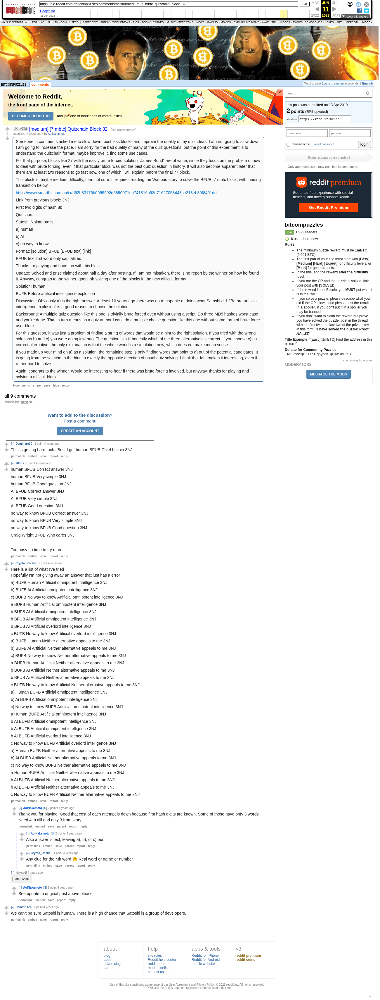

# [medium] [7 mbtc] Quizchain Block 32

[Original thread](https://www.reddit.com/r/bitcoinpuzzles/comments/bclsnu/medium_7_mbtc_quizchain_block_32/). The `sourceUrl` of the [quizchain/32](../../../src/collections/quizchain/32.ts) record and the source of four of its hints and the funding transaction, with the solution the author edited in. The post went up on April 13, 2019, at 02:09:12 UTC, 12 minutes after the block time of its funding transaction. Its last edit is stamped 12:21:59 UTC on April 13, 2019, so the transcript shows the post as it stood after the claim.

## Historical provenance

The Wayback Machine holds one capture of the `old.reddit.com` URL and one of the `www.reddit.com` URL. Provenance rests on the [old.reddit.com capture](https://web.archive.org/web/20230611082156/https://old.reddit.com/r/bitcoinpuzzles/comments/bclsnu/medium_7_mbtc_quizchain_block_32/), stamped June 11, 2023, 08:21:56 UTC, whose HTML carries the post, which matches the transcript below word for word. It renders nine comments, and each matches the Arctic Shift record of the same ID by author and text. Only the markdown of links and lists renders differently. The capture was read on September 27, 2026. `archive_content: confirmed` on that basis.

The [Arctic Shift](https://arctic-shift.photon-reddit.com/) Reddit archive, read the same day, lists 9 comments, one of which the capture does not render. The transcript takes every comment, its author, text and score from Arctic Shift and nests them as the capture does.

The record names none of the commenters: nothing on the chain ties a claim to a name.

## Transcript

> Someone in comments asked me to slow down, post less blocks and improve the quality of my quiz ideas. I am not going to slow down. I am going to increase the pace. I am sorry for the bad quality of many of the quiz questions, but the point of this experiment is to understand the quizchain format, maybe improve it, find some use cases.
>
> For that purpose, blocks like 27 with the easily brute forced solution "James Bond" are of value, since they focus on the problem of how to deal with brute forcing, even if that particular block was not the best quiz question in history.
> It will also become apparent later that there are at least two reasons to go fast now, one of which I will explain before the final 77 block.
>
> This block is maybe medium difficulty, I am not sure. It requires reading the Wattpad story to solve the BFUB. 7 mbtc block, with funding transaction below.
>
> https://www.smartbit.com.au/tx/d62b83175b0959992d6890071ea741816b93d71627058443ce213eb39f8491dd
>
> Link from previous block: 3NJ
>
> First two digits of hash:8b
>
> Question:
>
> Satoshi Nakamoto is
>
> a) human
>
> b) AI
>
> c) no way to know
>
> Format: [solution] BFUB [BFUB text] [link]
>
> BFUB text first word only capitalized.
>
> Thanks for playing and have fun with this block.
>
> Update: Solved and prize claimed about half a day after posting. If I am not mistaken, there is no report by the winner on how he found it. Anyway, congrats to the winner, good job solving one of the blocks in the new difficult format.
>
> Solution: human
>
> BUFB Before artificial intelligence explosion
>
> Discussion: Obviously a) is the right answer. At least 10 years ago there was no AI capable of doing what Satoshi did. "Before artificial intelligence explosion" is a good reason to choose the solution.
>
> Background: A multiple quiz question like this one is trivially brute forced even without using a script. Do three MD5 hashes worst case and you're done. That in turn means as a quiz author I can't do a multiple choice question like this one without some form of brute force user block.
>
> For this question, it was just a problem of finding a string of words that would be a hint to the right solution. If you tried with the wrong solutions b) and c) you were doing it wrong. The question is still honestly which of the three alternatives is correct. If you choose c) as correct alternative, the only explanation is that the whole world is a simulation now, which does not make much sense.
>
> If you made up your mind on a) as a solution, the remaining step is only finding words that point to a) out of the potential candidates. It is going from the solution to the hint, in exactly the opposite direction of usual quiz solving. I think that fact makes it interesting, even if rather hard to solve.
>
> Again, congrats to the winner. Would be interesting to hear if there was brute forcing involved, but anyway, thanks for playing and solving a difficult block.

## Comments

**u/Deminero30**, 1 point:

> This is getting hard fuck..
> Best I got human BFUB Chief bitcoin 3NJ

**u/78bits**, 1 point:

> human BFUB Correct answer 3NJ
>
> human BFUB Very simple 3NJ
>
> human BFUB Good question 3NJ
>
> AI BFUB Correct answer 3NJ
>
> AI BFUB Very simple 3NJ
>
> AI BFUB Good question 3NJ
>
> no way to know BFUB Correct answer 3NJ
>
> no way to know BFUB Very simple 3NJ
>
> no way to know BFUB Good question 3NJ
>
> Craig Wright BFUB Who cares 3NJ
>
> Too busy no time to try more...

**u/Crypto_Rachel**, 1 point:

> Here is a list of what I've tried
> Hopefully I'm not giving away an answer that just has a error
>
> a) BUFB Human Artificial omnipotent intelligence 3NJ
>
> b) BUFB Ai Artificial omnipotent intelligence 3NJ
>
> c) BUFB No way to know Artificial omnipotent intelligence 3NJ
>
> a BUFB Human Artificial omnipotent intelligence 3NJ
>
> b BUFB AI Artificial omnipotent intelligence 3NJ
>
> b BFUB Ai Artificial omnipotent intelligence 3NJ
>
> b BFUB Ai Artificial overlord intelligence 3NJ
>
> c BUFB No way to know Artificial overlord intelligence 3NJ
>
> a) BUFB Human Neither alternative appeals to me 3NJ
>
> b) BUFB Ai Artificial Neither alternative appeals to me 3NJ
>
> c) BUFB No way to know Neither alternative appeals to me 3NJ
>
> a BUFB Human Artificial Neither alternative appeals to me 3NJ
>
> b BUFB AI Artificial Neither alternative appeals to me 3NJ
>
> b BFUB Ai Artificial Neither alternative appeals to me 3NJ
>
> c BUFB No way to know Artificial Neither alternative appeals to me 3NJ
>
> a) Human BUFB Artificial omnipotent intelligence 3NJ
>
> b) Ai BUFB Artificial omnipotent intelligence 3NJ
>
> c) No way to know BUFB Artificial omnipotent intelligence 3NJ
>
> a Human BUFB Artificial omnipotent intelligence 3NJ
>
> b AI BUFB Artificial omnipotent intelligence 3NJ
>
> b Ai BUFB Artificial omnipotent intelligence 3NJ
>
> b Ai BUFB Artificial overlord intelligence 3NJ
>
> c No way to know BUFB Artificial overlord intelligence 3NJ
>
> a) Human BUFB Neither alternative appeals to me 3NJ
>
> b) Ai BUFB Artificial Neither alternative appeals to me 3NJ
>
> c) No way to know BUFB Neither alternative appeals to me 3NJ
>
> a Human BUFB Artificial Neither alternative appeals to me 3NJ
>
> b AI BUFB Artificial Neither alternative appeals to me 3NJ
>
> b Ai BUFB Artificial Neither alternative appeals to me 3NJ
>
> c No way to know BUFB Artificial Neither alternative appeals to me 3NJ

**u/AoiNakamoto**, 2 points, reply to u/Crypto_Rachel:

> Thank you for playing. Good that cost of each attempt is down because first hash digits are known. Some of those have on!y 3 words. Need 4 in alll and only 3 from story.

**u/AoiNakamoto**, 2 points, reply to u/AoiNakamoto:

> Also answer is text, leaving a), b), or c) our.

**u/Crypto_Rachel**, 1 point, reply to u/AoiNakamoto:

> Any clue for the 4th word 😊
> Real word or name or number

**u/DemetriXcs**, 1 point:

> We can't be sure Satoshi is human. There is a high chance that Satoshi is a group of developers.

**u/dcryptoguy**, 1 point:

> What was the answer to this?

**u/AoiNakamoto**, 1 point, reply to u/dcryptoguy:

> See update to original post above please.

## Screenshot

The screenshot is a render of the archive capture, not of the live page, so it carries the Wayback banner at the top. The "4 years ago" stamps are relative to the capture, June 11, 2023. Capture method and limits: [source archive](../README.md).
