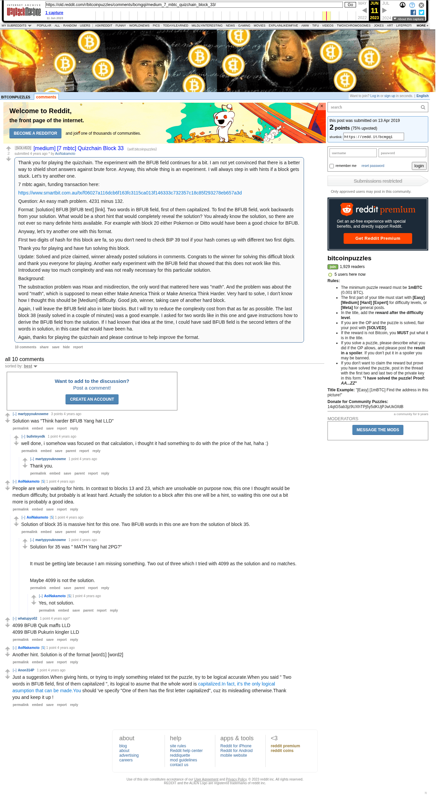

# [medium] [7 mbtc] Quizchain Block 33

[Original thread](https://www.reddit.com/r/bitcoinpuzzles/comments/bcmgqi/medium_7_mbtc_quizchain_block_33/). The `sourceUrl` of the [quizchain/33](../../../src/collections/quizchain/33.ts) record and the source of two of its hints and the funding transaction. The post went up on April 13, 2019, at 03:29:34 UTC, 12 minutes after the block time of its funding transaction. Its last edit is stamped 09:14:40 UTC on April 14, 2019, so the transcript shows the post as it stood after the claim.

## Historical provenance

The Wayback Machine holds one capture of the `old.reddit.com` URL and two of the `www.reddit.com` URL, plus two of single comment permalinks. Provenance rests on the [old.reddit.com capture](https://web.archive.org/web/20230611095851/https://old.reddit.com/r/bitcoinpuzzles/comments/bcmgqi/medium_7_mbtc_quizchain_block_33/), stamped June 11, 2023, 09:58:51 UTC, whose HTML carries the post, which matches the transcript below word for word. It renders ten comments, and each matches the Arctic Shift record of the same ID by author and text. Only the markdown of links and lists renders differently. The capture was read on September 27, 2026. `archive_content: confirmed` on that basis.

The [Arctic Shift](https://arctic-shift.photon-reddit.com/) Reddit archive, read the same day, lists 11 comments, one of which the capture does not render. The transcript takes every comment, its author, text and score from Arctic Shift and nests them as the capture does. One of them is a deleted comment, kept below as `[deleted]`.

The record names none of the commenters: nothing on the chain ties a claim to a name.

## Transcript

> Thank you for playing the quizchain. The experiment with the BFUB field continues for a bit. I am not yet convinced that there is a better way to shield short answers against brute force. Anyway, this whole thing is an experiment. I will always step in with hints if a block gets stuck. Let's try another one.
>
> 7 mbtc again, funding transaction here:
>
> https://www.smartbit.com.au/tx/f06027a116dcb6f163fc3115ca013f146333c732357c18c85f293278eb657a3d
>
> Question: An easy math problem. 4231 minus 132.
>
> Format: [solution] BFUB [BFUB text] [link]. Two words in BFUB field, first of them capitalized. To find the BFUB field, work backwards from your solution. What would be a short hint that would completely reveal the solution? You already know the solution, so there are not ever so many definite hints available. For example with block 20 either Pokemon or Ditto would have been a good choice for BFUB.
>
> Anyway, let's try another one with this format.
>
> FIrst two digits of hash for this block are fa, so you don't need to check BIP 39 tool if your hash comes up with different two first digits.
>
> Thank you for playing and have fun solving this block.
>
> Update: Solved and prize claimed, winner already posted solutions in comments. Congrats to the winner for solving this difficult block and thank you everyone for playing. Another early experiment with the BFUB field that showed that this does not work like this. Introduced way too much complexity and was not really necessary for this particular solution.
>
> Background:
>
> The substraction problem was Hoax and misdirection, the only word that mattered here was "math". And the problem was about the word "math", which is supposed to mean either Make America Think or Make America Think Harder. Very hard to solve, I don't know how I thought this should be [Medium] difficulty. Good job, winner, taking care of another hard block.
>
> Again, I will leave the BFUB field also in later blocks. But I will try to reduce the complexity cost from that as far as possible. The last block 38 (easily solved in a couple of minutes) was a good example. I asked for two words like in this one and gave instructions how to derive the BFUB field from the solution. If I had known that idea at the time, I could have said BFUB field is the second letters of the words in solution, in this case that would have been ha.
>
> Again, thanks for playing the quizchain and please continue to help improve the format.

## Comments

**u/martypyouknowme**, 3 points:

> Solution was "Think harder BFUB Yang hat LLD"

**u/bulleteyedk**, 1 point, reply to u/martypyouknowme:

> well done, i somehow was focused on that calculation, i thought it had something to do with the price of the hat, haha :)

**u/martypyouknowme**, 1 point, reply to u/bulleteyedk:

> Thank you.

**u/AoiNakamoto**, 1 point:

> People are wisely waiting for hints. In contrast to blocks 13 and 23, which are unsolvable on purpose now, this one I thought would be medium difficulty, but probably is at least hard. Actually the solution to a block after this one will be a hint, so waiting this one out a bit more is probably a good idea.

**u/AoiNakamoto**, 1 point, reply to u/AoiNakamoto:

> Solution of block 35 is massive hint for this one. Two BFUB words in this one are from the solution of block 35.

**u/martypyouknowme**, 1 point, reply to u/AoiNakamoto:

> Solution for 35 was " MATH Yang hat 2PG?"
>
> It must be getting late because I am missing something. Two out of three which I tried with 4099 as the solution and no matches.
>
> Maybe 4099 is not the solution.

**u/AoiNakamoto**, 1 point, reply to u/martypyouknowme:

> Yes, not solution.

**u/whatupyo02**, 1 point:

> 4099 BFUB Quik maffs LLD
> 4099 BFUB Pukurin kingler LLD

**u/AoiNakamoto**, 1 point:

> Another hint. Solution is of the format [word1] [word2]

**[deleted]**, reply to u/AoiNakamoto:

> [deleted]

**u/Anon314P**, 1 point:

> Just a suggestion.When giving hints, or trying to imply something related tot the puzzle, try to be logical accurate.When you said " Two words in BFUB field, first of them capitalized ", its logical to asume that the whole word is [capitalized.In fact, it's the only logical asumption that can be made.You](https://capitalized.You) should 've specify "One of them has the first letter capitalized", cuz its misleading otherwise.Thank you and keep it up !

## Screenshot

The screenshot is a render of the archive capture, not of the live page, so it carries the Wayback banner at the top. The "4 years ago" stamps are relative to the capture, June 11, 2023. Capture method and limits: [source archive](../README.md).
