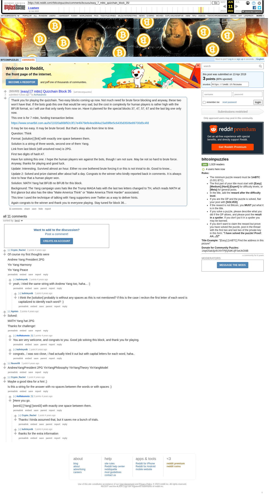

# [easy] [7 mbtc] Quizchain Block 35

[Original thread](https://www.reddit.com/r/bitcoinpuzzles/comments/bcouou/easy_7_mbtc_quizchain_block_35/). The `sourceUrl` of the [quizchain/35](../../../src/collections/quizchain/35.ts) record and the source of three of its hints and the funding transaction, with the solution the author edited in. The post went up on April 13, 2019, at 09:34:00 UTC, 4 minutes before the block time of its funding transaction. Its last edit is stamped 14:58:34 UTC on April 13, 2019, so the transcript shows the post as it stood after the claim.

## Historical provenance

The Wayback Machine holds one capture of the `old.reddit.com` URL and two of the `www.reddit.com` URL, plus six of single comment permalinks. Provenance rests on the [old.reddit.com capture](https://web.archive.org/web/20230611075121/https://old.reddit.com/r/bitcoinpuzzles/comments/bcouou/easy_7_mbtc_quizchain_block_35/), stamped June 11, 2023, 07:51:21 UTC, whose HTML carries the post, which matches the transcript below word for word. It renders 11 comments, and each matches the Arctic Shift record of the same ID by author and text. Only the markdown of links and lists renders differently. The capture was read on September 27, 2026. `archive_content: confirmed` on that basis.

The [Arctic Shift](https://arctic-shift.photon-reddit.com/) Reddit archive, read the same day, lists the same 11 comments. The transcript takes authors, text and scores from it and nests the comments as the capture does.

The record names none of the commenters: nothing on the chain ties a claim to a name.

## Transcript

> Thank you for playing the quizchain. Two easy blocks coming up now. Not much need for brute force blocking and anyway, these two won't have that. If the bots grab this one that would be very sad, but the cost in complexity for human players is rather high with the BFUB format, so I will use that only rarely from now on. Have it planned for the special blocks 37, 47, 57, 67 and the last big one only now.
>
> This one is for 7 mbtc, funding transaction below.
>
> https://www.smartbit.com.au/tx/11020a80bf92c3f17e4f479efe4ea984a15a69f8e5c6435d3506e89700d5c4fd
>
> It may be too easy. It may be brute forced. But that's okay also from time to time.
>
> Question: Think
>
> Format: [solution] [link] with exactly one space between them.
>
> Solution is a string of three words, second one of them Yang.
>
> Link from last block (still unsolved now) is 2PG.
>
> First two digits of hash:47.
>
> Have fun solving this one. I hope the human players win against the bots, though I am not sure. May be not so hard to brute force. Anyway, thanks for playing and good luck.
>
> Update: Interesting. Survived almost an hour. Either no one bothered brute forcing it or this is not trivial to do. Good to know...
>
> Update 2: Solved and prize claimed after about half a day. Congrats to the winner who kindly reported back in comments. It is always nice to hear that a human player won.
>
> Solution: MATH Yang hat BFUB no BFUB for this block.
>
> Background: The Yang campaign uses hats like the Trump MAGA hats with the last two letters changed to TH, which reads MATH at first glance but also has the idea "Make America Think" or "Make America Think Harder" associated.
>
> This time I used the technique of talking with Yang supporters over Twitter as a way to deliver hints.
>
> Again congrats to the winner and thank you to everyone playing. Stay tuned for block 36...

## Comments

**u/Crypto_Rachel**, 2 points:

> Of course my first thoughts were
>
> Andrew Yang President 2PG
>
> Yin Yang Harmony
>
> Yin Yang Peace

**u/bulleteyedk**, 2 points, reply to u/Crypto_Rachel:

> yeah, i tried the same string with Andrew Yang too, haha... :)

**u/bulleteyedk**, 1 point, reply to u/bulleteyedk:

> I think the \[solution\] probably is without any spaces as this is not mentioned? if this is the case i reckon the first letter of each word is capitalized to identify each word? :)

**u/Agelais**, 2 points:

> Solved:
>
> MATH Yang hat 2PG
>
> Thanks for challenge!

**u/AoiNakamoto**, 2 points, reply to u/Agelais:

> You are very welcome, and congrats to you. Good job solving this block, and thank you for playing.

**u/bulleteyedk**, 1 point, reply to u/Agelais:

> congrats.. i was soo close, i had actually tried it out but with capital letters for each word, haha..

**u/Noomr06**, 1 point:

> AndrewYangPresident 2PG
> YinYangPhilosophy
> YinYangTheory
> YinYangModel

**u/Crypto_Rachel**, 1 point:

> Maybe a good Idea for a hint ;)
>
> Is this a string for the answer with no spaces between the words or with spaces :)

**u/AoiNakamoto**, 3 points, reply to u/Crypto_Rachel:

> ]Here you go.
>
> [word1] [Yang] [word3] with exactly one space between them.

**u/Crypto_Rachel**, 1 point, reply to u/AoiNakamoto:

> Thanks I kinda assumed that, but it saves me a bunch of trials.

**u/bulleteyedk**, 1 point, reply to u/AoiNakamoto:

> thanks for the extra information

## Screenshot

The screenshot is a render of the archive capture, not of the live page, so it carries the Wayback banner at the top. The "4 years ago" stamps are relative to the capture, June 11, 2023. Capture method and limits: [source archive](../README.md).
