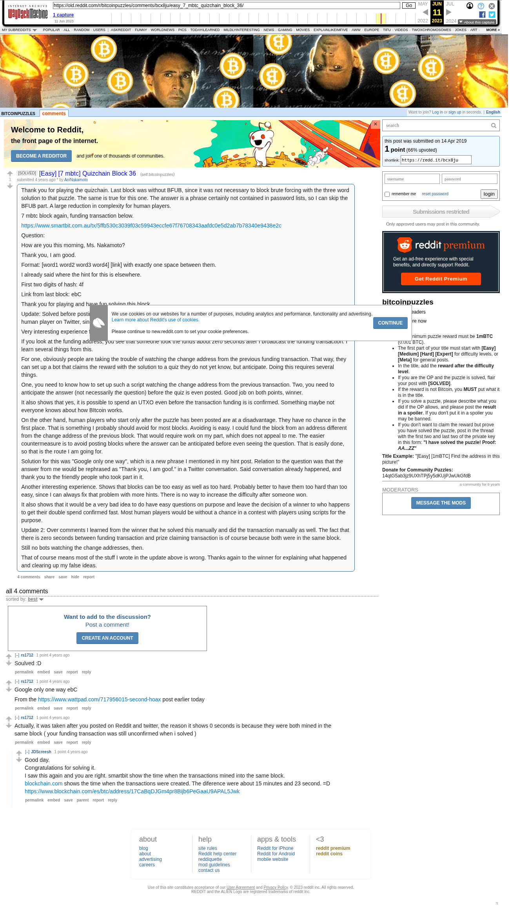

# [Easy] [7 mbtc] Quizchain Block 36

[Original thread](https://www.reddit.com/r/bitcoinpuzzles/comments/bcx8ju/easy_7_mbtc_quizchain_block_36/). The `sourceUrl` of the [quizchain/36](../../../src/collections/quizchain/36.ts) record and the source of three of its hints and the funding transaction, with the solution the author edited in. The post went up on April 14, 2019, at 00:28:19 UTC, 5 minutes before the block time of its funding transaction. Its last edit is stamped 01:19:02 UTC on April 14, 2019, so the transcript shows the post as it stood after the claim.

## Historical provenance

The Wayback Machine holds one capture of the `old.reddit.com` URL and one of the `www.reddit.com` URL. Provenance rests on the [old.reddit.com capture](https://web.archive.org/web/20230611170029/https://old.reddit.com/r/bitcoinpuzzles/comments/bcx8ju/easy_7_mbtc_quizchain_block_36/), stamped June 11, 2023, 17:00:29 UTC, whose HTML carries the post, which matches the transcript below word for word. It renders four comments, and each matches the Arctic Shift record of the same ID by author and text. Only the markdown of links and lists renders differently. The capture was read on September 27, 2026. `archive_content: confirmed` on that basis.

The [Arctic Shift](https://arctic-shift.photon-reddit.com/) Reddit archive, read the same day, lists the same four comments. The transcript takes authors, text and scores from it and nests the comments as the capture does.

The record names none of the commenters: nothing on the chain ties a claim to a name.

## Transcript

> Thank you for playing the quizchain. Last block was without BFUB, since it was not necessary to block brute forcing with the three word solution to that puzzle. The same is true for this one. The answer is a phrase certainly not contained in password lists, so I can skip the BFUB part. A large reduction in complexity for human players.
>
> 7 mbtc block again, funding transaction below.
>
> https://www.smartbit.com.au/tx/5ffb530c3039f03c59943eccfe67f76708343aafdc0e5d2ab7b78340e9438e2c
>
> Question:
>
> How are you this morning, Ms. Nakamoto?
>
> Thank you, I am good.
>
> Format: [word1 word2 word3 word4] [link] with exactly one space between them.
>
> I already said where the hint for this is elsewhere.
>
> First two digits of hash: 4f
>
> Link from last block: ebC
>
> Thank you for playing and have fun solving this block.
>
> Update: Solved before posting of quiz and prize claimed in zero seconds. Congrats to the winner and thank you for confirming you are human player on Twitter, since I might have suspected brute force bots.
>
> Very interesting experience from this one.
>
> If you look at the funding address, you see that someone took the funds about zero
> seconds after I broadcast the funding transaction. I learn several things from this.
>
> For one, obviously people are taking the trouble of watching the change address from the previous funding transaction. That way, they can set up a bot that claims the reward with the solution to a quiz they do not yet know, but anticipate. Doing this requires several things.
>
> One, you need to know how to set up such a script watching the change address from the previous transaction. Two, you need to anticipate the answer (not necessarily the question) before the quiz is even posted. Good job on both points, winner.
>
> It also shows that yes, it is possible to spend an UTXO even before the transaction funding is is confirmed. Something maybe not everyone knows about how BItcoin works.
>
> On the other hand, human players who start only after the puzzle has been posted are at a disadvantage. They have no chance in the first place. That is something I probably should avoid for most blocks. Avoiding is easy. I could fund the block from an address different from the change address of the previous block. That would require work on my part, which does not appeal to me. The easier countermeasure is to avoid posting blocks where the answer can be anticipated before even seeing the question. That is easily done, so that is the route I am going for.
>
> Solution for this was "Google only one way", which is a new phrase I mentioned in my hint post. Relation to the question was that the answer from me would be rephrased as "Thank you, I am goof." in a Twitter conversation. Said conversation already happened, and thank you to the friendly people who took part in it.
>
> Another interesting experience. Shows that blocks can be too easy as well as too hard. Probably better to have them too hard than too easy, since I can always fix that problem with more hints. There is no way to increase the difficulty after someone won.
>
> It also shows that it would be a very bad idea to do have easy questions on purpose and leave the decision of a winner to who happens to get their double spend confirmed fast. Most human players would be without a chance in a contest with players using scripts for the purpose.
>
> Update 2: Over comments I learned from the winner that he solved this manually and did the transaction manually as well. The fact that there is zero seconds between funding transaction and prize claiming transaction is of course because both were in the same block.
>
> Still no bots watching the change addresses, then.
>
> That of course means most of the stuff I wrote in the update above is wrong. Thanks again to the winner for explaining what happened and clearing up my false ideas.

## Comments

**u/rs1712**, 1 point:

> Soulved :D

**u/rs1712**, 1 point:

> Google only one way ebC
>
> From the https://www.wattpad.com/717956015-second-hoax post earlier today

**u/rs1712**, 1 point:

> Actually, it was taken after you posted on Reddit and twitter, the reason it shows 0 seconds is because they were both mined in the same block ( your funding transaction was still unconfirmed when i solved )

**u/JDScreesh**, 1 point, reply to u/rs1712:

> Good day.
> Congratulations for solving it.
> I saw this again and you are right. smartbit show the time when the transactions mined into the same block.
> [blockchain.com](https://blockchain.com) shows the time when the transactions were created. The diference were about 15 minutes and 23 second. =D
> [https://www.blockchain.com/es/btc/address/17CaBqDJGm4pr8Bijb6PeGaaU9APAL5Jwk](https://www.blockchain.com/es/btc/address/17CaBqDJGm4pr8Bijb6PeGaaU9APAL5Jwk)

## Screenshot

The screenshot is a render of the archive capture, not of the live page, so it carries the Wayback banner at the top. The "4 years ago" stamps are relative to the capture, June 11, 2023. Capture method and limits: [source archive](../README.md).
