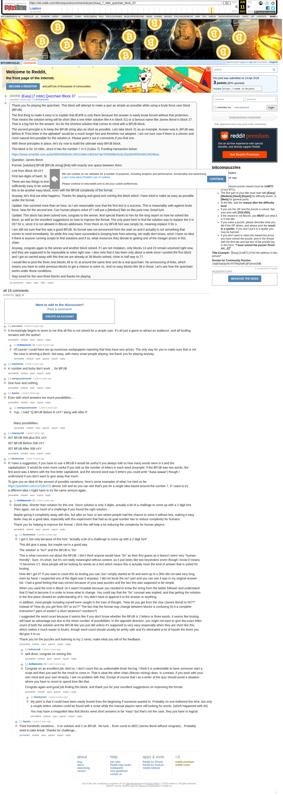

# [Easy] [7 mbtc] Quizchain Block 37

[Original thread](https://www.reddit.com/r/bitcoinpuzzles/comments/bcykn2/easy_7_mbtc_quizchain_block_37/). The `sourceUrl` of the [quizchain/37](../../../src/collections/quizchain/37.ts) record and the source of three of its hints and the funding transaction, with the solution the author edited in. The post went up on April 14, 2019, at 03:04:55 UTC, 2 minutes before the block time of its funding transaction. Its last edit is stamped 10:08:41 UTC on April 14, 2019, so the transcript shows the post as it stood after the claim.

## Historical provenance

The Wayback Machine holds one capture of the `old.reddit.com` URL and two of the `www.reddit.com` URL, plus two of single comment permalinks. Provenance rests on the [old.reddit.com capture](https://web.archive.org/web/20230611103607/https://old.reddit.com/r/bitcoinpuzzles/comments/bcykn2/easy_7_mbtc_quizchain_block_37/), stamped June 11, 2023, 10:36:07 UTC, whose HTML carries the post, which matches the transcript below word for word. It renders 14 comments, and each matches the Arctic Shift record of the same ID by author and text. Only the markdown of links and lists renders differently. The capture was read on September 27, 2026. `archive_content: confirmed` on that basis.

The [Arctic Shift](https://arctic-shift.photon-reddit.com/) Reddit archive, read the same day, lists the same 14 comments. The transcript takes authors, text and scores from it and nests the comments as the capture does.

The record names none of the commenters: nothing on the chain ties a claim to a name.

## Transcript

> Thank you for playing the quizchain. This block will attempt to make a quiz as simple as possible while using a brute force user block (BFUB).
>
> The first thing to make it easy is to explain that BUFB is only there because the answer is easily brute forced without that protection. That means the solution string will be short (like a one letter solution like A in block 31) or a famous name like James Bond in block 27. That is a big hint for the answer. Go for the shortest solution that comes to mind with a BFUB block.
>
> The second principle is to keep the BFUB string also as short as possible. Lets take block 31 as an example. Answer was A, BFUB was Before B."First letter in the alphabet" would be a much longer hint and therefore not adopted. I am not sure now if there is a shorter and more natural hint possible for the solution A. Please point it out in comments if you find one.
>
> With these principles in place, let's try now to build the ultimate easy BFUB block.
>
> This block is for 10 mbtc, since it has the number 7 in it (3 plus 7). Funding transaction below:
>
> https://www.smartbit.com.au/tx/5654065b34c1652c0dee19034a7de7bf3999b43c9c20a3834f5834bf14928bea
>
> Question: James Bond
>
> Format: [solution] BFUB [BFUB string] [link] with exactly one space between them.
>
> Link from Block 36:vXY
>
> First two digits of hash: 3c
>
> There are two things to test with this block. One is if the BFUB string is sufficiently complex to stop bots for a while. The other is if it is sufficiently easy to be solved by human players. Both goals are in conflict, which makes finding the right balance difficult. My aim is for this to be another easy block, even with the BFUB complexity of the format.
>
> Anyway, let's find out what happens. Thanks for playing and good luck solving this block which I have tried to make as easy as possible under the format.
>
> Update: Has survived more than an hour, so I am reasonable sure that the first test is a success. This is reasonably safe against brute force. Now for the second test. Can human players solve it?
> I will put a [Medium] flair on this post now. Good luck.
>
> Update: This block has been solved now, congrats to the winner. And special thanks to him for the long report on how he solved the block, as well as the excellent suggestions on how to improve the format. The only point here to find the solution was to replace the 0 in 007 for o, since 0 is not allowed in Bitcoin addresses. From there on my BFUB hint was simply 0o, meaning replace 0 for o.
>
> I am still not sure that this was a good BFUB. Its format was not announced from the start on and it actually is not something that comes to mind immediately. So while this may have succeeded in keeping bots from winning, we really don't know, since I have no idea if there is anyone running scripts to find solutions and if so, what resources they devote to getting one of the meager prizes in this chain.
>
> Anyway, congrats again to the winner and another block solved. If I am not mistaken, only blocks 13 and 23 remain unsolved right now, and they are supposed to be impossible to solve right now. I also note that it has been only about a week since I posted the first block and I got so carried away with this that we are already at 38 blocks solved, close to half way to 77.
>
> I would like to post the three next blocks 39 to 41 at around the same time and do a real quizchain. No announcing of links, which means you have to solve previous blocks to get a chance to solve 41. And no easy blocks like 38 in those. Let's see how the quizchain works under those conditions.
>
> Stay tuned for the next three blocks and thanks for playing.

## Comments

**u/msvnoken**, 2 points:

> It increasingly begins to seem to me that all this is not solved for a simple user. It's all just a game to attract an audience, and all funding remains with the author!

**u/AoiNakamoto**, 1 point, reply to u/msvnoken:

> Of course I could have set up numerous sockpuppets reporting that they have won prizes. The only way for you to make sure that is not the case is winning a block. Not easy, with many smart people playing, but thank you for playing anyway.

**u/mapl3sn0w**, 1 point:

> \#, number and lucky don't work ... for BFUB

**u/martypyouknowme**, 1 point:

> One hour and nothing.

**u/Agelais**, 1 point:

> Even with short answers too much possibilities...

**u/martypyouknowme**, 1 point, reply to u/Agelais:

> Yup...I tried "Q BFUB Before R vXY" along with After P.
>
> Many possibilities.

**u/whatupyo02**, 1 point:

> 007 BFUB 006 plus 001 vXY
>
> 007 BFUB Before 008 vXY
>
> 007 BFUB After 006 vXY

**u/Randomiser**, 1 point:

> If I have a suggestion, if you have to use a BFUB it would be useful if you always told us how many words were in it and the capitalisation. It would be even more useful if you told us the number of letters in each word (example: if the BFUB was two words, the first word was 4 letters with the first letter capitalized, and the second word was 5 letters you could write "Aaaa aaaaa") though I understand if you don't want to give away that much.
>
> To give you an idea of the amount of possible variations, here's some examples of what I've tried so far: [https://pastebin.com/137y8UCD](https://pastebin.com/137y8UCD) almost 100 and as you can see that's just for a single idea based around the number 7. If I want to try a different idea I might have to try the same amount again.

**u/AoiNakamoto**, 1 point, reply to u/Randomiser:

> Good idea. Shorter than solution for this one. Since solution is only 3 digits, actually a bit of a challinge to come up with a 2 digit hint. Then again, not so much of a challenge if you found the right solution...
>
> Maybe giving it completely away with this, but after an hour or two where people had the chance to solve it without hint, making it easy faster may be a good idea, especially with this experiment that had as its goal number two to reduce complexity for humans.
>
> Thank you for helping to improve the format. I think this will help a lot reducing the complexity for human players.

**u/Randomiser**, 2 points, reply to u/AoiNakamoto:

> I got it, but only because of this hint: "actually a bit of a challenge to come up with a 2 digit hint"
>
> This did give it away, but maybe not in a good way.
>
> The solution is "oo7" and the BFUB is "0o"
>
> This is what concerns me about the BFUB: I don't think anyone would have "0o" as their first guess as it doesn't seem very "human-friendly". Sure, it's short, but it's not really meaningful without context, as it just looks like two keystrokes (even though I know it means "0 becomes o"). Most people will be looking for words as a hint which means this is actually more the kind of answer that is suited for bruting.
>
> How did I get it? If you want to count this as bruting you can; but I simply started at 00 and went up to o (this did not take very long, even by hand. I suspected one of the digits was 0 anyway). I did not brute the oo7 part and you can see it was in my original answer list; I had a good feeling that was correct because of your past puzzles and the fact this was supposed to be simple.
>
> When you used the trick in Block 16 it wasn't brutable because you needed to know the string from the twitter follower and understand that O had to become 0 in order to know what to change. You could say that the "0o" concept was implied, and that getting the solution in the first place showed an understanding of it. You didn't have to append it to the answer or anything.
>
> In addition, most people including myself were caught in the train of thought, "How do you get from the clue (James Bond) to 007?" instead of "How do you get from 007 to oo7?" The fact that the format may change between blocks is confusing (Is it a complete instruction? pairs of words? a short sentence? numbers?)
>
> I suggested the word count because it seems like if you don't know whether the BFUB is 2 letters or three words, it seems like bruting will have an advantage just due to the sheer number of possibilities. In the opposite direction, you might not want to give the exact letter count of both the solution and the BFUB like you just did unless it's supposed to very easy (especially when they are short like this, which makes it much easier to brute), though word count should usually be pretty safe and it's eliminated a lot of hassle the times you did give it to us.
>
> Thank you for the puzzles and listening to my 2 cents; make what you will of the feedback.

**u/bulleteyedk**, 1 point, reply to u/Randomiser:

> well done, congrats on solving this

**u/AoiNakamoto**, 1 point, reply to u/Randomiser:

> Congrats on an excellent job. And no, I don't count this as undesirable brute forcing. I think it is undesirable to have someone start a script and then just wait for the result to come in. That is what the other chain (Bitcoin mining) does. In contrast, if you work with your own mind and your own tenacity, I see no problem with that. Except of course that I as a writer of the quiz should avoid a situation where you have to resort to spend time like that.
>
> Congrats again and good job finding this block, and thank you for your excellent suggestions on improving the format.

**u/Randomiser**, 1 point, reply to u/AoiNakamoto:

> My point is that it could have been easily bruted from the beginning if someone wanted to. Probably no one bothered this time, but only a couple letters solution could be found with a script while the manual players were still looking for words. (which happened with 40)
>
> You may have a misguided idea that blocks need short answers to be "easy" but that's not the case, they just have to logical.

**u/Agelais**, 1 point, reply to u/AoiNakamoto:

> Tried hundreds variations... 3 on solution and 2 on BFUB.. No luck... Even come to AEO (James Bond without congrats)... Probably need to take break. Thanks for challenge...

## Screenshot

The screenshot is a render of the archive capture, not of the live page, so it carries the Wayback banner at the top. The "4 years ago" stamps are relative to the capture, June 11, 2023. Capture method and limits: [source archive](../README.md).
