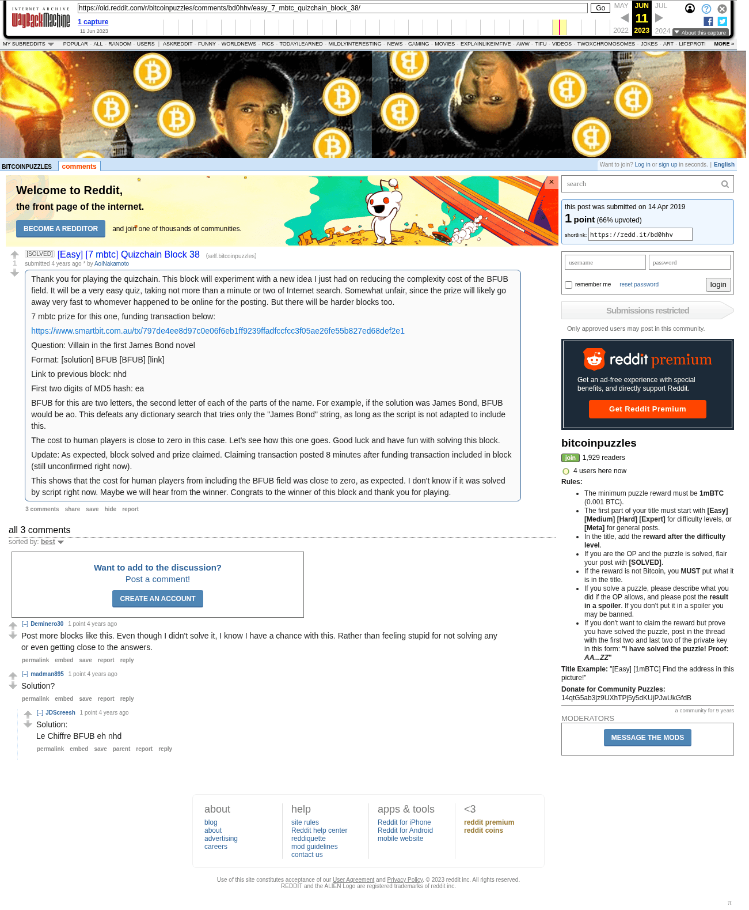

# [Easy] [7 mbtc] Quizchain Block 38

[Original thread](https://www.reddit.com/r/bitcoinpuzzles/comments/bd0hhv/easy_7_mbtc_quizchain_block_38/). The `sourceUrl` of the [quizchain/38](../../../src/collections/quizchain/38.ts) record and the source of three of its hints and the funding transaction. The post went up on April 14, 2019, at 07:39:31 UTC, 2 minutes after the block time of its funding transaction. Its last edit is stamped 07:52:12 UTC on April 14, 2019, so the transcript shows the post as it stood after the claim.

## Historical provenance

The Wayback Machine holds one capture of the `old.reddit.com` URL and one of the `www.reddit.com` URL. Provenance rests on the [old.reddit.com capture](https://web.archive.org/web/20230611111753/https://old.reddit.com/r/bitcoinpuzzles/comments/bd0hhv/easy_7_mbtc_quizchain_block_38/), stamped June 11, 2023, 11:17:53 UTC, whose HTML carries the post, which matches the transcript below word for word. It renders three comments, and each matches the Arctic Shift record of the same ID by author and text. Only the markdown of links and lists renders differently. The capture was read on September 27, 2026. `archive_content: confirmed` on that basis.

The [Arctic Shift](https://arctic-shift.photon-reddit.com/) Reddit archive, read the same day, lists the same three comments. The transcript takes authors, text and scores from it and nests the comments as the capture does.

The record names none of the commenters: nothing on the chain ties a claim to a name.

## Transcript

> Thank you for playing the quizchain. This block will experiment with a new idea I just had on reducing the complexity cost of the BFUB field. It will be a very easy quiz, taking not more than a minute or two of Internet search. Somewhat unfair, since the prize will likely go away very fast to whomever happened to be online for the posting. But there will be harder blocks too.
>
> 7 mbtc prize for this one, funding transaction below:
>
> https://www.smartbit.com.au/tx/797de4ee8d97c0e06f6eb1ff9239ffadfccfcc3f05ae26fe55b827ed68def2e1
>
> Question: Villain in the first James Bond novel
>
> Format: [solution] BFUB [BFUB] [link]
>
> Link to previous block: nhd
>
> First two digits of MD5 hash: ea
>
> BFUB for this are two letters, the second letter of each of the parts of the name.
> For example, if the solution was James Bond, BFUB would be ao. This defeats any dictionary search that tries only the "James Bond" string, as long as the script is not adapted to include this.
>
> The cost to human players is close to zero in this case. Let's see how this one goes. Good luck and have fun with solving this block.
>
> Update: As expected, block solved and prize claimed. Claiming transaction posted 8 minutes after funding transaction included in block (still unconfirmed right now).
>
> This shows that the cost for human players from including the BFUB field was close to zero, as expected. I don't know if it was solved by script right now. Maybe we will hear from the winner. Congrats to the winner of this block and thank you for playing.

## Comments

**u/Deminero30**, 1 point:

> Post more blocks like this. Even though I didn't solve it, I know I have a chance with this. Rather than feeling stupid for not solving any or even getting close to the answers.

**u/madman895**, 1 point:

> Solution?

**u/JDScreesh**, 1 point, reply to u/madman895:

> Solution:
> Le Chiffre BFUB eh nhd

## Screenshot

The screenshot is a render of the archive capture, not of the live page, so it carries the Wayback banner at the top. The "4 years ago" stamps are relative to the capture, June 11, 2023. Capture method and limits: [source archive](../README.md).
