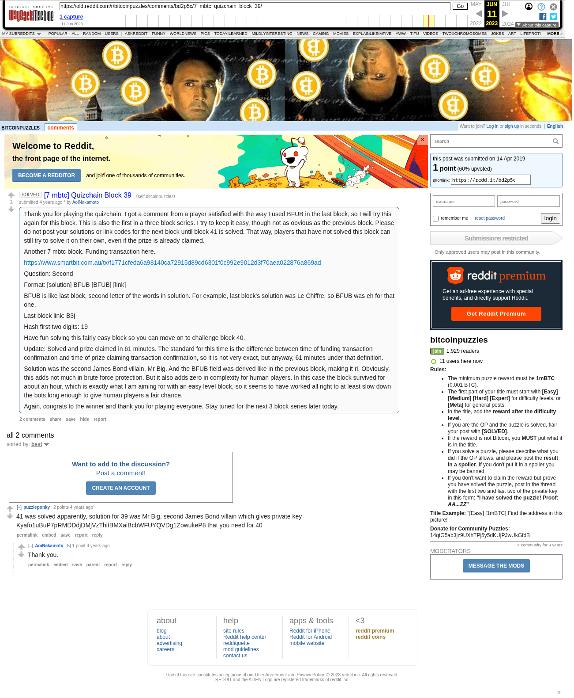

# [7 mbtc] Quizchain Block 39

[Original thread](https://www.reddit.com/r/bitcoinpuzzles/comments/bd2p5c/7_mbtc_quizchain_block_39/). The `sourceUrl` of the [quizchain/39](../../../src/collections/quizchain/39.ts) record and the source of three of its hints and the funding transaction, with the solution the author edited in. The WIF of block 39 is printed here by u/puzzleponky. The post went up on April 14, 2019, at 13:23:37 UTC, 29 minutes after the block time of its funding transaction. Its last edit is stamped 00:25:38 UTC on May 18, 2019, so the transcript shows the post as it stood after the claim.

## Historical provenance

The Wayback Machine holds one capture of the `old.reddit.com` URL and one of the `www.reddit.com` URL. Provenance rests on the [old.reddit.com capture](https://web.archive.org/web/20230611092038/https://old.reddit.com/r/bitcoinpuzzles/comments/bd2p5c/7_mbtc_quizchain_block_39/), stamped June 11, 2023, 09:20:38 UTC, whose HTML carries the post, which matches the transcript below word for word. It renders two comments, and each matches the Arctic Shift record of the same ID by author and text. Only the markdown of links and lists renders differently. The capture was read on September 27, 2026. `archive_content: confirmed` on that basis.

The [Arctic Shift](https://arctic-shift.photon-reddit.com/) Reddit archive, read the same day, lists the same two comments. The transcript takes authors, text and scores from it and nests the comments as the capture does.

The record names none of the commenters: nothing on the chain ties a claim to a name.

## Transcript

> Thank you for playing the quizchain. I got a comment from a player satisfied with the way I used BFUB in the last block, so I will try this again for this block.
> This is also the first in a three block series. I try to keep it easy, though not as obvious as the previous block. Please do not post your solutions or link codes for the next block until block 41 is solved. That way, players that have not solved this block can still try to solve it on their own, even if the prize is already claimed.
>
> Another 7 mbtc block. Funding transaction here.
>
> https://www.smartbit.com.au/tx/f1771cfeda6a98140ca72915d89cd6301f0c992e9012d3f70aea022876a869ad
>
> Question: Second
>
> Format: [solution] BFUB [BFUB] [link]
>
> BFUB is like last block, second letter of the words in solution. For example, last block's solution was Le Chiffre, so BFUB was eh for that one.
>
> Last block link: B3j
>
> Hash first two digits: 19
>
> Have fun solving this fairly easy block so you can move on to challenge block 40.
>
> Update: Solved and prize claimed in 61 minutes. The standard for this time is the difference between time of funding transaction confirmation and time of prize claiming transaction confirmation, so it is not very exact, but anyway, 61 minutes under that definition.
>
> Solution was the second James Bond villain, Mr Big. And the BFUB field was derived like in the previous block, making it ri. Obviously, this adds not much in brute force protection. But it also adds zero in complexity for human players. In this case the block survived for about an hour, which is exactly what I am aiming for with an easy level block, so it seems to have worked all right to at least slow down the bots long enough to give human players a fair chance.
>
> Again, congrats to the winner and thank you for playing everyone. Stay tuned for the next 3 block series later today.

## Comments

**u/puzzleponky**, 2 points:

> 41 was solved apparently, solution for 39 was Mr Big, second James Bond villain which gives private key Kyafo1uBuP7pRMDDdjDMjVzThitBMXaiBcbWFUYQVDg1ZowukeP8 that you need for 40

**u/AoiNakamoto**, 1 point, reply to u/puzzleponky:

> Thank you.

## Screenshot

The screenshot is a render of the archive capture, not of the live page, so it carries the Wayback banner at the top. The "4 years ago" stamps are relative to the capture, June 11, 2023. Capture method and limits: [source archive](../README.md).
