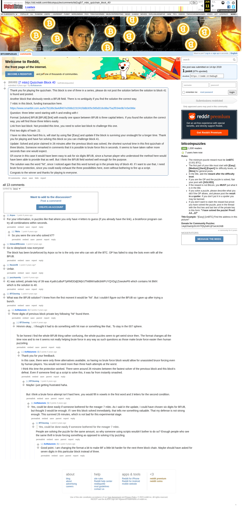

# [7 mbtc] Quizchain Block 40

[Original thread](https://www.reddit.com/r/bitcoinpuzzles/comments/bd2ug5/7_mbtc_quizchain_block_40/). The `sourceUrl` of the [quizchain/40](../../../src/collections/quizchain/40.ts) record and the source of three of its hints and the funding transaction, with the solution the author edited in. The post went up on April 14, 2019, at 13:40:59 UTC, 30 minutes after the block time of its funding transaction. Its last edit is stamped 23:18:12 UTC on April 14, 2019, so the transcript shows the post as it stood after the claim.

## Historical provenance

The Wayback Machine holds one capture of the `old.reddit.com` URL and one of the `www.reddit.com` URL. Provenance rests on the [old.reddit.com capture](https://web.archive.org/web/20230611163539/https://old.reddit.com/r/bitcoinpuzzles/comments/bd2ug5/7_mbtc_quizchain_block_40/), stamped June 11, 2023, 16:35:39 UTC, whose HTML carries the post, which matches the transcript below word for word. It renders 13 comments, and each matches the Arctic Shift record of the same ID by author and text. Only the markdown of links and lists renders differently. The capture was read on September 27, 2026. `archive_content: confirmed` on that basis.

The [Arctic Shift](https://arctic-shift.photon-reddit.com/) Reddit archive, read the same day, lists the same 13 comments. The transcript takes authors, text and scores from it and nests the comments as the capture does.

The record names none of the commenters: nothing on the chain ties a claim to a name.

## Transcript

> Thank you for playing the quizchain. This block is one of three in a series, please do not post the solution before the solution to block 41 is found and posted.
>
> Another block that obviously needs a BFUB field. There is no ambiguity if you find the solution the correct way.
>
> 7 mbtc in this block, funding transaction here.
>
> https://www.smartbit.com.au/tx/7b186c9a4df407e356b2231f41fddb305c585d316c88a75a2f034e9b7e5e086e
>
> Question: three letter word starting with h and ending with t
>
> Format: [solution] BFUB [BFUB] [link] with exactly one space between
> BFUB is three capital letters. If you found the solution the correct way, you will find those three letters easily.
>
> Link from last block: Not provided this time, you need to solve last block to challenge this one.
>
> First two digits of hash: 21
>
> I have no idea how hard this is, will start by using flair [Easy] and update if the block is surviving your onslaught for a longer time. Thank you for playing and have fun solving this block so you can challenge block 41.
>
> Update: Solved and prize claimed in 26 minutes after the previous block was solved, the shortest survival time in this first quizchain of three blocks. Someone remarked in comments that it is possible to brute force this in seconds. It seems to have taken rather more seconds than one would expect.
>
> Of course in this case it would have been easy to ask for six digits BFUB, since a human player who understood the method here would have been able to provide that as well. But I think the BFUB field worked well enough for the purpose.
>
> The solution was the word "hit", since I noticed again that this word turned up in the private key of block 40. If I want to use that, I need brute force protection, since you could easily exhaust the three possibilities here, even without bothering to fire up a script.
>
> Congrats to the winner and thanks for playing to everyone.

## Comments

**u/Arpox**, 1 point:

> For your information, in puzzles like that where you only have 4 letters to guess (if you already have the link), a bruteforce program can try all combinations within seconds.

**u/78bits**, 1 point, reply to u/Arpox:

> So you were the one who solved it??

**u/EdwardRBrowne**, 1 point:

> Go to sleep/work now everyone!
>
> The block has been bruteforced by Arpox so he is the only one who can win all the BTC. OP has failed to stop the bots even with all the BFUB.

**u/Noomr06**, 1 point:

> Unfair.

**u/puzzleponky**, 1 point:

> 41 was solved, private key of 39 was Kyafo1uBuP7pRMDDdjDMjVzThitBMXaiBcbWFUYQVDg1ZowukeP8 which contains hit BMX which is the solution to 40.

**u/BTCkoning**, 1 point:

> What was the BFUB solution? I knew from the first monent it would be "hit". But i couldn't figure out the BFUB so i gave up after trying a bunch.

**u/AoiNakamoto**, 0 points, reply to u/BTCkoning:

> Three digits of previous block private key following "hit" found there.

**u/BTCkoning**, 1 point, reply to u/AoiNakamoto:

> Hmmm okay... I thought it had to do something with hit man or something like that.. To stay in the 007 sphere.
>
> To be honest i find the whole BFUB thing rather confusing, the whole puzzles seem to get weird since then. The format changes all the time now and to me it seems not really helping brute force in any way as such questions as those make brute force easier then human puzzeling.

**u/AoiNakamoto**, 0 points, reply to u/BTCkoning:

> Thank you for your feedback.
>
> In this case, there were only three alternatives available, so having no brute force block would allow for unassisted bruce forcing even by human players. You would not need more than three hash attempts at the worst.
>
> I think this time the protection worked. There were around 26 minutes between the fastest solver of the previous block and this block's defeat. Even if someone fired up a script to solve this, it was far from instantly smashed.

**u/BTCkoning**, 1 point, reply to u/AoiNakamoto:

> Maybe i just getting frustrated haha.
>
> But i think a brute force attempt isn't hard here, you would fill in vowels in the first word and 3 letters for the second condition.

**u/AoiNakamoto**, 0 points, reply to u/BTCkoning:

> Yes, could be done easily if someone bothered for the meager 7 mbtc. As I said in the update, I could have chosen six digits for BFUB, but thought 3 would be enough.
> If I see this block solved immediately, that tells me something valuable. That my defense is not strong enough. This survived 26 minutes, which is not bad for this experimental stage.

**u/BTCkoning**, 1 point, reply to u/AoiNakamoto:

> > Yes, could be done easily if someone bothered for the meager 7 mbtc.
>
> People are solving the puzzle for the same amount, so why someone using scripts wouldn't bother to do so? Enough people who see the same thrill in brute forcing something as opposed to solving it by puzzling.

**u/AoiNakamoto**, 1 point, reply to u/BTCkoning:

> Good point. I am changing the format a bit to make BF a little bit harder for the next three block chain. Maybe should have asked for seven digits in this particular block instead of three.

## Screenshot

The screenshot is a render of the archive capture, not of the live page, so it carries the Wayback banner at the top. The "4 years ago" stamps are relative to the capture, June 11, 2023. Capture method and limits: [source archive](../README.md).
