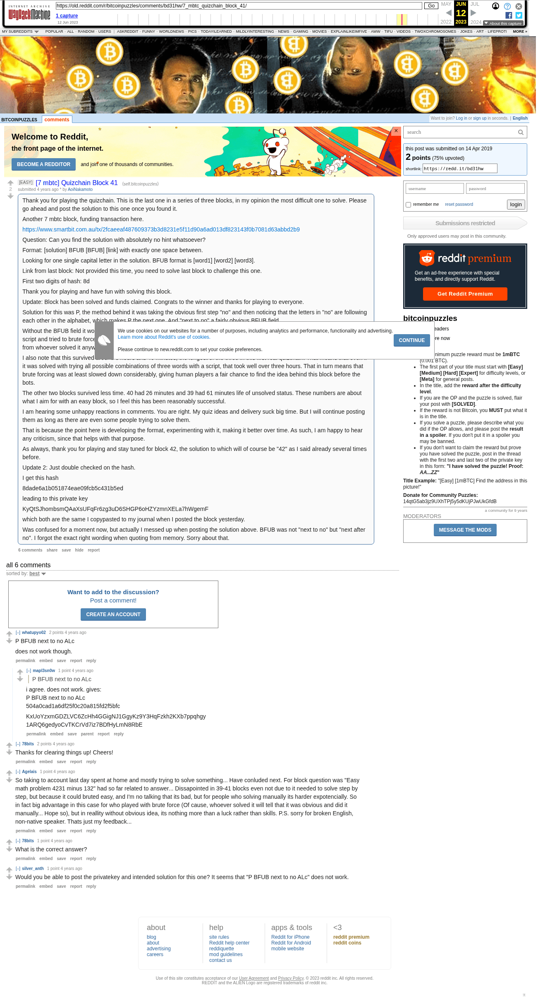

# [7 mbtc] Quizchain Block 41

[Original thread](https://www.reddit.com/r/bitcoinpuzzles/comments/bd31hw/7_mbtc_quizchain_block_41/). The `sourceUrl` of the [quizchain/41](../../../src/collections/quizchain/41.ts) record and the source of three of its hints and the funding transaction, with the solution the author edited in. The WIF of block 41 is printed here by the author, in the post. The post went up on April 14, 2019, at 14:03:23 UTC, 13 minutes after the block time of its funding transaction. Its last edit is stamped 03:44:27 UTC on April 15, 2019, so the transcript shows the post as it stood after the claim.

## Historical provenance

The Wayback Machine holds one capture of the `old.reddit.com` URL and one of the `www.reddit.com` URL. Provenance rests on the [old.reddit.com capture](https://web.archive.org/web/20230612123208/https://old.reddit.com/r/bitcoinpuzzles/comments/bd31hw/7_mbtc_quizchain_block_41/), stamped June 12, 2023, 12:32:08 UTC, whose HTML carries the post, which matches the transcript below word for word. It renders six comments, and each matches the Arctic Shift record of the same ID by author and text. Only the markdown of links and lists renders differently. The capture was read on September 27, 2026. `archive_content: confirmed` on that basis.

The [Arctic Shift](https://arctic-shift.photon-reddit.com/) Reddit archive, read the same day, lists the same six comments. The transcript takes authors, text and scores from it and nests the comments as the capture does.

The record names none of the commenters: nothing on the chain ties a claim to a name.

## Transcript

> Thank you for playing the quizchain. This is the last one in a series of three blocks, in my opinion the most difficult one to solve. Please go ahead and post the solution to this one once you found it.
>
> Another 7 mbtc block, funding transaction here.
>
> https://www.smartbit.com.au/tx/2fcaeeaf487609373b3d8231e5f11d90a6ad013df823143f0b7081d63abbd2b9
>
> Question: Can you find the solution with absolutely no hint whatsoever?
>
> Format: [solution] BFUB [BFUB] [link] with exactly one space between.
>
> Looking for one single capital letter in the solution. BFUB format is [word1] [word2] [word3].
>
> Link from last block: Not provided this time, you need to solve last block to challenge this one.
>
> First two digits of hash: 8d
>
> Thank you for playing and have fun with solving this block.
>
> Update: Block has been solved and funds claimed. Congrats to the winner and thanks for playing to everyone.
>
> Solution for this was P, the method behind it was taking the obvious first step "no" and then noticing that the letters in "no" are following each other in the alphabet, which makes P the next one. And "next to no" a fairly obvious BFUB field.
>
> Without the BFUB field it would be impossible to have a quiz with "P" as the answer. It is of course possible that someone fired up a script and tried to brute force three words, but I think that is unlikely considering the small reward at stake here. Would be nice to hear from whoever solved it anyway, but making it harder for bots would have made it harder for human players too.
>
> I also note that this survived around 3 hours and 46 minutes, the longest of the three in this first real quizchain. That means that even if it was solved with trying all possible combinations of three words with a script, that took well over three hours. That in turn means that brute forcing was at least slowed down considerably, giving human players a fair chance to find the idea behind this block before the bots.
>
> The other two blocks survived less time. 40 had 26 minutes and 39 had 61 minutes life of unsolved status. These numbers are about what I aim for with an easy block, so I feel this has been reasonably successful.
>
> I am hearing some unhappy reactions in comments. You are right. My quiz ideas and delivery suck big time. But I will continue posting them as long as there are even some people trying to solve them.
>
> That is because the point here is developing the format, experimenting with it, making it better over time. As such, I am happy to hear any criticism, since that helps with that purpose.
>
> As always, thank you for playing and stay tuned for block 42, the solution to which will of course be "42" as I said already several times before.
>
> Update 2: Just double checked on the hash.
>
> I get this hash
>
> 8dade6a1b051874eae09fcb5c431b5ed
>
> leading to this private key
>
> KyQtSJhombsmQAaXsUFqFr6zg3uD6SHGP6oHZYzmnXELa7hWgemF
>
> which both are the same I copypasted to my journal when I posted the block yesterday.
>
> Was confused for a moment now, but actually I messed up when posting the solution above. BFUB was not "next to no" but "next after no". I forgot the exact right wording when quoting from memory. Sorry about that.

## Comments

**u/whatupyo02**, 2 points:

> P BFUB next to no ALc
>
> does not work though.

**u/mapl3sn0w**, 1 point, reply to u/whatupyo02:

> > P BFUB next to no ALc
>
> i agree. does not work. gives:
> P BFUB next to no ALc
> 504a0cad1a6df25f0c20a815fd2f5bfc
>
> KxUoYzxmGDZLVC6ZcHh4GGigNJ1GgyKz9Y3HqFzkh2KXb7ppqhgy
> 1ARQ6gedyoCvTKCrVd7iz7BDfHyLmN8RbE

**u/78bits**, 2 points:

> Thanks for clearing things up! Cheers!

**u/Agelais**, 1 point:

> So taking to account last day spent at home and mostly trying to solve something... Have conluded next. For block question was "Easy math problem 4231 minus 132" had so far related to answer... Dissapointed in 39-41 blocks even not due to it needed to solve step by step, but because it could bruted easy, and I'm no talking that its bad, but for people who solving manually its harder expotencially. So in fact big advantage in this case for who played with brute force (Of cause, whoever solved it will tell that it was obvious and did it manually... Hope so), but in reallity without obvious idea, its nothing more than a luck rather than skills. P.S. sorry for broken English, non-native speaker. Thats just my feedback...

**u/78bits**, 1 point:

> What is the correct answer?

**u/silver_anth**, 1 point:

> Would you be able to post the privatekey and intended solution for this one? It seems that "P BFUB next to no ALc" does not work.

## Screenshot

The screenshot is a render of the archive capture, not of the live page, so it carries the Wayback banner at the top. The "4 years ago" stamps are relative to the capture, June 12, 2023. Capture method and limits: [source archive](../README.md).
