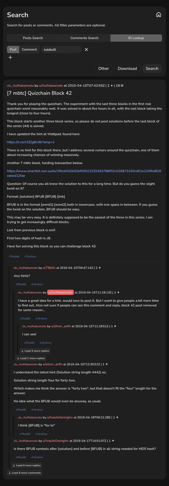

# [7 mbtc] Quizchain Block 42

[Original thread](https://www.reddit.com/r/u_AoiNakamoto/comments/bddbd5/7_mbtc_quizchain_block_42/). The `sourceUrl` of the [quizchain/42](../../../src/collections/quizchain/42.ts) record and the source of three of its hints and the funding transaction. The WIF of block 42 is printed here by u/Quantris. The post went up on April 15, 2019, at 07:43:55 UTC, 71 minutes after the block time of its funding transaction.

## Historical provenance

No capture found. The post sits on the author's profile, not in the subreddit, and the author wrote in the comments that it had been removed for a while. On September 27, 2026 the Wayback Machine index listed one entry for its `www.reddit.com` URL, June 11, 2023, 09:22:36 UTC, whose body is Reddit's empty app shell without the post, and none for the `old.reddit.com` URL.

The transcript below comes from the [Arctic Shift](https://arctic-shift.photon-reddit.com/) Reddit archive: the post record and the 18 comments it lists for `bddbd5`, read on September 27, 2026. The [pullpush](https://pullpush.io/) Reddit archive, read the same day, gives the same post text and time and the same 18 comments with the same authors. Their bodies differ only in how the empty `&#x200B;` paragraph in one comment is escaped, and the transcript leaves that empty paragraph out.

## Transcript

> Thank you for playing the quizchain. The experiment with the last three blocks in the first real quizchain went reasonably well. It was solved in about five hours in all, with the last block taking the longest (close to four hours).
>
> This block starts another three block series, so please do not post solutions before the last block of the series (44) is solved.
>
> I have updated the hint at Wattpad, found here:
>
> https://t.co/A3ZJg8nJ8r?amp=1
>
> There is no hint for this block there, but I address several rumors around the quizchain, one of them about increasing chances of winning massively.
>
> Another 7 mbtc block, funding transaction below.
>
> https://www.smartbit.com.au/tx/2fbcb042b52bf00921020393788f02c026873160cd51e216fbd826cdeed12fae
>
> Question: Of course you all knew the solution to this for a long time. But do you guess the slight twist on it?
>
> Format: [solution] BFUB [BFUB] [link]
>
> BFUB is in the format [word1] [word2] both in lowercase, with one space in between. If you guess the twist on the solution, BFUB should be easy.
>
> This may be very easy. It is definitely supposed to be the easiest of the three in this series. I am trying to get increasingly difficult blocks.
>
> Link from previous block is emF.
>
> First two digits of hash is c8.
>
> Have fun solving this block so you can challenge block 43.

## Comments

**u/78bits**, 2 points:

> Any hints?

**u/AoiNakamoto**, 1 point, reply to u/78bits:

> I have a great idea for a hint, would love to post it. But I want to give people a bit more time to find out. Also not sure if people can see this comment and reply, block 42 post removed for some reason...

**u/silver_anth**, 1 point, reply to u/AoiNakamoto:

> I can see!

**u/AoiNakamoto**, 1 point, reply to u/silver_anth:

> Thank you. Maybe this was removed by automoderation because of the Wattpad link and a human moderator decided to restore it.
>
> Anyway, previous three blocks survived only 5 hours, so I would like to refrain from hinting for another day to give people in unfortunate time zones more chances. It is really difficult to hint without giving the whole thing away.

**u/silver_anth**, 1 point, reply to u/AoiNakamoto:

> looks like 43 is already down, just 42 and 44 to go :)

**u/AoiNakamoto**, 1 point, reply to u/silver_anth:

> Yes. And remarkable that 43 should go before 42...

**u/78bits**, 1 point, reply to u/AoiNakamoto:

> Can't seem to find the Ultimate Answer....

**u/silver_anth**, 1 point:

> I understand the latest hint (Solution string length 4442) as:
>
> Solution string length four for forty two.
>
> Which makes me think the answer is "forty two", but that doesn't fit the "four" length for the answer.
>
> No idea what the BFUB would even be anyway, as usual.

**u/IvayloGeorgiev**, 1 point, reply to u/silver_anth:

> I think \[BFUB\] is "for to"

**u/IvayloGeorgiev**, 1 point:

> Is there BFUB symbols after \[solution\] and before \[BFUB\] in all string needed for MD5 hash?

**u/IvayloGeorgiev**, 1 point, reply to u/IvayloGeorgiev:

> I found 4 private key with c8 but not correspond with address of transaction

**u/AoiNakamoto**, 1 point, reply to u/IvayloGeorgiev:

> Yes. For example, if your solution is 42 and your BFUB string is four two, you would hash the string
> 42 BFUB four two emF
> Thank you for playing and good luck :)

**u/IvayloGeorgiev**, 1 point, reply to u/AoiNakamoto:

> Solution is from 4 symbols(numbers), right?

**u/AoiNakamoto**, 1 point, reply to u/IvayloGeorgiev:

> Sorry, no hints for another two hours...

**u/silver_anth**, 1 point:

> solved!

**u/AoiNakamoto**, 1 point, reply to u/silver_anth:

> Congrats and thanks for playing :)

**u/IvayloGeorgiev**, 1 point, reply to u/silver_anth:

> What is the answer?

**u/Quantris**, 1 point, reply to u/IvayloGeorgiev:

> For posterity, the answer here was
>
> "42"
>
> and the BFUB was quotation marks
>
> So the string to md5 is
>
> "42" BFUB quotation marks emF
>
> and we get a private key of
>
> L2htXn27ZGqymXMa6iz6x3y2CiYtFXooi1DQJidswTwhvWFdLUvY

## Screenshot

The screenshot is a render of the thread in Arctic Shift's ID lookup, not of Reddit, since no readable capture of the Reddit page exists. Capture method and limits: [source archive](../README.md).
