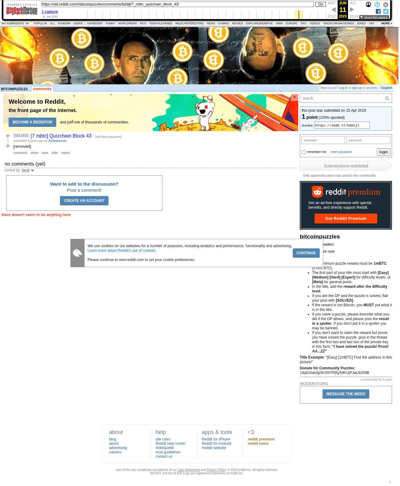

# [7 mbtc] Quizchain Block 43

[Original thread](https://www.reddit.com/r/bitcoinpuzzles/comments/bddijl/7_mbtc_quizchain_block_43/). The `sourceUrl` of the [quizchain/43](../../../src/collections/quizchain/43.ts) record and the source of its funding transaction. The post itself was removed, and the question survives in the author's Wattpad chapter Complete Quizchain. The post went up on April 15, 2019, at 08:16:44 UTC, 75 minutes after the block time of its funding transaction.

## Historical provenance

The Wayback Machine holds one capture of the `old.reddit.com` URL and one of the `www.reddit.com` URL. Provenance rests on the [old.reddit.com capture](https://web.archive.org/web/20230611154826/https://old.reddit.com/r/bitcoinpuzzles/comments/bddijl/7_mbtc_quizchain_block_43/), stamped June 11, 2023, 15:48:26 UTC, whose HTML carries the title and a removed post with no comments. Arctic Shift holds the same: the title, `[removed]` as the body and no comments. The question survives only in the author's Wattpad chapter Complete Quizchain, which the record cites for it. `archive_content: confirmed` on that basis: the capture was read on September 27, 2026 and shows exactly what the transcript shows.

## Transcript

> [removed]

## Screenshot

The screenshot is a render of the archive capture, not of the live page, so it carries the Wayback banner at the top. The "4 years ago" stamps are relative to the capture, June 11, 2023. Capture method and limits: [source archive](../README.md).
