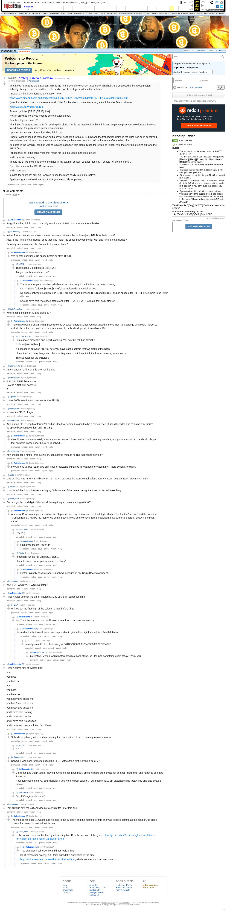

# [7 mbtc] Quizchain Block 44

[Original thread](https://www.reddit.com/r/bitcoinpuzzles/comments/bddkxb/7_mbtc_quizchain_block_44/). The `sourceUrl` of the [quizchain/44](../../../src/collections/quizchain/44.ts) record and the source of two of its hints and the funding transaction, with the solution the author edited in. The post went up on April 15, 2019, at 08:28:05 UTC, 32 minutes after the block time of its funding transaction. Its last edit is stamped 12:57:12 UTC on May 9, 2019, so the transcript shows the post as it stood after the claim.

## Historical provenance

The Wayback Machine holds one capture of the `old.reddit.com` URL and one of the `www.reddit.com` URL, plus two of single comment permalinks. Provenance rests on the [old.reddit.com capture](https://web.archive.org/web/20230611125222/https://old.reddit.com/r/bitcoinpuzzles/comments/bddkxb/7_mbtc_quizchain_block_44/), stamped June 11, 2023, 12:52:22 UTC, whose HTML carries the post, which matches the transcript below word for word. It renders 41 comments, and each matches the Arctic Shift record of the same ID by author and text. Only the markdown of links and lists renders differently. The capture was read on September 27, 2026. `archive_content: confirmed` on that basis.

The [Arctic Shift](https://arctic-shift.photon-reddit.com/) Reddit archive, read the same day, lists 42 comments, one of which the capture does not render. The transcript takes every comment, its author, text and score from Arctic Shift and nests them as the capture does. One of them is a deleted comment, kept below as `[deleted]`.

The record names none of the commenters: nothing on the chain ties a claim to a name.

## Transcript

> Thank you for playing the quizchain. This is the final block of the current three block minichain. It is supposed to be about medium difficulty, though it is very hard for me to predict how fast players will see the solution.
>
> Another 7 mbtc block, funding transaction here:
>
> https://www.smartbit.com.au/tx/fd1eca202459cf477c56ec716bf2cd6264a24c79716f01a54843e069396c6e92
>
> Question: Relax. Listen to some nice music. Wait for the idea to come. Have fun, even if the idea fails to show up.
>
> https://youtu.be/W3q8Od5qJio
>
> Format: [solution]BFUB [BFUB] [link]
>
> No link provided here, you need to solve previous block.
>
> First two digits of hash: 60
>
> Thank you for playing and have fun solving this block. This is the last block in this minichain, so please post your solution and how you found it after the prize claim transaction confirms.
>
> Update: Just noticed I forgot including link in hash...
>
> Update: Winner has had more than half a day of head start for block 77 now and the transaction claiming the prize has been confirmed many times over. Time to post the solution now, though there was not much left to figure out after the last hint.
>
> As noted in the last hint, solution was to leave the solution field blank. Since there was no link for this, the only thing to find out was the BFUB field.
>
> I chose the line in the song lyrics that made me use this video in the first place:
>
> and I have said nothing
>
> That is the BFUB field. It is one of the lines in my last hint as well, so after that hint, it should not be too difficult.
>
> One other idea for the BFUB was to use
>
> and I have said
>
> leaving the "nothing" out, but I wanted to use the more easily found alternative.
>
> Again, congrats to the winner and thank you everybody for playing.

## Comments

**u/AoiNakamoto**, 2 points:

> Forgot including link in hash. Use only solution and BFUB. Sorry for another mistake.

**u/puzzleponky**, 1 point:

> In the Format description above there is no space between the \[solution\] and BFUB, is that correct?
>
> Also, if the \[link\] is not included, does that also mean the space between the \[BFUB\] and \[link\] is not included?
>
> Basically can you update the Format to the correct one?

**u/AoiNakamoto**, 1 point, reply to u/puzzleponky:

> Yes to both questions. No space before or after [BFUB].

**u/rs1712**, 1 point, reply to u/AoiNakamoto:

> That means... [solution]BFUB[BFUB]
>
> Are you really sure about that?

**u/AoiNakamoto**, 1 point, reply to u/rs1712:

> Thank you for your question, which adresses one way to understand my answer wrong.
>
> No, it means [solution]BFUB [BFUB], like indicated in the original post.
>
> No space between [solution] and BFUB, but one space between BFUB and [BFUB], and no space after [BFUB], since there is no link in this one.
>
> Should have said "no space before and after BFUB [BFUB]" to make that point clearer.

**[deleted]**, reply to u/rs1712:

> [deleted]

**u/BrainForceOne**, 1 point:

> Where can I find block 43 and block 42?

**u/AoiNakamoto**, 1 point, reply to u/BrainForceOne:

> There have been problems with these (deleted by automoderator), but you don't need to solve them to challenge this block. I forgot to include the link in the hash, so it can (and must) be solved independent from block 43.

**u/Crypto_Rachel**, 1 point, reply to u/AoiNakamoto:

> I am curious since this one is still standing. You say the solution format is
>
> \[solution\]\[BFUB\]\[bfub\]
>
> No spaces in between Are you sure you gave us the correct first two digits of the hash.
>
> I have tried so many things and I believe they are correct, I just think the format is wrong somehow :)
>
> Thanks again for the puzzles :-)

**u/whatupyo02**, 1 point:

> Any chance of a hint on this one coming up?

**u/whatupyo02**, 1 point:

> 2 24 244 BFUB letter count
> Having a first digit hash: 60
> :(

**u/Agelais**, 1 point:

> I have 100% solution and no clue for the BFUB)

**u/whatupyo02**, 1 point:

> no solutionBFUB I forgot

**u/Randomiser**, 1 point:

> Any hint on BFUB length or format? I had an idea that seemed to good to be a coincidence (It uses the video and explains why there's no space between [solution] and "BFUB")

**u/AoiNakamoto**, 1 point, reply to u/Randomiser:

> I would love to. Unfortunately, I lost my notes on the solution in that Tragic Boating Accident, and got amnesia from the shock. I hope that amnesia passes after block 76 is solved...

**u/mapl3sn0w**, 1 point:

> Any chance for a hint for this puzzle 44, considering there is no link required to solve it ?

**u/AoiNakamoto**, 1 point, reply to u/mapl3sn0w:

> I would love to, but I can't give any hints for reasons explained in Wattpad story about my Tragic Boating Accident.

**u/AnirJ**, 1 point:

> One of hints was "4 for 44, 4 divide 44" i.e. "4:44", but I not find word combinations from 4:44 Last Day on Earth, JAY-Z 4:44, e.t.c.

**u/JDScreesh**, 1 point:

> I had found like 3 or 4 hashes starting by 60 but none of then were the right answer, so I'm still searching.

**u/silver_anth**, 1 point:

> Can we get the third digit of the hash? I am getting so many starting with "60"

**u/AoiNakamoto**, 1 point, reply to u/silver_anth:

> Amazing. Concentrating very hard on the 60 part revived my memory on the third digit, which is the third in "second" and the fourth in "Concentrating". Maybe my memory is coming back slowly as the shock from the accident gets farther and farther away in the back mirror...

**u/silver_anth**, 1 point, reply to u/AoiNakamoto:

> I "see" :)

**u/mapl3sn0w**, 1 point, reply to u/silver_anth:

> i think you meant I "cee" :P

**u/78bits**, 1 point, reply to u/AoiNakamoto:

> I need hint for the \[BFUB\] part.... sigh...
>
> I hope I can see what you meant at the "back"...

**u/AoiNakamoto**, 1 point, reply to u/78bits:

> Hint for 44 only possible after 76 solved, because of my Tragic Boating Accident.

**u/mooncritic**, 1 point:

> WUBFUB WUB WUB WUB Dubstep?

**u/AoiNakamoto**, 1 point:

> Final hint for this coming up on Thursday, May 9th, 8 am Japanese time.

**u/LiaVl**, 1 point, reply to u/AoiNakamoto:

> Will we get the first digit of the solution's md5 before hint?

**u/AoiNakamoto**, 1 point, reply to u/LiaVl:

> No, Thursday morning it is. I still need some time to recover my memory.

**u/AoiNakamoto**, 1 point, reply to u/AoiNakamoto:

> And actually it would have been impossible to give a first digit for a solution field left blank...

**u/rs1712**, 1 point, reply to u/AoiNakamoto:

> actually an md5 of a blank string is D41D8CD98F00B204E9800998ECF8427E

**u/AoiNakamoto**, 1 point, reply to u/rs1712:

> Interesting. My tool would not work with a blank string, so I learned something again today. Thank you.

**u/AoiNakamoto**, 1 point:

> Final hint live now at Twitter. It is:
>
> you
>
> you hate
>
> you hate me
>
> you
>
> you hate
>
> you hate me
>
> you hate/have asked me
>
> you hate/have asked me
>
> you hate/have asked me
>
> and I have said nothing
>
> and I have said no link
>
> and I have said no solution
>
> and I have said leave solution field blank

**u/AoiNakamoto**, 1 point, reply to u/AoiNakamoto:

> Solved immediately after this hint, waiting for confirmation of prize claiming transaction now.

**u/rs1712**, 1 point, reply to u/AoiNakamoto:

> õ.o

**u/Randomiser**, 1 point, reply to u/AoiNakamoto:

> Solved, it was hard for me to guess the BFUB without this hint. Having a go at 77

**u/AoiNakamoto**, 1 point, reply to u/Randomiser:

> Congrats, and thank you for playing. Checked this hash many times to make sure it was not another failed block and happy to see that it was not.
>
> Have fun challenging 77. Your decision if you want to post solution, I will publish at 10 pm Japanese time today if no one else posts it before.

**u/JDScreesh**, 1 point, reply to u/Randomiser:

> Great! Congratulations! =D

**u/reddeneer**, 1 point:

> I am curious how the 4444 "divide by four" hint fits in for this one

**u/AoiNakamoto**, 1 point, reply to u/reddeneer:

> The method for block 11 was to add nothing to the question and the method for this one was to have nothing as the solution, so block 11 was the closest in method to this one.

**u/silver_anth**, 1 point, reply to u/AoiNakamoto:

> It also worked as a double hint by referencing line 11 in this version of the lyrics: https://genius.com/Genius-english-translations-rammstein-du-hast-english-translation-lyrics

**u/AoiNakamoto**, 1 point, reply to u/silver_anth:

> That was just a coincidence, I did not realize that.
>
> Don't remember exactly, but I think I used this translation at the time:
>
> https://lyricstranslate.com/en/du-hast-du-hast.html, which has the "and" in lower case.

## Screenshot

The screenshot is a render of the archive capture, not of the live page, so it carries the Wayback banner at the top. The "4 years ago" stamps are relative to the capture, June 11, 2023. Capture method and limits: [source archive](../README.md).
