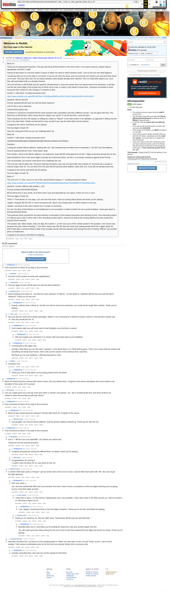

# [7 mbtc] [7 mbtc] [11 mbtc] Quizchain blocks 45 to 47

[Original thread](https://www.reddit.com/r/bitcoinpuzzles/comments/bdrcj7/7_mbtc_7_mbtc_11_mbtc_quizchain_blocks_45_to_47/). The `sourceUrl` of the [quizchain/45](../../../src/collections/quizchain/45.ts), [quizchain/46](../../../src/collections/quizchain/46.ts), [quizchain/47](../../../src/collections/quizchain/47.ts) records: the post shows all three blocks, each with its question and funding transaction. The post went up on April 16, 2019, at 08:08:47 UTC, 8 hours after the block time of its funding transaction. Its last edit is stamped 06:57:55 UTC on April 21, 2019, so the transcript shows the post as it stood after the claim.

## Historical provenance

The Wayback Machine holds one capture of the `old.reddit.com` URL and one of the `www.reddit.com` URL. Provenance rests on the [old.reddit.com capture](https://web.archive.org/web/20230611183838/https://old.reddit.com/r/bitcoinpuzzles/comments/bdrcj7/7_mbtc_7_mbtc_11_mbtc_quizchain_blocks_45_to_47/), stamped June 11, 2023, 18:38:38 UTC, whose HTML carries the post, which matches the transcript below word for word. It renders 28 comments, and each matches the Arctic Shift record of the same ID by author and text. Only the markdown of links and lists renders differently. The capture was read on September 27, 2026. `archive_content: confirmed` on that basis.

The [Arctic Shift](https://arctic-shift.photon-reddit.com/) Reddit archive, read the same day, lists 29 comments, one of which the capture does not render. The transcript takes every comment, its author, text and score from Arctic Shift and nests them as the capture does. One of them is a deleted comment, kept below as `[deleted]`.

The records name none of the commenters: nothing on the chain ties a claim to a name.

## Transcript

> Block 45
>
> Thank you for playing the quizchain. This post will show all three blocks in this short chain. If you want to discuss, please reply to appropriate comment I
> made.
>
> Having all discussion on one post makes it easier to follow. No need to switch between posts. Let's try this and see what happens.
>
> I would also like you to try this idea in comments. If you do not solve the block, post one and only one solution you tried and have found not to work. Post your best shot. Do not repeat solutions other people already have reported. This is to help other players out, since they will avoid dead ends you already checked.
>
> This one will have a BFUB field, but the question will determine it, since the answer does not require brute force protection. It will also use the last seven digits of the private key for block 44 as a link, to make it a bit harder to brute force. Someone succeeded in brute forcing the link in block 43, this change is in reaction to that.
>
> Another 7 mbtc block. Funding transaction here
>
> https://www.smartbit.com.au/tx/8514df7faec741d53faca908df5ccc855c760430759a2b5a12bf74ce00150f51
>
> Question: Bitcoin Second
>
> Format: [solution] BFUB Have fun with this block Da6Sn4J
>
> Link for this is set to Da6Sn4J.
>
> Solved pretty quickly also.
>
> Someone in comments remarked that the same question was used before and had a different answer. I do not agree with that. This block has no BFUB field, which means that the solution can not be "A" as the last time I used this idea.
>
> That is because this time the solution is shifting ALL letters in "Bitcoin" to the letter before in the alphabet, as opposed to shifing only the first in the other block. Really not that hard to come up with if you saw the other block and its solution.
>
> Congrats to the winner and thank you for playing.
>
> First two digits of hash: 66
>
> Have fun solving this block so you can challenge block 46.
>
> Block 46
>
> Another 7 mbtc block, funding transaction here.
>
> 2900dfc636a5a9f8c3bbbc2f28dbd9c0fbc98b7d8c06c2e59de613c5f7dfa90a
>
> Question:
>
> Looking for another Bitcoin address, starting with 1A1. Not mentioned by me before here or elsewhere. I do NOT own this address.
>
> Format: [solution] BFUB Think. Think harder. [link]
>
> Find solution, which is the Bitcoin address I am looking for, leave BFUB unchanged and use last 7 digits of previous private key for link.
>
> Note that [link] for this is last seven digits of private key of previous block, not last 3, to increase resistance against brute forcing.
>
> Link not provided, you need to solve block 45 to challenge this one.
>
> This one was solved rather fast. The prize claiming transaction was only one block after that of block 45. Survived only a couple of minutes longer than 45. You can learn from this quiz that the genesis block address starts with 1A1, if you did not already know that.
>
> Congrats to the winner and thank you for playing.
>
> First two digits of hash: 58
>
> Block 47
>
> This one is for 11 mbtc, since it is one of the special blocks ending in 7. Funding transaction below.
>
> https://www.smartbit.com.au/tx/f0e7f3f0fa053d4c05354eab666e99a0e40a4475ed098b5473759ce93b41b92e
>
> Question: Another difficult math problem. 1231
>
> Format; [solution] BFUB [BFUB] [link]
>
> BFUB will be four or less words, all of them lower case and seperated by one space, if there are two or more.
>
> First two digits of hash: b9
>
> That's it. Three blocks on one page. Let's see how that works. Have fun solving these blocks and thank you for playing.
>
> Update: changed "BR the link" in "brute forcing the link" above, this change does not affect solution in any way.
>
> Update: Last block in this series solved now. A couple of comments.
>
> For one, the idea of three blocks in one Reddit post is not successful. It makes it harder for me to avoid mistakes. I have gone back to posting individual blocks.
>
> This particular block survived for five days between confirmation of the funding transaction and claiming of prize. One interesting aspect of a Bitcoin quiz is that it comes with a time recording function built in. Anyone can look at the funding address and see exactly how long this block survived.
>
> The solution was rather simple. Only one digit, the number 7, as the cross sum of the number posted in the question. One reason was because this was a block including 7. One other reason was that this time the Hoax was making people think this is again about the MATH hats (like in previous blocks) while it was actually exactly what the question said, though the part of it being "difficult" was another piece of misdirection.
>
> Congrats to the winner and thanks for playing.

## Comments

**u/AoiNakamoto**, 3 points:

> Post comments for block 45 as reply to this comment.

**u/startfruits**, 1 point, reply to u/AoiNakamoto:

> Any hint on the number of words and capitalization?

**u/whatupyo02**, 1 point, reply to u/AoiNakamoto:

> First two digits of hash: BFUB Have fun with this block Da6Sn4J

**u/BrainForceOne**, 1 point, reply to u/AoiNakamoto:

> Same thinking as for block 31 - but done for each character of "Bitcoin".
> So this leads to: "Ahsbnhm BFUB Have fun with this block Da6Sn4J"
> Thank you for that one!

**u/AoiNakamoto**, 1 point, reply to u/BrainForceOne:

> Exactly, method close to block 31, but this one had no brute force protection, so it could not be single letter solution. Thank you for playing.

**u/silver_anth**, 1 point, reply to u/AoiNakamoto:

> Not sure why the same hint is being used again. Makes it very confusing as to what the answer could be, if the previous answer was "A", then this should also be "A".

**u/AoiNakamoto**, 1 point, reply to u/silver_anth:

> Can't explain right now, will come back to that feedback once the block is solved.

**u/AoiNakamoto**, 1 point, reply to u/AoiNakamoto:

> Still can't explain now until block 47 is solved. Will come back later to your feedback.

**u/AoiNakamoto**, 1 point, reply to u/silver_anth:

> Coming back to this again now.
>
> Actually I think these are not "the same" question. In this block there is no TOMI field to guess. That in turn means that the solution will something not easily brute forced, which rules out the solution of the previous time I used this.
>
> But thank you for your feedback. I will keep that point in mind.

**u/Sn00zor**, 1 point, reply to u/AoiNakamoto:

> Humanity First

**u/AoiNakamoto**, 1 point, reply to u/Sn00zor:

> Thank you, first to help others out by posting dead end for this block.

**u/AoiNakamoto**, 1 point:

> Block 45 solved and prize claimed after about 4 hours, this one without hints. Congrats to the winner and please don't post solution until last block of this series (47) is solved.

**u/BTCkoning**, 1 point:

> Can you maybe point out in the top of the post which is solved? Like \[solved : 45 - 46\] or something like that. And when all three are solved to solve the post like you did with others?

**u/AoiNakamoto**, 1 point:

> Post comments for block 46 as reply to this comment.

**u/AoiNakamoto**, 1 point, reply to u/AoiNakamoto:

> Block 46 also solved and prize claimed 2 minutes after block 45. Congrats to the winner.

**u/BrainForceOne**, 1 point, reply to u/AoiNakamoto:

> Just googled "1A1 famous bitcoin address" and the genesis address showed up.
> Thank you for that one too.

**u/AoiNakamoto**, 1 point:

> Post comments for block 47 as reply to this comment.

**u/Randomiser**, 2 points, reply to u/AoiNakamoto:

> Got it: "7 BFUB cross sum adyH5bR". All 3 blocks are solved now.
>
> Thanks for the hint (and the puzzles)!

**u/AoiNakamoto**, 2 points, reply to u/Randomiser:

> Congrats and good job solving this difficult block. As always, thank you for playing.

**u/JDScreesh**, 1 point, reply to u/Randomiser:

> Congratulations for solving it.
> I couldn't solve the block 45 so i was stuck for that. xD

**u/BrainForceOne**, 1 point, reply to u/AoiNakamoto:

> Is still the MD5 hash used as entropy?
> I got an answer (the correct one of corse:-) and its MD5 hash starts with "b9". But i do not get the right adresses.

**u/AoiNakamoto**, 1 point, reply to u/BrainForceOne:

> Nice user name :)
>
> Yes, this was hashed with MD5 and I just checked. First time I hear of such a coincidence of first two digits matching, but not giving access. First three digits are b90...

**u/Crypto_Rachel**, 1 point, reply to u/AoiNakamoto:

> I think there is like a 1 in 256 chance of getting that, but is very possible. I have seen many in the other puzzles as I look for answers. I'm still trying to figure out 42

**u/AoiNakamoto**, 1 point, reply to u/Crypto_Rachel:

> I see. Maybe I should post three or four first digits of hashes. Thank you for the info, and thanks for playing.

**u/BrainForceOne**, 1 point, reply to u/AoiNakamoto:

> Thank you for checking.
> So, this one didn't work:
> "factorization BFUB only one and itself ady...."

**u/AoiNakamoto**, 2 points, reply to u/BrainForceOne:

> Beautiful idea, but no. And thank you for posting the dead end, may save another player one test.
>
> You still made quizchain history being the first one to find a hash that matched first two digits but turned out wrong. Thank you for playing.

**u/martypyouknowme**, 1 point, reply to u/AoiNakamoto:

> Well after the latest hint, my theory of 1231 breaking down to "father son holy spirit" as the 123 and "trinity" as the 1 went out the window. Tried various combinations prior to the hint and none worked. Better luck to someone else.

**u/AoiNakamoto**, 1 point, reply to u/martypyouknowme:

> Actually a beautiful idea I also had, but not the solution for this block.

**[deleted]**, reply to u/AoiNakamoto:

> [deleted]

## Screenshot

The screenshot is a render of the archive capture, not of the live page, so it carries the Wayback banner at the top. The "4 years ago" stamps are relative to the capture, June 11, 2023. Capture method and limits: [source archive](../README.md).
