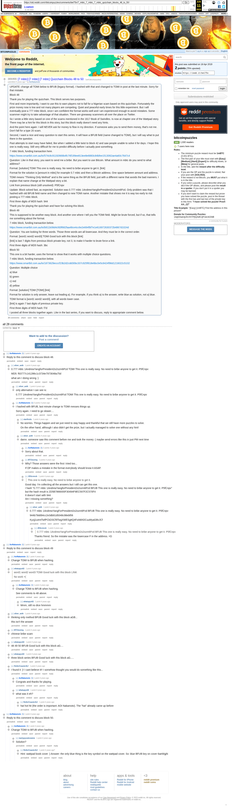

# [7 mbtc] [7 mbtc] [7 mbtc] Quizchain Blocks 48 to 50

[Original thread](https://www.reddit.com/r/bitcoinpuzzles/comments/bel75n/7_mbtc_7_mbtc_7_mbtc_quizchain_blocks_48_to_50/). The `sourceUrl` of the [quizchain/48](../../../src/collections/quizchain/48.ts), [quizchain/49](../../../src/collections/quizchain/49.ts), [quizchain/50](../../../src/collections/quizchain/50.ts) records: the post shows all three blocks, each with its question and funding transaction. The WIF of block 48 is printed here by u/silver_anth. The post went up on April 18, 2019, at 12:53:23 UTC, 7 hours after the block time of its funding transaction. Its last edit is stamped 13:57:10 UTC on April 18, 2019.

## Historical provenance

The Wayback Machine holds one capture of the `old.reddit.com` URL and one of the `www.reddit.com` URL. Provenance rests on the [old.reddit.com capture](https://web.archive.org/web/20230611180656/https://old.reddit.com/r/bitcoinpuzzles/comments/bel75n/7_mbtc_7_mbtc_7_mbtc_quizchain_blocks_48_to_50/), stamped June 11, 2023, 18:06:56 UTC, whose HTML carries the post, which matches the transcript below word for word. It renders 28 comments, and each matches the Arctic Shift record of the same ID by author and text. Only the markdown of links and lists renders differently. The capture was read on September 27, 2026. `archive_content: confirmed` on that basis.

The [Arctic Shift](https://arctic-shift.photon-reddit.com/) Reddit archive, read the same day, lists 29 comments, one of which the capture does not render. The transcript takes every comment, its author, text and score from Arctic Shift and nests them as the capture does. One of them is a deleted comment, kept below as `[deleted]`.

The records name none of the commenters: nothing on the chain ties a claim to a name.

## Transcript

> UPDATE: change all TOMI below to BFUB (legacy format). I hashed with that and changed to TOMI in post at the last minute. Sorry for that mistake.
>
> Block 48
>
> Thank you for playing the quizchain. This block serves two purposes.
>
> First and more importantly, I want to use this to warn players not to fall for a Nigerian scam based on this quizchain. Fortunately the prize money now is low and not many players are competing. Quiet and peaceful early times for this little experiment. But I will eventually post a 777 mbtc block, once I am confident the format works well and I am experienced enough to avoid mistakes. Some scammer might try to take advantage of that situation. There are giveaway scammers all over the place on Twitter.
>
> So I wrote a little story based on one of the scams mentioned in the 1617 Book of Swindles. Is now at chapter one of the Wattpad story. There may be a hint for this block in this story, but this block really doesn't need any hints.
>
> And the point here again: I will NEVER ask for money to flow in my direction. If someone asks you to send them money, that's not me. Don't fall for a type 20 scam.
>
> Second, I want a nice and easy question to start this series. It will have a BFUB field (name changed to TOMI), but I will say what to put there in the question.
>
> Past attempts to start easy have failed, like when I added a little twist to block 42 and saw people unable to solve it for days. I hope this one is really easy. Still very difficult for me to predict difficulty before I actually post something.
>
> 7 mbtc block, funding transaction here.
>
> https://www.smartbit.com.au/tx/574c8c91192669b4fc76f199ee813ee8e6883c84bfee1513062ae4a60c7647c4
>
> Question: Like in that story, you want to send me a bribe. But you want to use Bitcoin. What amount in mbtc do you send to what address?
>
> Format: [solution] TOMI This one is really easy. No need to bribe anyone to get it. [link]
>
> Format for the solution is [amount in mbtc] for example 0.7 mbtc and then a Bitcoin address. One space between amount and address.
>
> TOMI means "Thinking Only Method" and is the same thing as the BFUB field, just with a different name that avoids the bad manners. I explain that name change at the Wattpad story a bit.
>
> Link from previous block (still unsolved): P5fCnpv
>
> Update: Block solved fast, as expected. Solution was 0.777 mbtc 1AndrewYangforPresident2o2ozm6Pzd. Only problem was that I hashed with old BFUB field name and then changed to new TOMI name. Another mistake that shows me it is way too early to risk posting a 777 mbtc block.
>
> First three digits of MD5 hash: 944
>
> Thank you for playing the quizchain and have fun solving this block.
>
> Block 49
>
> This is supposed to be another easy block. And another one where I tell you the TOMI field. Might be brute forced, but if so, that tells me something about the format.
>
> 7 mbtc block, funding transaction below.
>
> https://www.smartbit.com.au/tx/b911b08d4cfd3f682faa48ce4cc6e2e694fbf7e1e616972630372b4867d1024d
>
> Question: You are looking for three words. Those three words are all lowercase. And they must be in the correct order.
>
> Format: [word1 word2 word3] TOMI Good luck with this block [link]
>
> [link] is last 7 digits from previous block private key, not 3, to make it harder to brute force a link.
>
> First three digits of MD5 hash: 3bc
>
> Block 50
>
> This one is a bit harder, uses the format to show that it works with multiple choice questions.
>
> 7 mbtc block, funding transaction below.
>
> https://www.smartbit.com.au/tx/1873629ecccf23b2d2cdd30bc337c925f818e6bc0e5c8424f96d1216022c5102
>
> Question: Multiple choice
>
> a) blue
>
> b) green
>
> c) red
>
> d) yellow
>
> Format: [solution] TOMI [TOMI] [link]
>
> Format for solution is only answer, leave out leading a). For example, if you think a) is the answer, write blue as solution, not a) blue.
>
> TOMI format is [word1 word2 word3], with all words lower case.
>
> [link] is again 7 last digits of previous private key.
>
> FIrst three digits of MD5 hash: f7d
>
> I posted all three blocks together again. Like in the last series, if you want to discuss, reply to appropriate comment below.

## Comments

**u/AoiNakamoto**, 1 point:

> Reply to this comment to discuss block 48.

**u/silver_anth**, 1 point, reply to u/AoiNakamoto:

> 0.777 mbtc 1AndrewYangforPresident2o2ozm6Pzd TOMI This one is really easy. No need to bribe anyone to get it. P5fCnpv
>
> MD5: f63777c141286c1c3734e7973048a75d
>
> what am I doing wrong :)

**u/silver_anth**, 1 point, reply to u/silver_anth:

> only alternative I can see is:
>
> 0.777 1AndrewYangforPresident2o2ozm6Pzd TOMI This one is really easy. No need to bribe anyone to get it. P5fCnpv

**u/AoiNakamoto**, 0 points, reply to u/silver_anth:

> I hashed with BFUB, last minute change to TOMI messes things up.
>
> Sorry again. I need to go slower....

**u/startfruits**, 1 point, reply to u/AoiNakamoto:

> No worries. Things happen and we just need to stay happy and thankful that we still have more puzzles to solve.
>
> On the other hand, although I also didn't get the prize, but I actually managed to solve one without any hint!

**u/silver_anth**, 0 points, reply to u/AoiNakamoto:

> damn. someone saw this comment before me and took the money :( maybe send errors like this in just PM next time

**u/AoiNakamoto**, 2 points, reply to u/silver_anth:

> Sorry about that.

**u/BTCkoning**, 2 points, reply to u/silver_anth:

> Why? Those answers were the first i tried too...
>
> If OP makes a mistake in the format everybody should know it ASAP.

**u/JDScreesh**, 1 point, reply to u/silver_anth:

> > This one is really easy. No need to bribe anyone to get it.
>
> Good day. I'm collecting all the answers but I still can get this one.
> I hash "0.777 mbtc 1AndrewYangforPresident2o2ozm6Pzd BFUB This one is really easy. No need to bribe anyone to get it. P5fCnpv" but the hash result is 2D5B7866000F30494F9EC597F2C570F4
> It doesn't start with 944
> Am I missing something?

**u/silver_anth**, 1 point, reply to u/JDScreesh:

> 0.777 mbtc 1AndrewYangForPresident2o2ozm6Pzd BFUB This one is really easy. No need to bribe anyone to get it. P5fCnpv
>
> 944b79dd94cc2e3db91d9348c98ebf06
>
> Kyzjj1utmtTwfPCkDSCf9TwgXWESgttQ4FxAtkhDCuuMyaGBvJCf

**u/JDScreesh**, 1 point, reply to u/silver_anth:

> > 0.777 mbtc 1AndrewYangForPresident2o2ozm6Pzd BFUB This one is really easy. No need to bribe anyone to get it. P5fCnpv
>
> Thanks friend. So the mistake was the lowercase F in the address. =D

**u/AoiNakamoto**, 1 point:

> Reply to this comment to discuss block 49

**u/AoiNakamoto**, 1 point, reply to u/AoiNakamoto:

> Change TOMI to BFUB when hashing.

**u/whatupyo02**, 1 point, reply to u/AoiNakamoto:

> > word1 word2 word3 TOMI Good luck with this block LINK
>
> > No work =(

**u/AoiNakamoto**, 1 point, reply to u/whatupyo02:

> Change TOMI to BFUB when hashing.
>
> See comments to 48 above.

**u/whatupyo02**, 1 point, reply to u/AoiNakamoto:

> Mmm, still no dice hmmmm

**u/silver_anth**, 1 point, reply to u/AoiNakamoto:

> thinking only method BFUB Good luck with this block aGB...
>
> this isn't the answer

**u/BTCkoning**, 1 point, reply to u/AoiNakamoto:

> chinese bribe scam

**u/whatupyo02**, 1 point, reply to u/AoiNakamoto:

> 48 49 50 BFUB Good luck with this block aG....

**u/whatupyo02**, 1 point, reply to u/AoiNakamoto:

> three block series BFUB Good luck with this block aG.....

**u/RollerCoaster4Lf**, 1 point, reply to u/AoiNakamoto:

> I found it :)! I cant believe it!! I somehow thought you would do something like this...

**u/AoiNakamoto**, 1 point, reply to u/RollerCoaster4Lf:

> Congrats and thanks for playing.

**u/whatupyo02**, 1 point, reply to u/RollerCoaster4Lf:

> what was it eh?

**u/RollerCoaster4Lf**, 1 point, reply to u/whatupyo02:

> hat hot hit (the order is important: AOI Nakamoto). The "hat" already came up before

**[deleted]**, reply to u/RollerCoaster4Lf:

> [deleted]

**u/AoiNakamoto**, 1 point:

> Reply to this comment to discuss block 50.

**u/AoiNakamoto**, 1 point, reply to u/AoiNakamoto:

> Change TOMI to BFUB when hashing.

**u/martypyouknowme**, 1 point, reply to u/AoiNakamoto:

> Solution?

**u/RollerCoaster4Lf**, 1 point, reply to u/martypyouknowme:

> Hint: wattpad book cover :)
> Answer: the only blue thing is the key symbol on the wattpad cover.
> So: blue BFUB key on cover 6aeWgjN

## Screenshot

The screenshot is a render of the archive capture, not of the live page, so it carries the Wayback banner at the top. The "4 years ago" stamps are relative to the capture, June 11, 2023. Capture method and limits: [source archive](../README.md).
