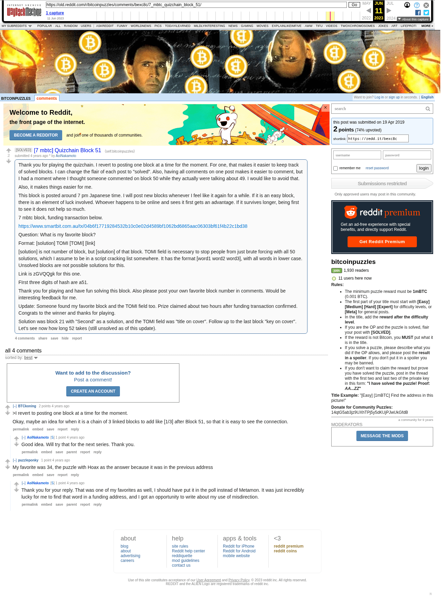

# [7 mbtc] Quizchain Block 51

[Original thread](https://www.reddit.com/r/bitcoinpuzzles/comments/bexc8c/7_mbtc_quizchain_block_51/). The `sourceUrl` of the [quizchain/51](../../../src/collections/quizchain/51.ts) record and the source of three of its hints and the funding transaction, with the solution the author edited in. The post went up on April 19, 2019, at 09:49:57 UTC, 17 minutes before the block time of its funding transaction. Its last edit is stamped 23:13:18 UTC on April 19, 2019, so the transcript shows the post as it stood after the claim.

## Historical provenance

The Wayback Machine holds one capture of the `old.reddit.com` URL and one of the `www.reddit.com` URL. Provenance rests on the [old.reddit.com capture](https://web.archive.org/web/20230611164614/https://old.reddit.com/r/bitcoinpuzzles/comments/bexc8c/7_mbtc_quizchain_block_51/), stamped June 11, 2023, 16:46:14 UTC, whose HTML carries the post, which matches the transcript below word for word. It renders four comments, and each matches the Arctic Shift record of the same ID by author and text. Only the markdown of links and lists renders differently. The capture was read on September 27, 2026. `archive_content: confirmed` on that basis.

The [Arctic Shift](https://arctic-shift.photon-reddit.com/) Reddit archive, read the same day, lists the same four comments. The transcript takes authors, text and scores from it and nests the comments as the capture does.

The record names none of the commenters: nothing on the chain ties a claim to a name.

## Transcript

> Thank you for playing the quizchain. I revert to posting one block at a time for the moment. For one, that makes it easier to keep track of solved blocks. I can change the flair of each post to "solved". Also, having all comments on one post makes it easier to comment, but I had a moment where I thought someone commented on block 50 while they actually were talking about 49. I would like to avoid that.
>
> Also, it makes things easier for me.
>
> This block is posted around 7 pm Japanese time. I will post new blocks whenever I feel like it again for a while. If it is an easy block, there is an element of luck involved. Whoever happens to be online and sees it first gets an advantage. If it survives longer, being first to see it does not help so much.
>
> 7 mbtc block, funding transaction below.
>
> https://www.smartbit.com.au/tx/04b6f17719284532b10c0e02d4589bf1062bd6865aac06303bf61f4b22c1bd38
>
> Question: What is my favorite block?
>
> Format: [solution] TOMI [TOMI] [link]
>
> [solution] is not number of block, but [solution] of that block. TOMI field is necessary to stop people from just brute forcing with all 50 solutions, which I assume to be in a script cracking list somewhere. It has the format [word1 word2 word3], with all words in lower case. Unsolved blocks are not possible solutions for this.
>
> Link is zGVQQgk for this one.
>
> FIrst three digits of hash are a51.
>
> Thank you for playing and have fun solving this block. Also please post your own favorite block number in comments. Would be interesting feedback for me.
>
> Update: Someone found my favorite block and the TOMI field too. Prize claimed about two hours after funding transaction confirmed. Congrats to the winner and thanks for playing.
>
> Solution was block 21 with "Second" as a solution, and the TOMI field was "title on cover". Follow up to the last block "key on cover". Let's see now how long 52 takes (still unsolved as of this update).

## Comments

**u/BTCkoning**, 2 points:

> > I revert to posting one block at a time for the moment.
>
> Okay, maybe an idea for when it is a chain of 3 linked blocks to add like \[1/3\] after Block 51, so that it is easy to see the connection.

**u/AoiNakamoto**, 1 point, reply to u/BTCkoning:

> Good idea. Will try that for the next series. Thank you.

**u/puzzleponky**, 1 point:

> My favorite was 34, the puzzle with Hoax as the answer because it was in the previous address

**u/AoiNakamoto**, 1 point, reply to u/puzzleponky:

> Thank you for your reply. That was one of my favorites as well, I should have put it in the poll instead of Metamon. It was just incredibly lucky for me to find that word in a funding address, and I got an opportunity to write about my use of misdirection.

## Screenshot

The screenshot is a render of the archive capture, not of the live page, so it carries the Wayback banner at the top. The "4 years ago" stamps are relative to the capture, June 11, 2023. Capture method and limits: [source archive](../README.md).
