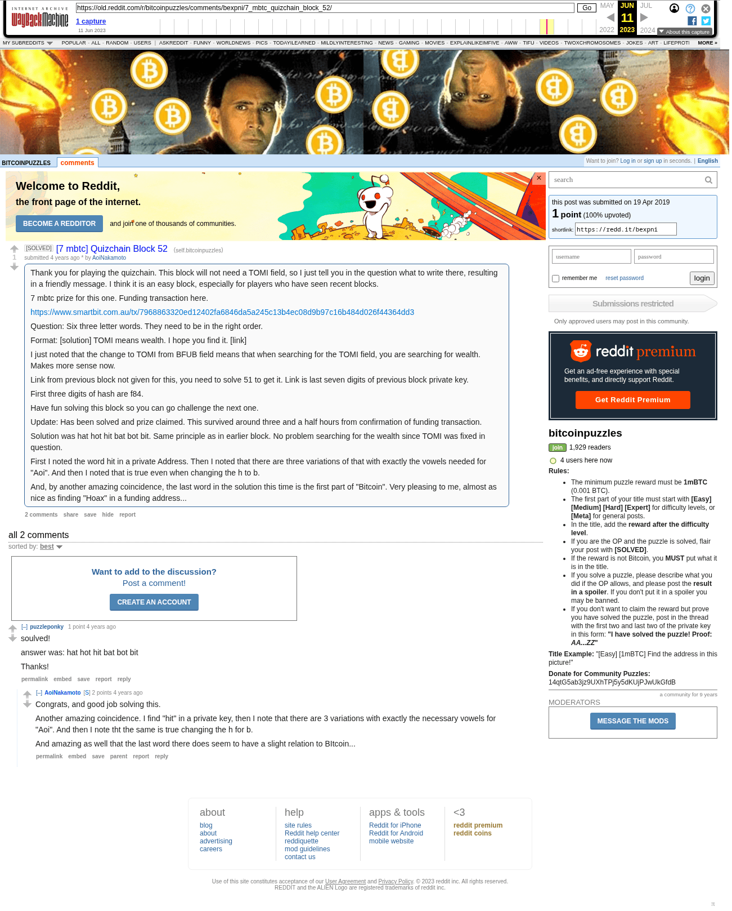

# [7 mbtc] Quizchain Block 52

[Original thread](https://www.reddit.com/r/bitcoinpuzzles/comments/bexpni/7_mbtc_quizchain_block_52/). The `sourceUrl` of the [quizchain/52](../../../src/collections/quizchain/52.ts) record and the source of two of its hints and the funding transaction, with the solution the author edited in. The post went up on April 19, 2019, at 10:43:00 UTC, 63 minutes before the block time of its funding transaction. Its last edit is stamped 23:05:55 UTC on April 19, 2019, so the transcript shows the post as it stood after the claim.

## Historical provenance

The Wayback Machine holds one capture of the `old.reddit.com` URL and one of the `www.reddit.com` URL. Provenance rests on the [old.reddit.com capture](https://web.archive.org/web/20230611101838/https://old.reddit.com/r/bitcoinpuzzles/comments/bexpni/7_mbtc_quizchain_block_52/), stamped June 11, 2023, 10:18:38 UTC, whose HTML carries the post, which matches the transcript below word for word. It renders two comments, and each matches the Arctic Shift record of the same ID by author and text. Only the markdown of links and lists renders differently. The capture was read on September 27, 2026. `archive_content: confirmed` on that basis.

The [Arctic Shift](https://arctic-shift.photon-reddit.com/) Reddit archive, read the same day, lists the same two comments. The transcript takes authors, text and scores from it and nests the comments as the capture does.

The record names none of the commenters: nothing on the chain ties a claim to a name.

## Transcript

> Thank you for playing the quizchain. This block will not need a TOMI field, so I just tell you in the question what to write there, resulting in a friendly message.
> I think it is an easy block, especially for players who have seen recent blocks.
>
> 7 mbtc prize for this one. Funding transaction here.
>
> https://www.smartbit.com.au/tx/7968863320ed12402fa6846da5a245c13b4ec08d9b97c16b484d026f44364dd3
>
> Question: Six three letter words. They need to be in the right order.
>
> Format: [solution] TOMI means wealth. I hope you find it. [link]
>
> I just noted that the change to TOMI from BFUB field means that when searching for the TOMI field, you are searching for wealth. Makes more sense now.
>
> Link from previous block not given for this, you need to solve 51 to get it. Link is last seven digits of previous block private key.
>
> First three digits of hash are f84.
>
> Have fun solving this block so you can go challenge the next one.
>
> Update: Has been solved and prize claimed. This survived around three and a half hours from confirmation of funding transaction.
>
> Solution was hat hot hit bat bot bit. Same principle as in earlier block. No problem searching for the wealth since TOMI was fixed in question.
>
> First I noted the word hit in a private Address. Then I noted that there are three variations of that with exactly the vowels needed for "Aoi". And then I noted that is true even when changing the h to b.
>
> And, by another amazing coincidence, the last word in the solution this time is the first part of "Bitcoin". Very pleasing to me, almost as nice as finding "Hoax" in a funding address...

## Comments

**u/puzzleponky**, 1 point:

> soulved!
>
> answer was: hat hot hit bat bot bit
>
> Thanks!

**u/AoiNakamoto**, 2 points, reply to u/puzzleponky:

> Congrats, and good job solving this.
>
> Another amazing coincidence. I find "hit" in a private key, then I note that there are 3 variations with exactly the necessary vowels for "Aoi". And then I note tht the same is true changing the h for b.
>
> And amazing as well that the last word there does seem to have a slight relation to BItcoin...

## Screenshot

The screenshot is a render of the archive capture, not of the live page, so it carries the Wayback banner at the top. The "4 years ago" stamps are relative to the capture, June 11, 2023. Capture method and limits: [source archive](../README.md).
