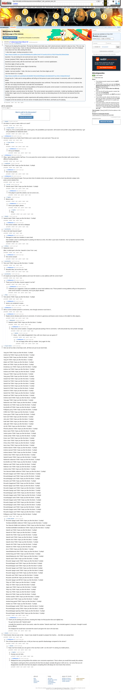

# [7 mbtc] Quizchain Block 53

[Original thread](https://www.reddit.com/r/bitcoinpuzzles/comments/bf6fya/7_mbtc_quizchain_block_53/). The `sourceUrl` of the [quizchain/53](../../../src/collections/quizchain/53.ts) record and the source of three of its hints and the funding transaction. The post went up on April 20, 2019, at 00:33:22 UTC, 12 hours before the block time of its funding transaction. Its last edit is stamped 13:21:03 UTC on April 20, 2019, so the transcript shows the post as it stood after the claim.

## Historical provenance

The Wayback Machine holds one capture of the `old.reddit.com` URL and one of the `www.reddit.com` URL. Provenance rests on the [old.reddit.com capture](https://web.archive.org/web/20230610215605/https://old.reddit.com/r/bitcoinpuzzles/comments/bf6fya/7_mbtc_quizchain_block_53/), stamped June 10, 2023, 21:56:05 UTC, whose HTML carries the post, which matches the transcript below word for word. It renders 41 comments, and each matches the Arctic Shift record of the same ID by author and text. Only the markdown of links and lists renders differently. The capture was read on September 27, 2026. `archive_content: confirmed` on that basis.

The [Arctic Shift](https://arctic-shift.photon-reddit.com/) Reddit archive, read the same day, lists 42 comments, one of which the capture does not render. The transcript takes every comment, its author, text and score from Arctic Shift and nests them as the capture does. One of them is a deleted comment, kept below as `[deleted]`.

The record names none of the commenters: nothing on the chain ties a claim to a name.

## Transcript

> Thank you for playing the quizchain. The last two blocks were fairly easy, both solved and prize claimed in about an hour. This one may be hard or it may be easy. I have no idea and will just go ahead and post it. I will also post a longer hint at chapter one of the Wattpad story about one hour after posting this block.
>
> 7 mbtc block again, funding transaction is here.
>
> https://www.smartbit.com.au/tx/cf03595feba78ccad9ee24e67371eee91a7b37a17fd19705ae29323f3e8206de
>
> Question: You are looking for one word and one name. The word is contained in the name.
>
> Format: [solution] TOMI I hope you like this block. [link]
>
> [solution] is [name word], with the word lower case and the name in normal capitalization.
>
> First three digits of hash are 08a.
>
> Link from block 52 are last seven digits of private key.
>
> Have fun solving this block.
>
> Update:
> Just sent another 7 mbtc, this time to correct hash, first three digits are 937
>
> LInk from block 52 is Y1ui6qG.
>
> https://www.smartbit.com.au/tx/ba01e9c0de866749c6c4b94599aab1c8e4ddeded257ac1262c218dadc08c5a20
>
> Private key for 7 mbtc sent to wrong address will still go to first person to post correct answer in comments, with one try allowed per player.
>
> Update: Prize was claimed one block after funding transaction was confirmed. That was fast. Fairness of process is in doubt for this one, but I am trying to do the best I can under the circumstances.
>
> Will still send private key for funds at wrong address to first person who posts correct answer in comments (may be same person who swept this prize, I would have no way to know).
>
> Update: We have a second winner for this block. The correct answer was posted to comments. I ended up handing out double prizes for this block. Again sorry for messing up the hash. But there may be an interesting lesson for the format to be learned from this mistake.
>
> One thing improved compared to earlier experiments with posting solutions to comments is the rule of only one try per player.
>
> Congrats to the two winners (or the one winner of double prize) for this block, and thank you for playing.

## Comments

**u/Agelais**, 3 points:

> Are letters in name is same order as in word?

**u/Crypto_Rachel**, 1 point, reply to u/Agelais:

> I hope so, if it's a word jumble with a name guess, the possibilities just skyrocket. with dcode word jumbler using english dictionary I get 244 possibilities for Nakamoto alone.

**u/AoiNakamoto**, 2 points:

> Someone asked at my Twitter feed if letters are in same order in name and word. They are not.

**u/Crypto_Rachel**, 1 point, reply to u/AoiNakamoto:

> ouch

**u/AoiNakamoto**, 1 point, reply to u/Crypto_Rachel:

> Hint up at Wattpad...

**u/AoiNakamoto**, 2 points:

> Okay. I give it about another half hour. If no one posts the correct solution in comments, I will repost this block with correct hash to different funding address.

**u/mapl3sn0w**, 2 points:

> Satoshi hast TOMI i hope you like this block. Y1ui6qG

**u/AoiNakamoto**, 1 point, reply to u/mapl3sn0w:

> Not correct answer...

**u/AoiNakamoto**, 1 point:

> I messed up hash beyond repair. Post your best shot of solution (only one per player). I will send private key directly to player who posts correct solution first.

**u/tp_94**, 2 points, reply to u/AoiNakamoto:

> Satoshi stash TOMI I hope you like this block. Y1ui6qG

**u/AoiNakamoto**, 1 point, reply to u/tp_94:

> FIrst player to post this solution, but not correct one...

**u/Agelais**, 1 point, reply to u/AoiNakamoto:

> Bitcoin coin)

**u/AoiNakamoto**, 1 point, reply to u/Agelais:

> One try per player, please...

**u/Agelais**, 1 point, reply to u/AoiNakamoto:

> Okay

**u/Agelais**, 1 point:

> Satoshi stash TOMI I hope you like this block. Y1ui6qG

**u/AoiNakamoto**, 1 point, reply to u/Agelais:

> Not correct solution. See hint at Wattpad.

**u/puzzleponky**, 1 point:

> why is the hash beyond repair?

**u/AoiNakamoto**, 1 point, reply to u/puzzleponky:

> Managed to make two mistakes in same hash.
>
> One mistake is due to switching back to posting one block at a time, the other is pure lack of attention. Not my favorite moment of this experiment right now.

**u/Sn00zor**, 1 point:

> Nakamoto moon
>
> (Btw, in which part is the hint, Satoshi's Coins? Nm I see)

**u/AoiNakamoto**, 1 point, reply to u/Sn00zor:

> Not correct answer.

**u/puzzleponky**, 1 point:

> Tomi omit TOMI I hope you like this block. Y1ui6qG

**u/AoiNakamoto**, 1 point, reply to u/puzzleponky:

> Beautiful idea, but not the one I had...

**u/puzzleponky**, 1 point:

> eh maybe just scrap this puzzle address and move the funds to a new address with the correct hash?

**u/AoiNakamoto**, 2 points, reply to u/puzzleponky:

> Thank you for this idea. Anyone support it as fair?

**u/AoiNakamoto**, 1 point, reply to u/AoiNakamoto:

> I followed your suggestion, funds are available at correct hash address now. Those posted to wrong address will go to first person to write correct answer in comments, one try per player allowed.

**u/78bits**, 1 point:

> Tomi atomic TOMI I hope you like this block. Y1ui6qG

**u/AoiNakamoto**, 1 point, reply to u/78bits:

> atomic not contained in name...

**u/AoiNakamoto**, 1 point:

> Still no correct solution posted to comments, even though someone must know it...

**u/AoiNakamoto**, 1 point, reply to u/AoiNakamoto:

> Maybe winner already used one try in comments. Or winner is generous and leaves some money on the table for other players...

**u/Mykhailo11**, 0 points, reply to u/AoiNakamoto:

> Satoshi's stash TOMI I hope you like this block. Y1ui6qG

**u/AoiNakamoto**, 1 point, reply to u/Mykhailo11:

> That is the correct solution. Congrats and good job posting it first to comments. I will send private key over private message.

**u/Agelais**, 0 points, reply to u/AoiNakamoto:

> Jesus... And, totally disappointed ( How, with one chance you can guess it?

**u/AoiNakamoto**, 1 point, reply to u/Agelais:

> I am not happy either with my mistake. Sorry again for that.

**u/Crypto_Rachel**, 1 point:

> Here are all my trials a hard days work, all these are just my by hand trials.
>
> Yang hat TOMI I hope you like this block. Y1ui6qG
>
> Andrew hat TOMI I hope you like this block. Y1ui6qG
>
> Yang hot TOMI I hope you like this block. Y1ui6qG
>
> Yang hit TOMI I hope you like this block. Y1ui6qG
>
> Akako red TOMI I hope you like this block. Y1ui6qG
>
> Akako red TOMI I hope you like this block. Y1ui6qG
>
> Amaterasu sun TOMI I hope you like this block. Y1ui6qG
>
> Andrew red TOMI I hope you like this block. Y1ui6qG
>
> Andrew and TOMI I hope you like this block. Y1ui6qG
>
> Yang yan TOMI I hope you like this block. Y1ui6qG
>
> Yang yang TOMI I hope you like this block. Y1ui6qG
>
> Sotashi hat TOMI I hope you like this block. Y1ui6qG
>
> Sotashi hot TOMI I hope you like this block. Y1ui6qG
>
> Satoshi hat TOMI I hope you like this block. Y1ui6qG
>
> Satoshi hot TOMI I hope you like this block. Y1ui6qG
>
> Satoshi hit TOMI I hope you like this block. Y1ui6qG
>
> Satoshi hi TOMI I hope you like this block. Y1ui6qG
>
> Satoshi hits TOMI I hope you like this block. Y1ui6qG
>
> Satoshi sat TOMI I hope you like this block. Y1ui6qG
>
> Andrew wand TOMI I hope you like this block. Y1ui6qG
>
> Yang gay TOMI I hope you like this block. Y1ui6qG
>
> Nakamoto man TOMI I hope you like this block. Y1ui6qG
>
> Nakamoto not TOMI I hope you like this block. Y1ui6qG
>
> Kerckhoffs off TOMI I hope you like this block. Y1ui6qG
>
> Fluffypony pony TOMI I hope you like this block. Y1ui6qG
>
> Chiffre hire TOMI I hope you like this block. Y1ui6qG
>
> Grace grace TOMI I hope you like this block. Y1ui6qG
>
> Noel noel TOMI I hope you like this block. Y1ui6qG
>
> John john TOMI I hope you like this block. Y1ui6qG
>
> Faith faith TOMI I hope you like this block. Y1ui6qG
>
> Jade jade TOMI I hope you like this block. Y1ui6qG
>
> Lily lily TOMI I hope you like this block. Y1ui6qG
>
> Phoenix phoenix TOMI I hope you like this block. Y1ui6qG
>
> Maria maria TOMI I hope you like this block. Y1ui6qG
>
> Justice justice TOMI I hope you like this block. Y1ui6qG
>
> Jordan jordan TOMI I hope you like this block. Y1ui6qG
>
> Grace race TOMI I hope you like this block. Y1ui6qG
>
> Victor victor TOMI I hope you like this block. Y1ui6qG
>
> China china TOMI I hope you like this block. Y1ui6qG
>
> Harry harry TOMI I hope you like this block. Y1ui6qG
>
> Andrew darwen TOMI I hope you like this block. Y1ui6qG
>
> Andrew warned TOMI I hope you like this block. Y1ui6qG
>
> Andrew dawner TOMI I hope you like this block. Y1ui6qG
>
> Andrew draw TOMI I hope you like this block. Y1ui6qG
>
> Satoshi hoasts TOMI I hope you like this block. Y1ui6qG
>
> Nakamoto nakamoto TOMI I hope you like this block. Y1ui6qG
>
> Kerckhoffs rock TOMI I hope you like this block. Y1ui6qG
>
> Wattman watt TOMI I hope you like this block. Y1ui6qG
>
> Wattman man TOMI I hope you like this block. Y1ui6qG
>
> Andrew drew TOMI I hope you like this block. Y1ui6qG
>
> Tom Marvolo Riddle voldemort TOMI I hope you like this block. Y1ui6qG
>
> Riccardo Spagni card TOMI I hope you like this block. Y1ui6qG
>
> RiccardoSpagni card TOMI I hope you like this block. Y1ui6qG
>
> Riccardospagni card TOMI I hope you like this block. Y1ui6qG
>
> Riccardo card TOMI I hope you like this block. Y1ui6qG
>
> Riccardo Spagnicard TOMI I hope you like this block. Y1ui6qG
>
> Ricardo Spagni card TOMI I hope you like this block. Y1ui6qG
>
> Riccardo Spagni card TOMI I hope you like this block. Y1ui6qG
>
> Riccardo Spangi card TOMI I hope you like this block. Y1ui6qG
>
> RiccardoSpagni cards TOMI I hope you like this block. Y1ui6qG
>
> Riccardo Spagni cards TOMI I hope you like this block. Y1ui6qG
>
> riccardospagni cards TOMI I hope you like this block. Y1ui6qG
>
> Riccardo Spagni cards TOMI I hope you like this block. Y1ui6qG
>
> Riccardo Spagni card TOMI I hope you like this block. Y1ui6qG
>
> RiccardoSpagni cards TOMI I hope you like this block. Y1ui6qG
>
> RiccardoSpagni card TOMI I hope you like this block. Y1ui6qG
>
> Riccardo Spagni cards TOMI I hope you like this block. Y1ui6qG
>
> Riccardo Spagni card TOMI I hope you like this block. Y1ui6qG
>
> Fluffypony card TOMI I hope you like this block. Y1ui6qG

**u/Crypto_Rachel**, 1 point, reply to u/Crypto_Rachel:

> Riccardo Spagni cardo TOMI I hope you like this block. Y1ui6qG
>
> TomMarvoloRiddle voldemort TOMI I hope you like this block. Y1ui6qG
>
> Tom Marvolo Riddle lord voldemort TOMI I hope you like this block. Y1ui6qG
>
> TomMarvoloRiddle lordvoldemort TOMI I hope you like this block. Y1ui6qG
>
> Satoshi sat TOMI I hope you like this block. Y1ui6qG
>
> Satoshi hit TOMI I hope you like this block. Y1ui6qG
>
> Satoshi hits TOMI I hope you like this block. Y1ui6qG
>
> Satoshi toshi TOMI I hope you like this block. Y1ui6qG
>
> Satoshi shot TOMI I hope you like this block. Y1ui6qG
>
> Satoshi shots TOMI I hope you like this block. Y1ui6qG
>
> Satoshi shit TOMI I hope you like this block. Y1ui6qG
>
> Satoshi tos TOMI I hope you like this block. Y1ui6qG
>
> Aoi oi TOMI I hope you like this block. Y1ui6qG
>
> SatoshiNakamoto think TOMI I hope you like this block. Y1ui6qG
>
> AndrewYang and TOMI I hope you like this block. Y1ui6qG
>
> SatoshiNakamoto shin TOMI I hope you like this block. Y1ui6qG
>
> Satoshi stash TOMI I hope you like this block. Y1ui6qG
>
> Riccardo Spagni cardo TOMI I hope you like this block Y1ui6qG
>
> RiccardoSpagni card TOMI I hope you like this block Y1ui6qG
>
> RiccardoSpagni card TOMI I hope you like this block Y1ui6qG
>
> Riccardo Spagni card TOMI I hope you like this block Y1ui6qG
>
> Riccardo Spagni cards TOMI I hope you like this block Y1ui6qG
>
> Riccardo Spagni card TOMI I hope you like this block. Y1ui6qG
>
> Riccardo card TOMI I hope you like this block. Y1ui6qG
>
> Riccardo card BFUB I hope you like this block. Y1ui6qG
>
> Riccardo Spagni card BFUB I hope you like this block. Y1ui6qG
>
> Tokyo ok TOMI I hope you like this block. Y1ui6qG
>
> Tokyo ok TOMI I hope you like this block Y1ui6qG
>
> Japan pan TOMI I hope you like this block. Y1ui6qG
>
> Tokyo toy TOMI I hope you like this block. Y1ui6qG
>
> Tokyo toy TOMI I hope you like this block Y1ui6qG
>
> Bitcoin bit TOMI I hope you like this block. Y1ui6qG
>
> Andrew warden TOMI I hope you like this block. Y1ui6qG
>
> Andrew ward TOMI I hope you like this block. Y1ui6qG
>
> AndrewYang grand TOMI I hope you like this block. Y1ui6qG
>
> Andrew ran TOMI I hope you like this block. Y1ui6qG
>
> RiccardoSpagni cardio TOMI I hope you like this block. Y1ui6qG
>
> RiccardoSpagni racing TOMI I hope you like this block. Y1ui6qG
>
> RiccardoSpagni sparring TOMI I hope you like this block. Y1ui6qG
>
> RiccardoSpagni spacing TOMI I hope you like this block. Y1ui6qG

**u/AoiNakamoto**, 2 points, reply to u/Crypto_Rachel:

> Thank you for posting your process, knowing this helps me find puzzles that suck slightly less.
>
> You got real close with "Satoshi stash".
>
> I actually first wanted to ask for two words, make the solution "Satoshi stash hash", then decided against it, because I thought it would be too difficult.
>
> The Wattpad hint would have narrowed the search and given the clue to the last twist.

**u/Agelais**, 0 points:

> To be honest, that one was no fair... Cause it was simple for people to prepare few hashes.... And after just spwept them

**u/AoiNakamoto**, 1 point, reply to u/Agelais:

> One of those people would be you, or did you have any specific disadvantage compared to the winner?

**u/Agelais**, 1 point, reply to u/AoiNakamoto:

> Nope, but how exactly you can guess in first raw that is with 's on the end? I'm solving via mobile phone...

**u/Agelais**, 1 point, reply to u/Agelais:

> Anyway you set rules.

**u/AoiNakamoto**, 1 point, reply to u/Agelais:

> Wattpad hint was up long before this solution over comments experiment. That is where you would find exactly this solution.
>
> That players could guess this is proved by the fact that one player actually did guess it with one try. I am sorry that you are disappointed, but with more than two players competing there will always be more losers than winners.

**[deleted]**:

> [deleted]

## Screenshot

The screenshot is a render of the archive capture, not of the live page, so it carries the Wayback banner at the top. The "4 years ago" stamps are relative to the capture, June 10, 2023. Capture method and limits: [source archive](../README.md).
