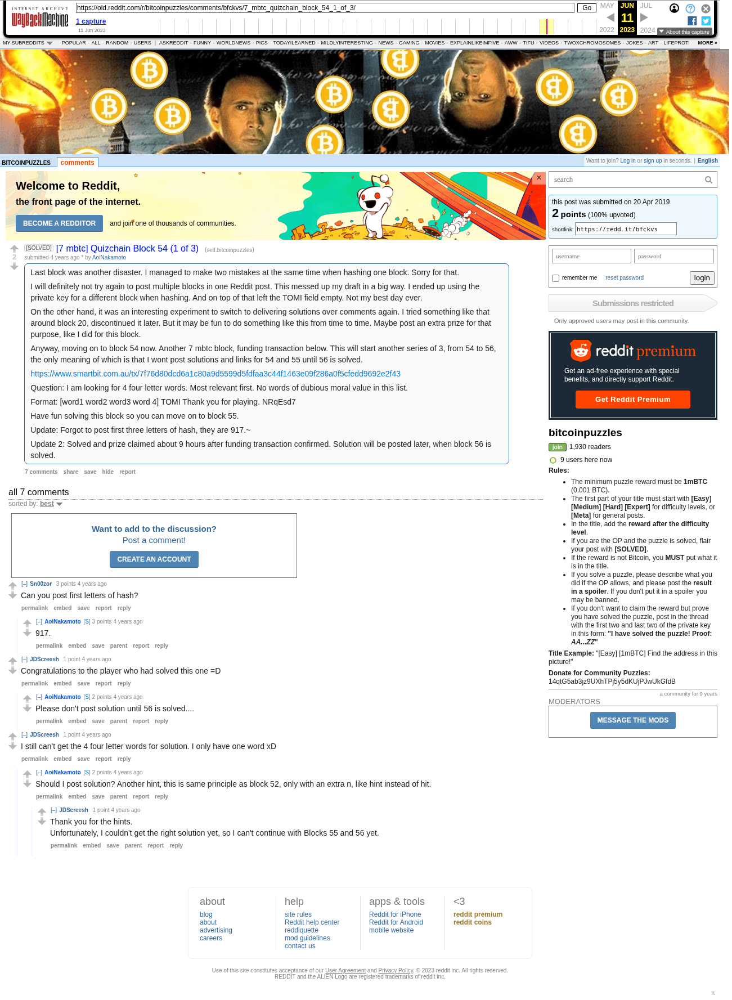

# [7 mbtc] Quizchain Block 54 (1 of 3)

[Original thread](https://www.reddit.com/r/bitcoinpuzzles/comments/bfckvs/7_mbtc_quizchain_block_54_1_of_3/). The `sourceUrl` of the [quizchain/54](../../../src/collections/quizchain/54.ts) record and the source of two of its hints and the funding transaction. The post went up on April 20, 2019, at 14:11:06 UTC, 24 minutes before the block time of its funding transaction. Its last edit is stamped 00:27:54 UTC on April 21, 2019, so the transcript shows the post as it stood after the claim.

## Historical provenance

The Wayback Machine holds one capture of the `old.reddit.com` URL and one of the `www.reddit.com` URL. Provenance rests on the [old.reddit.com capture](https://web.archive.org/web/20230611192202/https://old.reddit.com/r/bitcoinpuzzles/comments/bfckvs/7_mbtc_quizchain_block_54_1_of_3/), stamped June 11, 2023, 19:22:02 UTC, whose HTML carries the post, which matches the transcript below word for word. It renders seven comments, and each matches the Arctic Shift record of the same ID by author and text. Only the markdown of links and lists renders differently. The capture was read on September 27, 2026. `archive_content: confirmed` on that basis.

The [Arctic Shift](https://arctic-shift.photon-reddit.com/) Reddit archive, read the same day, lists the same seven comments. The transcript takes authors, text and scores from it and nests the comments as the capture does.

The record names none of the commenters: nothing on the chain ties a claim to a name.

## Transcript

> Last block was another disaster. I managed to make two mistakes at the same time when hashing one block. Sorry for that.
>
> I will definitely not try again to post multiple blocks in one Reddit post. This messed up my draft in a big way. I ended up using the private key for a different block when hashing. And on top of that left the TOMI field empty. Not my best day ever.
>
> On the other hand, it was an interesting experiment to switch to delivering solutions over comments again. I tried something like that around block 20, discontinued it later. But it may be fun to do something like this from time to time. Maybe post an extra prize for that purpose, like I did for this block.
>
> Anyway, moving on to block 54 now. Another 7 mbtc block, funding transaction below. This will start another series of 3, from 54 to 56, the only meaning of which is that I wont post solutions and links for 54 and 55 until 56 is solved.
>
> https://www.smartbit.com.au/tx/7f76d80dcd6a1c80a9d5599d5fdfaa3c44f1463e09f286a0f5cfedd9692e2f43
>
> Question: I am looking for 4 four letter words. Most relevant first. No words of dubious moral value in this list.
>
> Format: [word1 word2 word3 word 4] TOMI Thank you for playing. NRqEsd7
>
> Have fun solving this block so you can move on to block 55.
>
> Update: Forgot to post first three letters of hash, they are 917.~
>
> Update 2: Solved and prize claimed about 9 hours after funding transaction confirmed. Solution will be posted later, when block 56 is solved.

## Comments

**u/Sn00zor**, 3 points:

> Can you post first letters of hash?

**u/AoiNakamoto**, 3 points, reply to u/Sn00zor:

> 917.

**u/JDScreesh**, 1 point:

> Congratulations to the player who had solved this one =D

**u/AoiNakamoto**, 2 points, reply to u/JDScreesh:

> Please don't post solution until 56 is solved....

**u/JDScreesh**, 1 point:

> I still can't get the 4 four letter words for solution. I only have one word xD

**u/AoiNakamoto**, 2 points, reply to u/JDScreesh:

> Should I post solution? Another hint, this is same principle as block 52, only with an extra n, like hint instead of hit.

**u/JDScreesh**, 1 point, reply to u/AoiNakamoto:

> Thank you for the hints.
> Unfortunately, I couldn't get the right solution yet, so I can't continue with Blocks 55 and 56 yet.

## Screenshot

The screenshot is a render of the archive capture, not of the live page, so it carries the Wayback banner at the top. The "4 years ago" stamps are relative to the capture, June 11, 2023. Capture method and limits: [source archive](../README.md).
