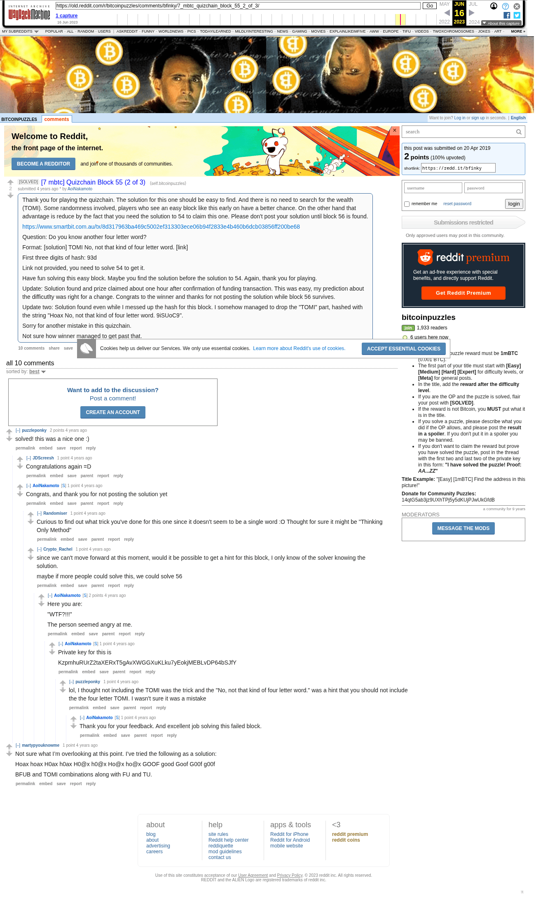

# [7 mbtc] Quizchain Block 55 (2 of 3)

[Original thread](https://www.reddit.com/r/bitcoinpuzzles/comments/bfinky/7_mbtc_quizchain_block_55_2_of_3/). The `sourceUrl` of the [quizchain/55](../../../src/collections/quizchain/55.ts) record and the source of three of its hints and the funding transaction, with the solution the author edited in. The WIF of block 55 is printed here by the author. The post went up on April 20, 2019, at 23:45:17 UTC, 9 minutes after the block time of its funding transaction. Its last edit is stamped 05:12:54 UTC on May 7, 2019, so the transcript shows the post as it stood after the claim.

## Historical provenance

The Wayback Machine holds one capture of the `old.reddit.com` URL and one of the `www.reddit.com` URL. Provenance rests on the [old.reddit.com capture](https://web.archive.org/web/20230616161036/https://old.reddit.com/r/bitcoinpuzzles/comments/bfinky/7_mbtc_quizchain_block_55_2_of_3/), stamped June 16, 2023, 16:10:36 UTC, whose HTML carries the post, which matches the transcript below word for word. It renders ten comments, and each matches the Arctic Shift record of the same ID by author and text. Only the markdown of links and lists renders differently. The capture was read on September 27, 2026. `archive_content: confirmed` on that basis.

The [Arctic Shift](https://arctic-shift.photon-reddit.com/) Reddit archive, read the same day, lists the same ten comments. The transcript takes authors, text and scores from it and nests the comments as the capture does.

The record names none of the commenters: nothing on the chain ties a claim to a name.

## Transcript

> Thank you for playing the quizchain. The solution for this one should be easy to find. And there is no need to search for the wealth (TOMI). Some randomness involved, players who see an easy block like this early on have a better chance. On the other hand that advantage is reduce by the fact that you need the solution to 54 to claim this one. Please don't post your solution until block 56 is found.
>
> https://www.smartbit.com.au/tx/8d317963ba469c5002ef313303ece06b94f2833e4b460b6dcb03856ff200be68
>
> Question: Do you know another four letter word?
>
> Format: [solution] TOMI No, not that kind of four letter word. [link]
>
> First three digits of hash: 93d
>
> Link not provided, you need to solve 54 to get it.
>
> Have fun solving this easy block. Maybe you find the solution before the solution to 54. Again, thank you for playing.
>
> Update: Solution found and prize claimed about one hour after confirmation of funding transaction. This was easy, my prediction about the difficutlty was right for a change. Congrats to the winner and thanks for not posting the solution while block 56 survives.
>
> Update two: Solution found even while I messed up the hash for this block. I somehow managed to drop the "TOMI" part, hashed with the string "Hoax No, not that kind of four letter word. 9iSUoC9".
>
> Sorry for another mistake in this quizchain.
>
> Not sure how winner managed to get past that.

## Comments

**u/puzzleponky**, 2 points:

> solved! this was a nice one :)

**u/JDScreesh**, 1 point, reply to u/puzzleponky:

> Congratulations again =D

**u/AoiNakamoto**, 1 point, reply to u/puzzleponky:

> Congrats, and thank you for not posting the solution yet

**u/Randomiser**, 1 point, reply to u/AoiNakamoto:

> Curious to find out what trick you've done for this one since it doesn't seem to be a single word :O Thought for sure it might be "Thinking Only Method"

**u/Crypto_Rachel**, 1 point, reply to u/AoiNakamoto:

> since we can't move forward at this moment, would it be possible to get a hint for this block, I only know of the solver knowing the solution.
>
> maybe if more people could solve this, we could solve 56

**u/AoiNakamoto**, 2 points, reply to u/Crypto_Rachel:

> Here you are:
>
> "WTF?!!!"
>
> The person seemed angry at me.

**u/AoiNakamoto**, 1 point, reply to u/AoiNakamoto:

> Private key for this is
>
> KzpmhuRUrZ2taXERxT5gAvXWGGXuKLku7yEokjMEBLvDP64bSJfY

**u/puzzleponky**, 1 point, reply to u/AoiNakamoto:

> lol, I thought not including the TOMI was the trick and the "No, not that kind of four letter word." was a hint that you should not include the the four letter TOMI. I wasn't sure it was a mistake

**u/AoiNakamoto**, 1 point, reply to u/puzzleponky:

> Thank you for your feedback. And excellent job solving this failed block.

**u/martypyouknowme**, 1 point:

> Not sure what I’m overlooking at this point. I’ve tried the following as a solution:
>
> Hoax
> hoax
> H0ax
> h0ax
> H0@x
> h0@x
> Ho@x
> ho@x
> GOOF
> good
> Goof
> G00f
> g00f
>
> BFUB and TOMI combinations along with FU and TU.

## Screenshot

The screenshot is a render of the archive capture, not of the live page, so it carries the Wayback banner at the top. The "4 years ago" stamps are relative to the capture, June 16, 2023. Capture method and limits: [source archive](../README.md).
