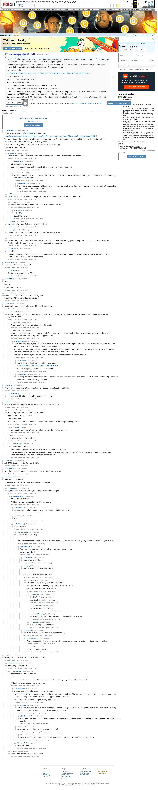

# [7 mbtc] Quizchain Block 56 (3 of 3)

[Original thread](https://www.reddit.com/r/bitcoinpuzzles/comments/bfiy4t/7_mbtc_quizchain_block_56_3_of_3/). The `sourceUrl` of the [quizchain/56](../../../src/collections/quizchain/56.ts) record and the source of two of its hints and the funding transaction, with the solution the author edited in. The post went up on April 21, 2019, at 00:15:24 UTC, 6 minutes before the block time of its funding transaction. Its last edit is stamped 10:07:19 UTC on May 10, 2019, so the transcript shows the post as it stood after the claim.

## Historical provenance

The Wayback Machine holds one capture of the `old.reddit.com` URL and one of the `www.reddit.com` URL. Provenance rests on the [old.reddit.com capture](https://web.archive.org/web/20230611100725/https://old.reddit.com/r/bitcoinpuzzles/comments/bfiy4t/7_mbtc_quizchain_block_56_3_of_3/), stamped June 11, 2023, 10:07:25 UTC, whose HTML carries the post, which matches the transcript below word for word. It renders 60 comments, and each matches the Arctic Shift record of the same ID by author and text. Only the markdown of links and lists renders differently. The capture was read on September 27, 2026. `archive_content: confirmed` on that basis.

The [Arctic Shift](https://arctic-shift.photon-reddit.com/) Reddit archive, read the same day, lists the same 60 comments. The transcript takes authors, text and scores from it and nests the comments as the capture does.

The record names none of the commenters: nothing on the chain ties a claim to a name.

## Transcript

> Thank you for playing the quizchain. Last block of this series of three. Series of three means that I am not posting links from or solutions for 54 and 55 before this block is solved. Please refrain from posting those also.
>
> This one should be pretty easy, even if you do need to find the wealth (TOMI) for this. At least that is what I expect, but I have been spectacularly wrong with this kind of prediction before. Only one way to find out.
>
> Funding transaction:
>
> https://www.smartbit.com.au/tx/90c21e7ee612a05ca5356c7bbc0152c9321c5236be69d2af8c278e2a328eeb08
>
> Question: AOI Second
>
> Format: [Solution] TOMI [TOMI] [link]
>
> FIrst three digits of hash: 780
>
> Link not given, you need to solve 55 to claim the prize for this one.
>
> Thank you for playing and have fun solving this last block of the series.
>
> Update: Another failed block. Sorry everybody for this mistake. It was the exact opposite of the mistake in block 55, where I forgot to include the word "TOMI" in the hash. In this block I included the word "link" in the hash.
>
> Solution to this was AOH, with TOMI field I after H. So I should have hashed with "AOH TOMI I after H 64bSJfY" but actually hashed with "AOH TOMI I after H _link_ 64bSJfY".
>
> Thank you for playing and stay tuned for the second run, which will start with a big prize 77 mbtc block because of this mistake.

## Comments

**u/AoiNakamoto**, 3 points:

> I want to test an idea by u/Randomiser proposed here:
>
> https://www.reddit.com/r/bitcoinpuzzles/comments/bjnzi8/11_mbtc_quizchain_block_74/emos9tk/?st=jvdtgvzn&sh=9ffbbb12
>
> The idea is to post the first digit of a MD5 hash for the solution only. That gives human players the ability to reject dead ends quickly in 15 out of 16 cases, while not helping brute forcing much.
>
> In this case, hashing only the solution string with MD5 has 5 as a first digit.
>
> Let's see how useful this is...

**u/silver_anth**, 1 point, reply to u/AoiNakamoto:

> I think in most cases so far this would be most helpful for the TOMI field, instead of the solution field :)

**u/AoiNakamoto**, 1 point, reply to u/silver_anth:

> Interesting idea, thank you.
>
> Maybe we can experiment with that too. But let's see how this idea works out first.

**u/LiaVl**, 1 point, reply to u/AoiNakamoto:

> You could provide both of them. This will totally help us to move to the right directions by excluding the wrong ones, without leaking any sensitive data of the fields.

**u/AoiNakamoto**, 1 point, reply to u/LiaVl:

> Thank you for your feedback. I will keep that in mind for experimenting with this idea in the next run. For this block, let's just see how giving one digit of the solution hash helps.

**u/JDScreesh**, 1 point, reply to u/AoiNakamoto:

> This is a great idea. It'll help more people. I'll try it (but first I need to solve 54 and then 55 first xD ).

**u/reddeneer**, 1 point, reply to u/JDScreesh:

> You don't have to, Aoi posted the link for 56 in the comments: 64bSJfY

**u/JDScreesh**, 1 point, reply to u/reddeneer:

> > 64bSJfY
>
> Great! Thanks =D

**u/reddeneer**, 1 point, reply to u/AoiNakamoto:

> Awesome, this is sort of what I requested. Thank you

**u/Crypto_Rachel**, 1 point, reply to u/AoiNakamoto:

> This actually helps A Lot :) Thank you. Now to just figure out the TOMI

**u/LiaVl**, 1 point, reply to u/AoiNakamoto:

> This was very helpful! I would have waste so much time in ideas that seemed very good but they were in fact incorrect. Many thanks to Randomiser for this suggestion and to you for accepting that suggestion.

**u/BrainForceOne**, 1 point, reply to u/AoiNakamoto:

> Good idea!
>
> Unfortunately this was not verry usefull yet. I tried thousands of possible solutions but only with one i got a starting 5. And with that idea i have no clue how to fit TOMI into three words.

**u/puzzleponky**, 1 point:

> Any hints on the number of words? :)

**u/AoiNakamoto**, 2 points, reply to u/puzzleponky:

> One item in solution, three in TOMI.

**u/AoiNakamoto**, 1 point:

> Use
>
> 64bSJfY
>
> as a link for this block.

**u/whatupyo02**, 1 point:

> Omnipotent TOMI Artificial Omnipotent Intelligence
> Omnipotent TOMI Artificial Overlord Intelligence

**u/puzzleponky**, 1 point:

> Can you check there are no mistakes in this one? just to be sure :)

**u/AoiNakamoto**, 2 points, reply to u/puzzleponky:

> Always a good idea with a long surviving block. Just checked the hash and it came out again the same. I also don't see any mistake in my solution string.

**u/puzzleponky**, 1 point, reply to u/AoiNakamoto:

> Thanks for checking! I am a bit stumped on this one then

**u/Randomiser**, 1 point, reply to u/AoiNakamoto:

> When you check a solution, it's better to type it in from scratch instead of copy and pasting it, to make sure there's not a mistake you didn't catch (which I'm assuming is what happened here)

**u/AoiNakamoto**, 2 points, reply to u/Randomiser:

> Good idea, thank you. Typing it in again would have a better chance of catching that extra "link" than just hashing again from the same line after looking at it again, which is what I did in this case.
>
> An even better way might be to not look at the record of the solution I have in my notes, but at the puzzle and then type in the solution from that. I recall having done this for one of the checks I did for block 44.
>
> And anyway, combining multiple methods of checking increases the chances of finding mistakes.

**u/mapl3sn0w**, 1 point, reply to u/AoiNakamoto:

> Here is an extra check you can make for your hash.
> MD5: [https://gchq.github.io/CyberChef/#recipe=MD5()](<https://gchq.github.io/CyberChef/#recipe=MD5()>)
>
> You can also get other hash types from that tool.

**u/AoiNakamoto**, 1 point, reply to u/AoiNakamoto:

> Following advice above I checked block 77 another time and found a mistake I would have had not much chance of finding without that.
>
> Thank you again for this very good idea.

**u/DemetriXcs**, 1 point:

> It's time to post answers to 54 and 55 so that more people can participate in 56 block.

**u/AoiNakamoto**, 1 point, reply to u/DemetriXcs:

> I already posted link for this block in a comment above today...

**u/AoiNakamoto**, 1 point:

> Second digit for MD5 hash for solution only is a, so 5a are first two digits.

**u/BrainForceOne**, 1 point, reply to u/AoiNakamoto:

> At least my only solution I found is still working.
>
> Again, TOMI ist the hardest part.
>
> Can't believe that!
>
> AOH TOMI SATOSHI STSI deleted 64bSJfY with solution hash 5a and complete string hash 780

**u/mapl3sn0w**, 1 point, reply to u/BrainForceOne:

> Let's play 20 questions: What's the third digit of the solution hash (after 5a) ?

**u/LiaVl**, 1 point, reply to u/AoiNakamoto:

> I am curious if the 3rd digit is f, 6 or 0.

**u/BrainForceOne**, 1 point, reply to u/LiaVl:

> "3" would also possible...
>
> Maybe Aoi is wrong with her solution while we all are on the right track :-)
>
> I like my solution where each second letter of SATOSHI is deleted. And it fits perfectly with the two hashes. It's nearly the same if you found the nonce of a Bitcoin block by "manually mining". lol

**u/whatupyo02**, 1 point:

> AOI TOMI Omnipotent After Overlord 64bSJfY

**u/AoiNakamoto**, 1 point:

> Next hint for this coming up 8 am Japanese time tomorrow (Friday May 10).

**u/AoiNakamoto**, 1 point:

> New hint for this live now:
>
> Three items in TOMI field are two capital letters and one word.

**u/puzzleponky**, 2 points, reply to u/AoiNakamoto:

> lol, this "easy" block still survives, something weird must be going on :|

**u/AoiNakamoto**, 1 point, reply to u/puzzleponky:

> It is. Another failed block.
>
> And I did not catch the mistake even double checking.

**u/puzzleponky**, 3 points, reply to u/AoiNakamoto:

> oof, rekt, wasted a lot of time on this one with being the first to solve 55 :(

**u/rs1712**, 2 points, reply to u/AoiNakamoto:

> sigh

**u/AoiNakamoto**, 2 points, reply to u/AoiNakamoto:

> Sorry everyone.

**u/Crypto_Rachel**, 1 point, reply to u/AoiNakamoto:

> It Is What It Is (: I.I.W.I.I. :)
>
> I have honestly been looking for errors all day have a few good possibilities yet nothing. Any chance at a hint to the type of error :)

**u/AoiNakamoto**, 1 point, reply to u/Crypto_Rachel:

> Yes. I included an extra word that had no business.being in the hash.
>
> Anyway, sorry for this.

**u/silver_anth**, 2 points, reply to u/AoiNakamoto:

> in the TOMI or solution? :)

**u/Crypto_Rachel**, 1 point, reply to u/AoiNakamoto:

> would the format be something like this
>
> \[solution\] TOMI CAP1WordCAP2 word

**u/AoiNakamoto**, 1 point, reply to u/Crypto_Rachel:

> Solution to this was AOH, TOMI field was I after H
>
> Should have been reasonably easy but was a complete failure.
>
> Not sure how to proceed with this block.

**u/puzzleponky**, 1 point, reply to u/AoiNakamoto:

> > AOH, TOMI field was I after H
>
> move the funds make a new puzzle

**u/puzzleponky**, 1 point, reply to u/puzzleponky:

> but give me a head start lol

**u/AoiNakamoto**, 1 point, reply to u/puzzleponky:

> Thank you for your ideas. Maybe I do a Twitter poll on what to do.

**u/puzzleponky**, 1 point, reply to u/AoiNakamoto:

> Solved, waiting for confirmation!

**u/puzzleponky**, 1 point, reply to u/AoiNakamoto:

> give extra word and position at 10 PM Japanese time ;)

**u/AoiNakamoto**, 1 point, reply to u/puzzleponky:

> That would result in a lottery with people setting up scripts getting an advantage, but thank you for the idea.

**u/rs1712**, 1 point, reply to u/AoiNakamoto:

> already gone anyway

**u/Agelais**, 1 point:

> Wasted 20 hours of work... And posted it in comments...

**u/AoiNakamoto**, 2 points, reply to u/Agelais:

> Again sorry for this mistake.

**u/Crypto_Rachel**, 1 point, reply to u/AoiNakamoto:

> It happens to the best of the best.
>
> No one is perfect. I have a saying "Show me someone who says they are perfect and I'll show you a liar"
>
> :) Thank you for the puzzle despite everything

**u/AoiNakamoto**, 3 points, reply to u/Crypto_Rachel:

> Thank you for your kind words and for playing here.
>
> I just decided that I am going to raise the prize for block 1 in the second run of the quizchain to 77 mbtc (from 7 mbtc planned originally) and do that every time a mistake like this one happens in the second run.
>
> My challenge is to have that happen exactly zero times.

**u/puzzleponky**, 2 points, reply to u/AoiNakamoto:

> well, the last blocks did not have mistakes so you should be good ;) let's just say the final puzzle for this one was to find the missing word. On to 77 (please triple-check ;) and thanks for the puzzles!

**u/AoiNakamoto**, 2 points, reply to u/puzzleponky:

> Good idea. Checked 77 again. Found interesting coincidence in private key from 44 (first three and last three digits are similar), but no mistake.

**u/rs1712**, 1 point, reply to u/AoiNakamoto:

> So by block 10 we will be playing for about 77 btc? rofl

**u/mooncritic**, 1 point, reply to u/rs1712:

> What happens if the 77 mBTC block is failed too, do we get a 777 mBTC block next, and so forth? ;)

**u/mooncritic**, 1 point, reply to u/AoiNakamoto:

> Nice challenge!

**u/Agelais**, 1 point, reply to u/AoiNakamoto:

> Thanks anyway, you are good) Keep it on)

## Screenshot

The screenshot is a render of the archive capture, not of the live page, so it carries the Wayback banner at the top. The "4 years ago" stamps are relative to the capture, June 11, 2023. Capture method and limits: [source archive](../README.md).
