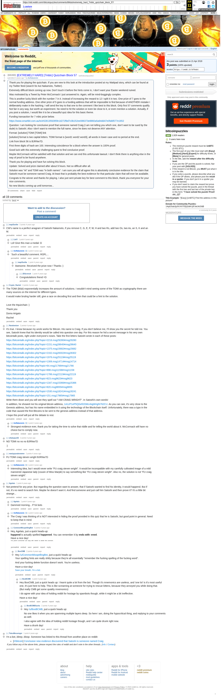

# [EXTREMELY HARD] [7mbtc] Quizchain Block 57

[Original thread](https://www.reddit.com/r/bitcoinpuzzles/comments/bfkdut/extremely_hard_7mbtc_quizchain_block_57/). The `sourceUrl` of the [quizchain/57](../../../src/collections/quizchain/57.ts) record and the source of three of its hints and the funding transaction, with the solution the author edited in. The post went up on April 21, 2019, at 02:53:42 UTC, 5 minutes after the block time of its funding transaction. Its last edit is stamped 13:24:50 UTC on April 21, 2019, so the transcript shows the post as it stood after the claim.

## Historical provenance

The Wayback Machine holds one capture of the `old.reddit.com` URL and one of the `www.reddit.com` URL. Provenance rests on the [old.reddit.com capture](https://web.archive.org/web/20230611103540/https://old.reddit.com/r/bitcoinpuzzles/comments/bfkdut/extremely_hard_7mbtc_quizchain_block_57/), stamped June 11, 2023, 10:35:40 UTC, whose HTML carries the post, which matches the transcript below word for word. It renders 19 comments, and each matches the Arctic Shift record of the same ID by author and text. Only the markdown of links and lists renders differently. The capture was read on September 27, 2026. `archive_content: confirmed` on that basis.

The [Arctic Shift](https://arctic-shift.photon-reddit.com/) Reddit archive, read the same day, lists the same 19 comments. The transcript takes authors, text and scores from it and nests the comments as the capture does.

The record names none of the commenters: nothing on the chain ties a claim to a name.

## Transcript

> Thank you for playing the quizchain. If you are new to this look at the introduction posted at my Wattpad story, which can be found at my Twitter feed (search for Aoi Nakamoto, Twitter).
>
> Extremely difficult block coming up now. Don't touch it before the hints come in, I don't want your Easter weekend ruined.
>
> Was motivated by a Tweet by Peter McCormack I just answered to. Again, will be mind-boggingly complex.
>
> This is another lucky block with the number 7 in it. instead of increasing the reward to 12 I split it in two. One prize of 7 goes to the normal funding address. One other prize of 5 goes to a funding address that will be impossible to find because of ANOTHER mistake I deliberately make in the hashing. I will send the key to that one to the comment I like best to this block. Only first 57 comments qualify. Not fair in any way, but worth an experiment. No need to hit the solution or even be close to it, or even mention a solution. Actually, if you post a solution, I would like it to be a beautiful quiz idea for this basic theme.
>
> Funding transaction for 7 mbtc prize below.
>
> https://www.smartbit.com.au/tx/e5281359285fe1d272fbd7c0b152ee086373e8860a5a94dd47e0fafd577e1652
>
> Question: I am looking for conclusive proof that someone named Craig (I am not telling you which one, don't want to be sued by the dude) is Satoshi. Also I don't want to mention the full name, since he does not deserve ANY attention.
>
> Format: [solution] TOMI [TOMI] link
>
> [solution] format is two capital letters. TOMI format is [word1 word2 word3], all words in lower case and no period at the end.
>
> Link from block 56 is BJRNw7D.
>
> First three digits of hash are 100. Interesting coincidence for a block where the answer is 100% proof.
>
> Good luck with this extremely challenging quest to find conclusive proof.
>
> Maybe McCormack will be satisfied with that solution and we can end this unfortunate lawsuit. I don't think there is anything else in the way of proof to be found anywhere.
>
> Thank you for playing and have fun solving this block.
>
> Update: Solved and prize claimed after about 9 hours. Not so difficult after all.
>
> Solution was "AI" and TOMI was "in both names". I am sure you will all agree this is absolutely conclusive evidence for the claim that Satoshi must be someone named Craig. At least that is probably the best evidence for that particular claim that will ever be available.
>
> Congrats to the winner and thanks for playing. I also just sent private key for best comment to this block, thank you everyone for your nice comments.
>
> No new blocks coming up until tomorrow...

## Comments

**u/mapl3sn0w**, 3 points:

> CW's name is a perfect anagram of Satoshi Nakamoto, if you remove C, G, E, P, W, H and two Rs, add two Os, two As, an S, K and an M.

**u/LiaVl**, 1 point, reply to u/mapl3sn0w:

> Lol! Give this man a medal :D

**u/AoiNakamoto**, 1 point, reply to u/mapl3sn0w:

> `Such a beautiful comment. ROFL...

**u/mapl3sn0w**, 1 point, reply to u/AoiNakamoto:

> Awesome. Received the prize now ! Thanks :)

**u/JDScreesh**, 1 point, reply to u/mapl3sn0w:

> Congratulations friend =D

**u/Crypto_Rachel**, 2 points:

> The TOMI (bfub) exponentially increases the amount of solutions. I wouldn't mind seeing some of the TOMI as cryptography there are many sources on the internet for different types.
>
> it would make bruting harder still, give a race on decoding first and then that could be a hint to the solution.
>
> Love the #quizchain :)
>
> Thank you
>
> Domo Arigato
>
> Rachel

**u/Randomiser**, 2 points:

> It's true. I know because my uncle works for Bitcoin. His name is Craig. If you don't believe me, I'll show you the secret he told me. You see, Satoshi knew that his identity would be called into question one day. For this reason he hid a secret message in his very own bitcointalk posts, right under everyone's noses. Take the first letters Satoshi wrote in each of these posts:
>
> [https://bitcointalk.org/index.php?topic=2216.msg29280#msg29280](https://bitcointalk.org/index.php?topic=2216.msg29280#msg29280)
>
> [https://bitcointalk.org/index.php?topic=2151.msg28640#msg28640](https://bitcointalk.org/index.php?topic=2151.msg28640#msg28640)
>
> [https://bitcointalk.org/index.php?topic=1375.msg15682#msg15682](https://bitcointalk.org/index.php?topic=1375.msg15682#msg15682)
>
> [https://bitcointalk.org/index.php?topic=2162.msg28302#msg28302](https://bitcointalk.org/index.php?topic=2162.msg28302#msg28302)
>
> [https://bitcointalk.org/index.php?topic=1976.msg25119#msg25119](https://bitcointalk.org/index.php?topic=1976.msg25119#msg25119)
>
> [https://bitcointalk.org/index.php?topic=1306.msg14714#msg14714](https://bitcointalk.org/index.php?topic=1306.msg14714#msg14714)
>
> [https://bitcointalk.org/index.php?topic=64.msg21766#msg21766](https://bitcointalk.org/index.php?topic=64.msg21766#msg21766)
>
> [https://bitcointalk.org/index.php?topic=898.msg11158#msg11158](https://bitcointalk.org/index.php?topic=898.msg11158#msg11158)
>
> [https://bitcointalk.org/index.php?topic=1786.msg22119#msg22119](https://bitcointalk.org/index.php?topic=1786.msg22119#msg22119)
>
> [https://bitcointalk.org/index.php?topic=823.msg9623#msg9623](https://bitcointalk.org/index.php?topic=823.msg9623#msg9623)
>
> [https://bitcointalk.org/index.php?topic=1347.msg15366#msg15366](https://bitcointalk.org/index.php?topic=1347.msg15366#msg15366)
>
> [https://bitcointalk.org/index.php?topic=820.msg9655#msg9655](https://bitcointalk.org/index.php?topic=820.msg9655#msg9655)
>
> [https://bitcointalk.org/index.php?topic=1530.msg18241#msg18241](https://bitcointalk.org/index.php?topic=1530.msg18241#msg18241)
>
> [https://bitcointalk.org/index.php?topic=151.msg17965#msg17965](https://bitcointalk.org/index.php?topic=151.msg17965#msg17965)
>
> Write them down and you will see they spell out "I AM CRAIG WRIGHT". In Satoshi's own words!
>
> In addition, he showed me his original bitcoin address, [1A1zP1eP5QGefi2DMcrAigWright762CU](https://www.blockchain.com/btc/address/1A1zP1eP5QGefi2DMcrAigWright762CU). As you can see, it's very close to the Genesis address, but has his name embedded in it using the technology of the Blockchain itself. Unfortunately, there was a typo in the code that caused the first Bitcoins to be sent to the genesis address instead of that address.
>
> I hope this proof will put all the debate to rest.

**u/AoiNakamoto**, 1 point, reply to u/Randomiser:

> Strongest evidence ever, thank you for taking the time to solve that riddle and for telling the world about it. McCormack will have no choice but to comply now.

**u/whatupyo02**, 2 points:

> NO TOMI no no no BJRNw7D
>
> :)

**u/martypyouknowme**, 2 points:

> FU TOMI craig steven wright BJRNw7D

**u/AoiNakamoto**, 1 point, reply to u/martypyouknowme:

> Interesting idea, but I would never write "FU craig steven wright". It would be incompatible with my carefully cultivated image of a mild mannered Japanese lady (cousin of Miss Marple) to say someithing like "FU craig steven wright". Also no, the solution is not "FU craig steven wright".

**u/Agelais**, 1 point:

> Not pretend for any prize. But regarding the question want to answer, that if Satoshi wanted to find his identity, it would happend. But if not, it's no need to search him. Maybe he doesn't want it. And find someone and just call him Satoshi and then prove it? It's a little bit strange...

**u/Agelais**, 1 point, reply to u/Agelais:

> Dammed morning... F*ck bots

**u/AoiNakamoto**, 1 point, reply to u/Agelais:

> The Craig I was thinking of is NOT interested in hiding the proof provided in this quiz that he is Satoshi, but good point in general. Need to keep that in mind.

**u/CommonMisspellingBot**, 0 points, reply to u/Agelais:

> Hey, Agelais, just a quick heads-up:
> **happend** is actually spelled **happened**. You can remember it by **ends with -ened**.
> Have a nice day!
>
> ^^^^The ^^^^parent ^^^^commenter ^^^^can ^^^^reply ^^^^with ^^^^'delete' ^^^^to ^^^^delete ^^^^this ^^^^comment.

**u/BooCMB**, 2 points, reply to u/CommonMisspellingBot:

> Hey /u/CommonMisspellingBot, just a quick heads up:
> Your spelling hints are really shitty because they're all essentially "remember the fucking spelling of the fucking word".
>
> And your fucking delete function doesn't work. You're useless.
>
> Have a nice day!
>
> [^Save ^your ^breath, ^I'm ^a ^bot.](https://www.reddit.com/user/BooCMB/comments/9vnzpd/faq/)

**u/BooBCMB**, 1 point, reply to u/BooCMB:

> Hey BooCMB, just a quick heads up:
> I learnt quite a lot from the bot. Though it's mnemonics are useless,
> and 'one lot' is it's most useful one, it's just here to help. This is like screaming at
> someone for trying to rescue kittens, because they annoyed you while doing that. (But really CMB get some quiality mnemonics)
>
> I do agree with your idea of holding reddit for hostage by spambots though, while it might be a bit ineffective.
>
> Have a nice day!

**u/BooBCMBSucks**, 2 points, reply to u/BooBCMB:

> Hey /u/BooBCMB, just a quick heads up:
>
> No one likes it when you are spamming multiple layers deep. So here I am, doing the hypocritical thing, and replying to your comments as well.
>
> I also agree with the idea of holding reddit hostage though, and I am quite drunk right now.
>
> Have a drunk day!

**u/TotesMessenger**, 1 point:

> I'm a bot, _bleep_, _bloop_. Someone has linked to this thread from another place on reddit:
>
> - [/r/bitcoin] [Conclusive new evidence discovered that Satoshi is someone named Craig](https://www.reddit.com/r/Bitcoin/comments/bfp2jr/conclusive_new_evidence_discovered_that_satoshi/)
>
>  _^(If you follow any of the above links, please respect the rules of reddit and don't vote in the other threads.) ^\([Info](/r/TotesMessenger) ^/ ^[Contact](/message/compose?to=/r/TotesMessenger))_

## Screenshot

The screenshot is a render of the archive capture, not of the live page, so it carries the Wayback banner at the top. The "4 years ago" stamps are relative to the capture, June 11, 2023. Capture method and limits: [source archive](../README.md).
