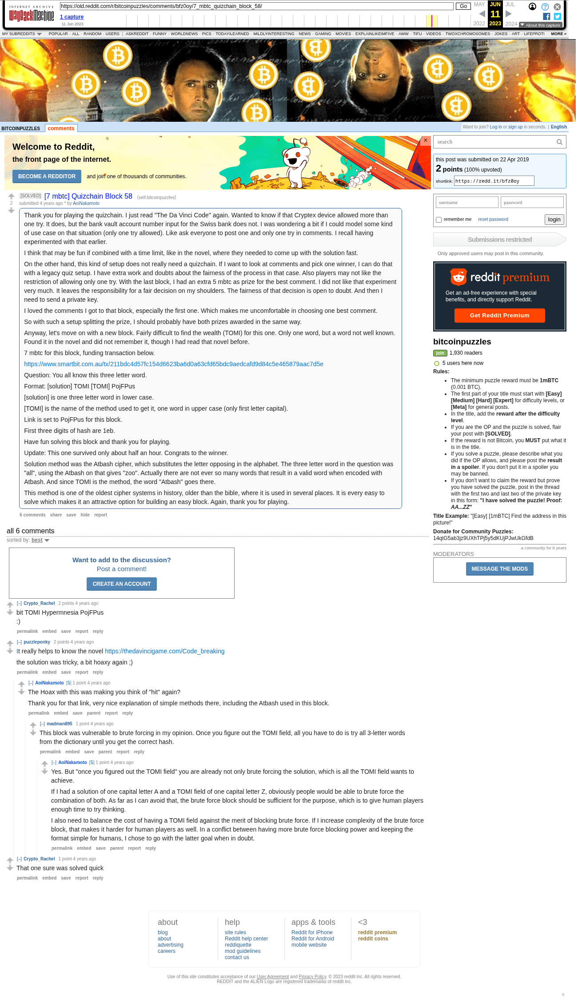

# [7 mbtc] Quizchain Block 58

[Original thread](https://www.reddit.com/r/bitcoinpuzzles/comments/bfz0oy/7_mbtc_quizchain_block_58/). The `sourceUrl` of the [quizchain/58](../../../src/collections/quizchain/58.ts) record and the source of three of its hints and the funding transaction, with the solution the author edited in. The post went up on April 22, 2019, at 06:56:15 UTC, 7 minutes before the block time of its funding transaction. Its last edit is stamped 11:32:03 UTC on April 22, 2019, so the transcript shows the post as it stood after the claim.

## Historical provenance

The Wayback Machine holds one capture of the `old.reddit.com` URL and one of the `www.reddit.com` URL. Provenance rests on the [old.reddit.com capture](https://web.archive.org/web/20230611164054/https://old.reddit.com/r/bitcoinpuzzles/comments/bfz0oy/7_mbtc_quizchain_block_58/), stamped June 11, 2023, 16:40:54 UTC, whose HTML carries the post, which matches the transcript below word for word. It renders six comments, and each matches the Arctic Shift record of the same ID by author and text. Only the markdown of links and lists renders differently. The capture was read on September 27, 2026. `archive_content: confirmed` on that basis.

The [Arctic Shift](https://arctic-shift.photon-reddit.com/) Reddit archive, read the same day, lists the same six comments. The transcript takes authors, text and scores from it and nests the comments as the capture does.

The record names none of the commenters: nothing on the chain ties a claim to a name.

## Transcript

> Thank you for playing the quizchain. I just read "The Da Vinci Code" again. Wanted to know if that Cryptex device allowed more than one try. It does, but the bank vault account number input for the Swiss bank does not. I was wondering a bit if I could model some kind of use case on that situation (only one try allowed). Like ask everyone to post one and only one try in comments. I recall having experimented with that earlier.
>
> I think that may be fun if combined with a time limit, like in the novel, where they needed to come up with the solution fast.
>
> On the other hand, this kind of setup does not really need a quizchain. If I want to look at comments and pick one winner, I can do that with a legacy quiz setup. I have extra work and doubts about the fairness of the process in that case. Also players may not like the restriction of allowing only one try.
> With the last block, I had an extra 5 mbtc as prize for the best comment. I did not like that experiment very much. It leaves the responsibility for a fair decision on my shoulders. The fairness of that decision is open to doubt. And then I need to send a private key.
>
> I loved the comments I got to that block, especially the first one. Which makes me uncomfortable in choosing one best comment.
>
> So with such a setup splitting the prize, I should probably have both prizes awarded in the same way.
>
> Anyway, let's move on with a new block. Fairly difficult to find the wealth (TOMI) for this one. Only one word, but a word not well known. Found it in the novel and did not remember it, though I had read that novel before.
>
> 7 mbtc for this block, funding transaction below.
>
> https://www.smartbit.com.au/tx/211bdc4d57fc154d6623ba6d0a63cfd65bdc9aedcafd9d84c5e465879aac7d5e
>
> Question: You all know this three letter word.
>
> Format: [solution] TOMI [TOMI] PojFPus
>
> [solution] is one three letter word in lower case.
>
> [TOMI] is the name of the method used to get it, one word in upper case (only first letter capital).
>
> Link is set to PojFPus for this block.
>
> First three digits of hash are 1eb.
>
> Have fun solving this block and thank you for playing.
>
> Update: This one survived only about half an hour. Congrats to the winner.
>
> Solution method was the Atbash cipher, which substitutes the letter opposing in the alphabet. The three letter word in the question was "all", using the Atbash on that gives "zoo". Actually there are not ever so many words that result in a valid word when encoded with Atbash. And since TOMI is the method, the word "Atbash" goes there.
>
> This method is one of the oldest cipher systems in history, older than the bible, where it is used in several places. It is every easy to solve which makes it an attractive option for building an easy block.
> Again, thank you for playing.

## Comments

**u/Crypto_Rachel**, 2 points:

> bit TOMI Hypermnesia PojFPus
> :)

**u/puzzleponky**, 2 points:

> [I](https://thedavincigame.com/Code_breaking#Atbash)t really helps to know the novel [https://thedavincigame.com/Code\_breaking](https://thedavincigame.com/Code_breaking#Atbash)
>
> the solution was tricky, a bit hoaxy again ;)

**u/AoiNakamoto**, 1 point, reply to u/puzzleponky:

> The Hoax with this was making you think of "hit" again?
>
> Thank you for that link, very nice explanation of simple methods there, including the Atbash used in this block.

**u/madman895**, 1 point, reply to u/AoiNakamoto:

> This block was vulnerable to brute forcing in my opinion. Once you figure out the TOMI field, all you have to do is try all 3-letter words from the dictionary until you get the correct hash.

**u/AoiNakamoto**, 1 point, reply to u/madman895:

> Yes. But "once you figured out the TOMI field" you are already not only brute forcing the solution, which is all the TOMI field wants to achieve.
>
> If I had a solution of one capital letter A and a TOMI field of one capital letter Z, obviously people would be able to brute force the combination of both. As far as I can avoid that, the brute force block should be sufficient for the purpose, which is to give human players enough time to try thinking.
>
> I also need to balance the cost of having a TOMI field against the merit of blocking brute force. If I increase complexity of the brute force block, that makes it harder for human players as well. In a conflict between having more brute force blocking power and keeping the format simple for humans, I chose to go with the latter goal when in doubt.

**u/Crypto_Rachel**, 1 point:

> That one sure was solved quick

## Screenshot

The screenshot is a render of the archive capture, not of the live page, so it carries the Wayback banner at the top. The "4 years ago" stamps are relative to the capture, June 11, 2023. Capture method and limits: [source archive](../README.md).
