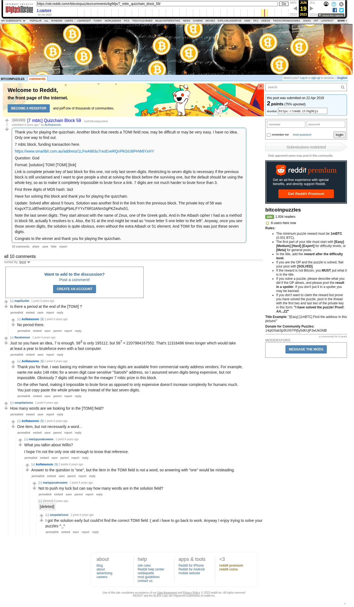

# [7 mbtc] Quizchain Block 59

[Original thread](https://www.reddit.com/r/bitcoinpuzzles/comments/bg96js/7_mbtc_quizchain_block_59/). The `sourceUrl` of the [quizchain/59](../../../src/collections/quizchain/59.ts) record and the source of two of its hints and the funding address, with the solution the author edited in. The WIF of block 58 is printed here by the author, in the post. The post went up on April 22, 2019, at 23:43:37 UTC, 2 minutes after the block time of its funding transaction. Its last edit is stamped 12:17:57 UTC on April 23, 2019, so the transcript shows the post as it stood after the claim.

## Historical provenance

The Wayback Machine holds one capture of the `old.reddit.com` URL and one of the `www.reddit.com` URL. Provenance rests on the [old.reddit.com capture](https://web.archive.org/web/20230619131554/https://old.reddit.com/r/bitcoinpuzzles/comments/bg96js/7_mbtc_quizchain_block_59/), stamped June 19, 2023, 13:15:54 UTC, whose HTML carries the post, which matches the transcript below word for word. It renders 11 comments, and each matches the Arctic Shift record of the same ID by author and text. Only the markdown of links and lists renders differently. The capture was read on September 27, 2026. `archive_content: confirmed` on that basis.

The [Arctic Shift](https://arctic-shift.photon-reddit.com/) Reddit archive, read the same day, lists 11 comments, one of which the capture does not render. The transcript takes every comment, its author, text and score from Arctic Shift and nests them as the capture does. One of them is a deleted comment, kept below as `[deleted]`.

The record names none of the commenters: nothing on the chain ties a claim to a name.

## Transcript

> Thank you for playing the quizchain. Another block that needs a TOMI field now, may be difficult or may be very easy. I have no idea. Only one way to find out.
>
> 7 mbtc block, funding transaction here.
>
> https://www.smartbit.com.au/address/1LFwAti63u7rxoEveRQnPkGtU8PHW6YxHY
>
> Question: God
>
> Format: [solution] TOMI [TOMI] [link]
>
> Link is complete private key of last block for this one, not only last seven digits. Restricting to seven digits is necessary if the previous block is still unclaimed and I want to give people a shot at solving the block before the surviving one, but the default should be using the whole key, so as to make it completely impossible to brute force a link. 7 digits are not much harder to brute force than 3.
>
> First three digits of MD5 hash: 3a3
>
> Have fun solving this block and thank you for playing the quizchain.
>
> Update: Solved after about 5 hours. Solution was another find in the link from the previous block. The private key of 58 was KxgvXT1LidEhei6XizyCpR5zgPbALFYYxT6R1tANmSgPKZeuhs51.
>
> Note the last seven digits. They start almost with the name of Zeus, one of the Greek gods. And in the Atbash cipher I had as a method in block 58, actually h resolves to s. Also, the 51 at the end might be read as "move letter 5 one letter to the left". Anyway, once you see those seven digits, the solution is quite obvious, even without the extra Atbash or 51 element. And TOMI for this was just these seven digits.
>
> Congrats to the winner and thank you for playing the quizchain.

## Comments

**u/mapl3sn0w**, 1 point:

> Is there a period at the end of the \[TOMI\] ?

**u/AoiNakamoto**, 1 point, reply to u/mapl3sn0w:

> No period there.

**u/Randomiser**, 1 point:

> Just so you have an idea, 7 is enough. 58^3 is only 195112, but 58^7 = 2207984167552. That's 11316496 times longer which would take at least a year to bruteforce even with a fast computer.

**u/AoiNakamoto**, 1 point, reply to u/Randomiser:

> Thank you for that. I was basing my estimate on how many digits are available from commercial vanity address vendors. For example, vante.me asks 148 mbtc for a seven digit case sensitive "Satoshi" address, so I assumed seven digits being expensive, but not impossible. Obviously 7 digits still enough for the meager 7 mbtc prize in this block.
>
> On the other hand, making it impossible to brute force as opposed to only expensive doesn't increase complexity for humans much. You just copy paste the whole private key instead of the last seven digits.

**u/ooxpolarisxoo**, 1 point:

> How many words are we looking for in the \[TOMI\] field?

**u/AoiNakamoto**, 1 point, reply to u/ooxpolarisxoo:

> One item, but not necessarily a word...

**u/martypyouknowme**, 1 point, reply to u/AoiNakamoto:

> What you talkin about Willis?
>
> I hope I’m not the only one old enough to know that reference.

**u/AoiNakamoto**, 2 points, reply to u/martypyouknowme:

> Answer to the question is "one", but the item in the TOMI field is not a word, so anwering with "one" would be misleading.

**u/martypyouknowme**, 1 point, reply to u/AoiNakamoto:

> Not to push my luck but can say how many words are in the solution field?

**[deleted]**, reply to u/AoiNakamoto:

> [deleted]

**u/ooxpolarisxoo**, 1 point, reply to a deleted comment:

> I got the solution early but could'nt find the correct TOMI field :( and i have to go back to work. Anyway I enjoy trying to solve your puzzles \^\_\^

## Screenshot

The screenshot is a render of the archive capture, not of the live page, so it carries the Wayback banner at the top. The "4 years ago" stamps are relative to the capture, June 19, 2023. Capture method and limits: [source archive](../README.md).
