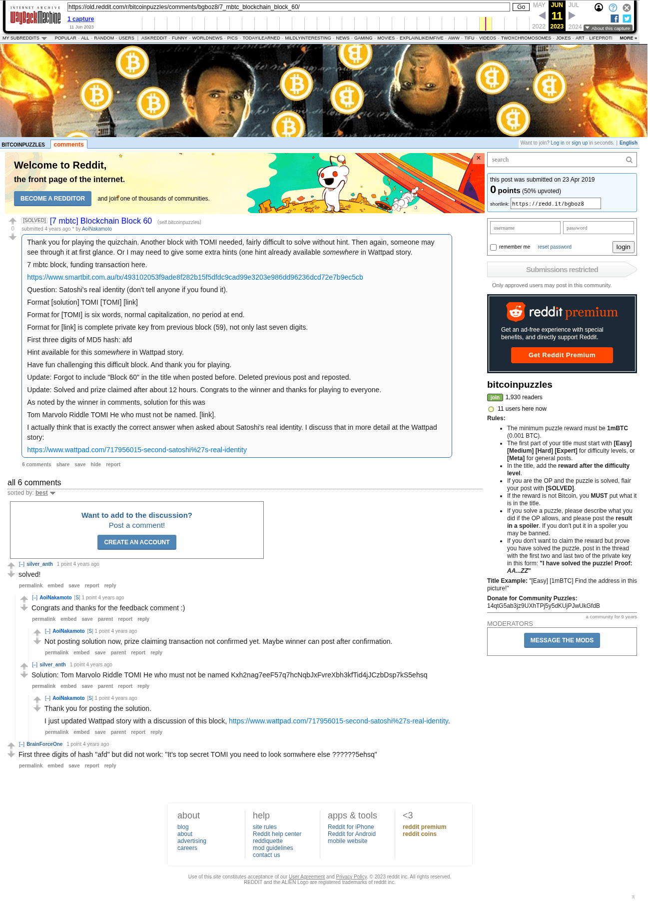

# [7 mbtc] Blockchain Block 60

[Original thread](https://www.reddit.com/r/bitcoinpuzzles/comments/bgboz8/7_mbtc_blockchain_block_60/). The `sourceUrl` of the [quizchain/60](../../../src/collections/quizchain/60.ts) record and the source of three of its hints and the funding transaction, with the solution the author edited in. The WIF of block 59 is printed here by u/silver_anth. The post went up on April 23, 2019, at 03:51:24 UTC, 2 hours after the block time of its funding transaction. Its last edit is stamped 23:48:01 UTC on April 23, 2019, so the transcript shows the post as it stood after the claim.

## Historical provenance

The Wayback Machine holds one capture of the `old.reddit.com` URL and one of the `www.reddit.com` URL. Provenance rests on the [old.reddit.com capture](https://web.archive.org/web/20230611164836/https://old.reddit.com/r/bitcoinpuzzles/comments/bgboz8/7_mbtc_blockchain_block_60/), stamped June 11, 2023, 16:48:36 UTC, whose HTML carries the post, which matches the transcript below word for word. It renders six comments, and each matches the Arctic Shift record of the same ID by author and text. Only the markdown of links and lists renders differently. The capture was read on September 27, 2026. `archive_content: confirmed` on that basis.

The [Arctic Shift](https://arctic-shift.photon-reddit.com/) Reddit archive, read the same day, lists the same six comments. The transcript takes authors, text and scores from it and nests the comments as the capture does.

The record names none of the commenters: nothing on the chain ties a claim to a name.

## Transcript

> Thank you for playing the quizchain. Another block with TOMI needed, fairly difficult to solve without hint. Then again, someone may see through it at first glance. Or I may need to give some extra hints (one hint already available _somewhere_ in Wattpad story.
>
> 7 mbtc block, funding transaction here.
>
> https://www.smartbit.com.au/tx/493102053f9ade8f282b15f5dfdc9cad99e3203e986dd96236dcd72e7b9ec5cb
>
> Question: Satoshi's real identity (don't tell anyone if you found it).
>
> Format [solution] TOMI [TOMI] [link]
>
> Format for [TOMI] is six words, normal capitalization, no period at end.
>
> Format for [link] is complete private key from previous block (59), not only last seven digits.
>
> First three digits of MD5 hash: afd
>
> Hint available for this _somewhere_ in Wattpad story.
>
> Have fun challenging this difficult block. And thank you for playing.
>
> Update: Forgot to include "Block 60" in the title when posted before. Deleted previous post and reposted.
>
> Update: Solved and prize claimed after about 12 hours. Congrats to the winner and thanks for playing to everyone.
>
> As noted by the winner in comments, solution for this was
>
> Tom Marvolo Riddle TOMI He who must not be named. [link].
>
> I actually think that is exactly the correct answer when asked about Satoshi's real identity. I discuss that in more detail at the Wattpad story:
>
> https://www.wattpad.com/717956015-second-satoshi%27s-real-identity

## Comments

**u/silver_anth**, 1 point:

> solved!

**u/AoiNakamoto**, 1 point, reply to u/silver_anth:

> Congrats and thanks for the feedback comment :)

**u/AoiNakamoto**, 1 point, reply to u/AoiNakamoto:

> Not posting solution now, prize claiming transaction not confirmed yet. Maybe winner can post after confirmation.

**u/silver_anth**, 1 point, reply to u/silver_anth:

> Solution: Tom Marvolo Riddle TOMI He who must not be named Kxh2nag7eeF57q7hcNqbJxFvreXbh3kfTid4jJCzbDsp7kS5ehsq

**u/AoiNakamoto**, 1 point, reply to u/silver_anth:

> Thank you for posting the solution.
>
> I just updated Wattpad story with a discussion of this block, https://www.wattpad.com/717956015-second-satoshi%27s-real-identity.

**u/BrainForceOne**, 1 point:

> First three digits of hash "afd" but did not work:
> "It's top secret TOMI you need to look somwhere else ??????5ehsq"

## Screenshot

The screenshot is a render of the archive capture, not of the live page, so it carries the Wayback banner at the top. The "4 years ago" stamps are relative to the capture, June 11, 2023. Capture method and limits: [source archive](../README.md).
