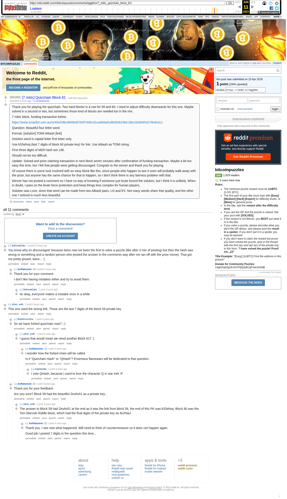

# [7 mbtc] Quizchain Block 61

[Original thread](https://www.reddit.com/r/bitcoinpuzzles/comments/bgg9mx/7_mbtc_quizchain_block_61/). The `sourceUrl` of the [quizchain/61](../../../src/collections/quizchain/61.ts) record and the source of three of its hints and the funding transaction, with the solution the author edited in. The post went up on April 23, 2019, at 13:17:24 UTC, 26 minutes before the block time of its funding transaction. Its last edit is stamped 13:30:28 UTC on April 23, 2019.

## Historical provenance

The Wayback Machine holds one capture of the `old.reddit.com` URL and one of the `www.reddit.com` URL. Provenance rests on the [old.reddit.com capture](https://web.archive.org/web/20230611091619/https://old.reddit.com/r/bitcoinpuzzles/comments/bgg9mx/7_mbtc_quizchain_block_61/), stamped June 11, 2023, 09:16:19 UTC, whose HTML carries the post, which matches the transcript below word for word. It renders 11 comments, and each matches the Arctic Shift record of the same ID by author and text. Only the markdown of links and lists renders differently. The capture was read on September 27, 2026. `archive_content: confirmed` on that basis.

The [Arctic Shift](https://arctic-shift.photon-reddit.com/) Reddit archive, read the same day, lists the same 11 comments. The transcript takes authors, text and scores from it and nests the comments as the capture does.

The record names none of the commenters: nothing on the chain ties a claim to a name.

## Transcript

> Thank you for playing the quizchain. Two hard blocks in a row for 59 and 60, I need to adjust difficulty downwards for this one. Maybe solved in a second or two, but sometimes those kind of blocks are needed too in the mix.
>
> 7 mbtc block, funding transaction below.
>
> https://www.smartbit.com.au/tx/45e038c49566d07b0f730b1d1ca584a81db5006236e13bccb2b9354278c6e2c1
>
> Question: Beautiful four letter word.
>
> Format: [solution] TOMI Atbash [link]
>
> Solution word is capital letter first letter only.
>
> Use kS5ehsq (last 7 digits of block 60 private key) for link. Use Atbash as TOMI string.
>
> FIrst three digits of MD5 hash are 136.
>
> Should not be too difficult.
>
> Update: Solved and prize claiming transaction in next block seven minutes after confirmation of funding transaction. Maybe a bit too easy this time, but I felt that people were getting discouraged. Congrats to the winner and thank you for playing.
>
> Of course there is some luck involved with an easy block like this, since people who happen to see it soon will probably walk away with the prize, but anyone has the same chance for that to happen, so I don't think there is any fairness problem with that.
>
> Winner has not posted a comment so I have no way of knowing if someone just brute forced the solution, but I think it is unlikely. When in doubt, I pass on the brute force protection and keep things less complex for human players.
>
> Solution was Love, since that word can be made from two Atbash pairs, LO and EV. Not many words share that quality, and the other one I noticed is much less beautiful.

## Comments

**u/DaGreatCake**, 2 points:

> You know why im discouraged: because twice now ive been the first to solve a puzzle (like after 3 min of posting) but then the hash was wrong or something and a random person who posted the answer in the comments way after me ran off with the prize money. That got me pretty pissed, twice... :(

**u/AoiNakamoto**, 3 points, reply to u/DaGreatCake:

> Thank you for your comment.
>
> I don't like having mistakes either and try to avoid them.

**u/DaGreatCake**, 1 point, reply to u/AoiNakamoto:

> Its okay, everyone makes a mistake once in a while

**u/silver_anth**, 1 point:

> This one used the wrong link. Those are the last 7 digits of the block 59 private key

**u/BrainForceOne**, 1 point, reply to u/silver_anth:

> So we have forked quizchain now? ;-)

**u/silver_anth**, 1 point, reply to u/BrainForceOne:

> I guess that would mean we need another Block 61? :)

**u/AoiNakamoto**, 1 point, reply to u/silver_anth:

> I wonder how the forked chain will be called.
>
> Is it "Quizchain Hash" or "QHash"? Enormous flamewars will be dedicated to that question.

**u/mapl3sn0w**, 1 point, reply to u/AoiNakamoto:

> I vote QHash, because i used to love the character Q in star trek :P

**u/AoiNakamoto**, 1 point, reply to u/silver_anth:

> Thank you for your feedback.
>
> Are you sure? Block 59 had the beautiful Zeuhs51 as a private key...

**u/silver_anth**, 1 point, reply to u/AoiNakamoto:

> The answer to Block 59 had Zeuhs51 at the end as it was the link from block 58, the end of this PK was kS5ehsq. Block 60 was the Tom Marvolo Riddle block, which had the final digits of the private key as 8x2NiaJ

**u/AoiNakamoto**, 1 point, reply to u/silver_anth:

> Thank you. I see now what happened. Will need to think of countermeasure so it does not happen again.
>
> Good job I posted 7 digits in the question this time...

## Screenshot

The screenshot is a render of the archive capture, not of the live page, so it carries the Wayback banner at the top. The "4 years ago" stamps are relative to the capture, June 11, 2023. Capture method and limits: [source archive](../README.md).
