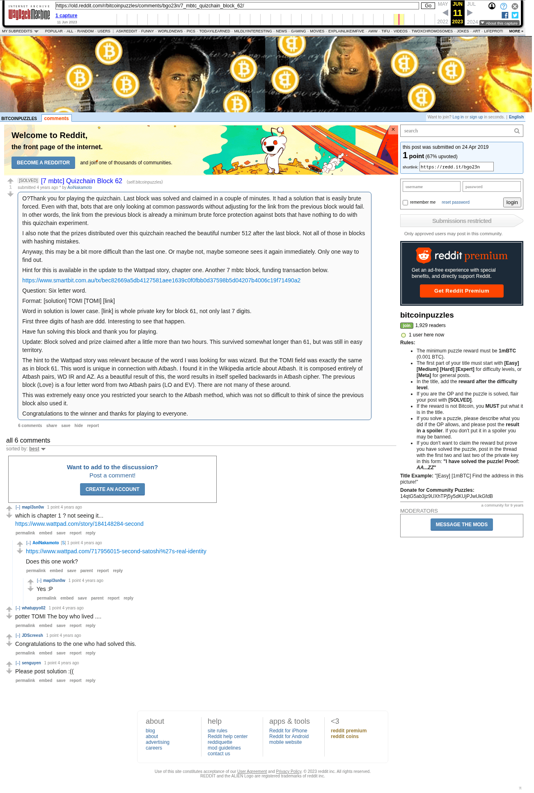

# [7 mbtc] Quizchain Block 62

[Original thread](https://www.reddit.com/r/bitcoinpuzzles/comments/bgo23n/7_mbtc_quizchain_block_62/). The `sourceUrl` of the [quizchain/62](../../../src/collections/quizchain/62.ts) record and the source of three of its hints and the funding transaction, with the solution the author edited in. The post went up on April 24, 2019, at 00:41:49 UTC, 2 minutes after the block time of its funding transaction. Its last edit is stamped 04:22:29 UTC on April 24, 2019, so the transcript shows the post as it stood after the claim.

## Historical provenance

The Wayback Machine holds one capture of the `old.reddit.com` URL and one of the `www.reddit.com` URL. Provenance rests on the [old.reddit.com capture](https://web.archive.org/web/20230611071943/https://old.reddit.com/r/bitcoinpuzzles/comments/bgo23n/7_mbtc_quizchain_block_62/), stamped June 11, 2023, 07:19:43 UTC, whose HTML carries the post, which matches the transcript below word for word. It renders six comments, and each matches the Arctic Shift record of the same ID by author and text. Only the markdown of links and lists renders differently. The capture was read on September 27, 2026. `archive_content: confirmed` on that basis.

The [Arctic Shift](https://arctic-shift.photon-reddit.com/) Reddit archive, read the same day, lists the same six comments. The transcript takes authors, text and scores from it and nests the comments as the capture does.

The record names none of the commenters: nothing on the chain ties a claim to a name.

## Transcript

> O?Thank you for playing the quizchain. Last block was solved and claimed in a couple of minutes. It had a solution that is easily brute forced. Even with that, bots that are only looking at common passwords without adjusting for the link from the previous block would fail. In other words, the link from the previous block is already a minimum brute force protection against bots that have nothing to do with this quizchain experiment.
>
> I also note that the prizes distributed over this quizchain reached the beautiful number 512 after the last block. Not all of those in blocks with hashing mistakes.
>
> Anyway, this may be a bit more difficult than the last one. Or maybe not, maybe someone sees it again immediately. Only one way to find out.
>
> Hint for this is available in the update to the Wattpad story, chapter one.
> Another 7 mbtc block, funding transaction below.
>
> https://www.smartbit.com.au/tx/bec82669a5db4127581aee1639c0f0fbb0d37598b5d04207b4006c19f71490a2
>
> Question: Six letter word.
>
> Format: [solution] TOMI [TOMI] [link]
>
> Word in solution is lower case. [link] is whole private key for block 61, not only last 7 digits.
>
> First three digits of hash are ddd. Interesting to see that happen.
>
> Have fun solving this block and thank you for playing.
>
> Update: Block solved and prize claimed after a little more than two hours. This survived somewhat longer than 61, but was still in easy territory.
>
> The hint to the Wattpad story was relevant because of the word I was looking for was wizard. But the TOMI field was exactly the same as in block 61. This word is unique in connection with Atbash. I found it in the Wikipedia article about Atbash. It is composed entirely of Atbash pairs, WD IR and AZ. As a beautiful result of this, the word results in itself spelled backwards in Atbash cipher. The previous block (Love) is a four letter word from two Atbash pairs (LO and EV). There are not many of these around.
>
> This was extremely easy once you restricted your search to the Atbash method, which was not so difficult to think of since the previous block also used it.
>
> Congratulations to the winner and thanks for playing to everyone.

## Comments

**u/mapl3sn0w**, 1 point:

> which is chapter 1 ? not seeing it...
> [https://www.wattpad.com/story/184148284-second](https://www.wattpad.com/story/184148284-second)

**u/AoiNakamoto**, 1 point, reply to u/mapl3sn0w:

> https://www.wattpad.com/717956015-second-satoshi%27s-real-identity
>
> Does this one work?

**u/mapl3sn0w**, 1 point, reply to u/AoiNakamoto:

> Yes :P

**u/whatupyo02**, 1 point:

> potter TOMI The boy who lived ....

**u/JDScreesh**, 1 point:

> Congratulations to the one who had solved this.

**u/senguyen**, 1 point:

> Please post solution :((

## Screenshot

The screenshot is a render of the archive capture, not of the live page, so it carries the Wayback banner at the top. The "4 years ago" stamps are relative to the capture, June 11, 2023. Capture method and limits: [source archive](../README.md).
